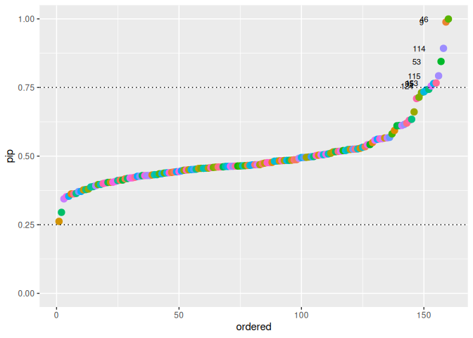
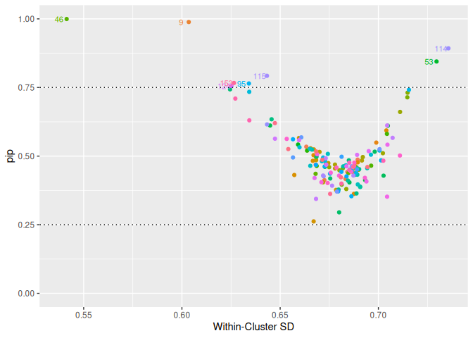
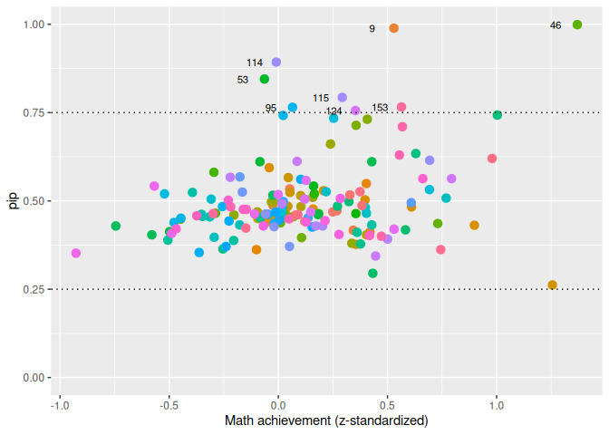
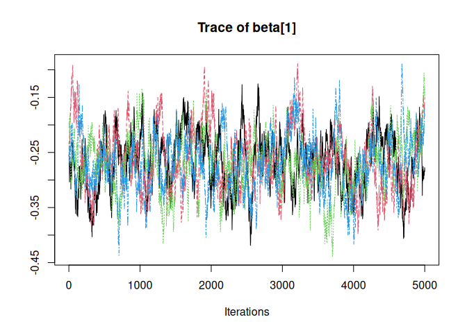
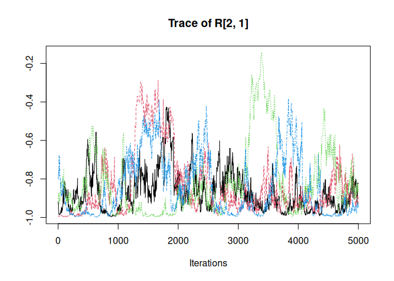

<!-- README.md is generated from README.Rmd. Please edit that file -->
<!-- knit with rmarkdown::render("README.Rmd", output_format = "md_document") -->

# Individual Variance Detection

<!-- badges: start -->

<!-- badges: end -->

*ivd* is an R package for random effects selection in the scale part of
Mixed Effects Location Scale Modlels (MELSM). `ivd()` fits a random
intercepts model with a spike-and-slab prior on the random effects of
the scale.

## Installation

This package can be installed with

    # install.packages("devtools")
    devtools::install_github("consistentlybetter/ivd")

## Example

    library(ivd)
    library(data.table)

## Data

The illustration uses openly accessible data from The Basic Education
Evaluation System (Saeb) conducted by Brazil’s National Institute for
Educational Studies and Research (Inep), available at
<https://www.gov.br/inep/pt-br/areas-de-atuacao/avaliacao-e-exames-educacionais/saeb/resultados>.
It is also available as the `saeb` dataset in the `ivd` package.

Separate within- from between-school effects. That is, besides
`student_ses`, compute `school_ses`.

    # Calculate school-level SES
    school_ses <- saeb[, .(school_ses = mean(student_ses, na.rm = TRUE)), by = school_id]

    # Join the school_ses back to the original dataset
    saeb <- saeb[school_ses, on = "school_id"]

    # Grand mean center school ses
    saeb$school_ses <- c(scale(saeb$school_ses, scale = FALSE))

    head(saeb )
    #>    school_id public student_ses math_proficiency location school_ses i.school_ses i.school_ses.1
    #>        <num>  <int>       <num>            <num>    <int>      <num>        <num>          <num>
    #> 1:         1      1        3.81         0.094789        1 -0.3717212     4.557222       4.557222
    #> 2:         1      1        4.59         1.518185        1 -0.3717212     4.557222       4.557222
    #> 3:         1      1        5.21        -0.474808        1 -0.3717212     4.557222       4.557222
    #> 4:         1      1        6.10         0.187490        1 -0.3717212     4.557222       4.557222
    #> 5:         1      1        5.37         0.730355        1 -0.3717212     4.557222       4.557222
    #> 6:         1      1        4.51         0.585839        1 -0.3717212     4.557222       4.557222

Illustration of school level variability:

    plot0 <- ggplot( data = saeb, aes( x = school_id, y = math_proficiency) )
    plot0 + geom_point(aes(color =  school_id), show.legend =  FALSE)

## Estimate Model

We will predict `math_proficiency` which is a standardized variable
capturing math proficiency at the end of grade 12.

Both, location (means) and scale (residual variances) are modeled as a
function of student and school SES. Note that the formula objects for
both location and scale follow `lme4` notation.

    out <- ivd(location_formula = math_proficiency ~ student_ses * school_ses + (1|school_id),
               scale_formula =  ~ student_ses * school_ses + (1|school_id),
               data = saeb,
               niter = 5000, nburnin = 5000, WAIC = TRUE, workers = 4)
    #> ===== Monitors =====
    #> thin = 1: beta, L, sigma_rand, ss, z, zeta
    #> ===== Samplers =====
    #> RW_lkj_corr_cholesky sampler (1)
    #>   - L[1:2, 1:2] 
    #> RW sampler (326)
    #>   - z[]  (320 elements)
    #>   - zeta[]  (4 elements)
    #>   - sigma_rand[]  (2 elements)
    #> conjugate sampler (4)
    #>   - beta[]  (4 elements)
    #> binary sampler (320)
    #>   - ss[]  (320 elements)
    #> warning: logProb of data node Y[5427]: logProb less than -1e12.
    #> warning: logProb of data node Y[5428]: logProb less than -1e12.
    #> warning: logProb of data node Y[5431]: logProb less than -1e12.
    #> warning: logProb of data node Y[5442]: logProb less than -1e12.
    #> warning: logProb of data node Y[5445]: logProb less than -1e12.
    #> warning: logProb of data node Y[5446]: logProb less than -1e12.
    #> warning: logProb of data node Y[5447]: logProb less than -1e12.
    #> warning: logProb of data node Y[5448]: logProb less than -1e12.
    #> warning: logProb of data node Y[5449]: logProb less than -1e12.
    #> warning: logProb of data node Y[5450]: logProb less than -1e12.
    #> warning: logProb of data node Y[5454]: logProb less than -1e12.
    #> warning: logProb of data node Y[5462]: logProb less than -1e12.
    #> warning: logProb of data node Y[5464]: logProb less than -1e12.
    #> warning: logProb of data node Y[5467]: logProb less than -1e12.
    #> warning: logProb of data node Y[5468]: logProb less than -1e12.
    #> warning: logProb of data node Y[5469]: logProb less than -1e12.
    #> warning: logProb of data node Y[5479]: logProb less than -1e12.
    #> warning: logProb of data node Y[5480]: logProb less than -1e12.
    #> warning: logProb of data node Y[10805]: logProb less than -1e12.
    #> warning: logProb of data node Y[10820]: logProb less than -1e12.
    #> warning: logProb of data node Y[10821]: logProb less than -1e12.
    #> warning: logProb of data node Y[10826]: logProb less than -1e12.
    #> warning: logProb of data node Y[10827]: logProb less than -1e12.
    #> warning: logProb of data node Y[10835]: logProb less than -1e12.
    #> |-------------|-------------|-------------|-------------|
    #> |-------------------------------------------------------|
    #>   [Warning] There are 3 individual pWAIC values that are greater than 0.4. This may indicate that the WAIC estimate is unstable (Vehtari et al., 2017), at least in cases without grouping of data nodes or multivariate data nodes.
    #> Defining model
    #> Building model
    #> Setting data and initial values
    #>   [Note] 'Z' is provided in 'data' but is not a variable in the model and is being ignored.
    #>   [Note] 'Z_scale' is provided in 'data' but is not a variable in the model and is being ignored.
    #> Running calculate on model
    #>   [Note] Any error reports that follow may simply reflect missing values in model variables.
    #> Checking model sizes and dimensions
    #>   [Note] This model is not fully initialized. This is not an error.
    #>          To see which variables are not initialized, use model$initializeInfo().
    #>          For more information on model initialization, see help(modelInitialization).
    #> Compiling
    #>   [Note] This may take a minute.
    #>   [Note] Use 'showCompilerOutput = TRUE' to see C++ compilation details.
    #> Compiling
    #>   [Note] This may take a minute.
    #>   [Note] Use 'showCompilerOutput = TRUE' to see C++ compilation details.
    #> running chain 1...
    #> ===== Monitors =====
    #> thin = 1: beta, L, sigma_rand, ss, z, zeta
    #> ===== Samplers =====
    #> RW_lkj_corr_cholesky sampler (1)
    #>   - L[1:2, 1:2] 
    #> RW sampler (326)
    #>   - z[]  (320 elements)
    #>   - zeta[]  (4 elements)
    #>   - sigma_rand[]  (2 elements)
    #> conjugate sampler (4)
    #>   - beta[]  (4 elements)
    #> binary sampler (320)
    #>   - ss[]  (320 elements)
    #> warning: logProb of data node Y[5467]: logProb less than -1e12.
    #> warning: logProb of data node Y[10805]: logProb less than -1e12.
    #> warning: logProb of data node Y[10808]: logProb less than -1e12.
    #> warning: logProb of data node Y[10810]: logProb less than -1e12.
    #> warning: logProb of data node Y[10818]: logProb less than -1e12.
    #> warning: logProb of data node Y[10820]: logProb less than -1e12.
    #> warning: logProb of data node Y[10821]: logProb less than -1e12.
    #> warning: logProb of data node Y[10824]: logProb less than -1e12.
    #> warning: logProb of data node Y[10826]: logProb less than -1e12.
    #> warning: logProb of data node Y[10827]: logProb less than -1e12.
    #> warning: logProb of data node Y[10829]: logProb less than -1e12.
    #> warning: logProb of data node Y[10832]: logProb less than -1e12.
    #> warning: logProb of data node Y[10835]: logProb less than -1e12.
    #> |-------------|-------------|-------------|-------------|
    #> |-------------------------------------------------------|
    #>   [Warning] There are 3 individual pWAIC values that are greater than 0.4. This may indicate that the WAIC estimate is unstable (Vehtari et al., 2017), at least in cases without grouping of data nodes or multivariate data nodes.
    #> Defining model
    #> Building model
    #> Setting data and initial values
    #>   [Note] 'Z' is provided in 'data' but is not a variable in the model and is being ignored.
    #>   [Note] 'Z_scale' is provided in 'data' but is not a variable in the model and is being ignored.
    #> Running calculate on model
    #>   [Note] Any error reports that follow may simply reflect missing values in model variables.
    #> Checking model sizes and dimensions
    #>   [Note] This model is not fully initialized. This is not an error.
    #>          To see which variables are not initialized, use model$initializeInfo().
    #>          For more information on model initialization, see help(modelInitialization).
    #> Compiling
    #>   [Note] This may take a minute.
    #>   [Note] Use 'showCompilerOutput = TRUE' to see C++ compilation details.
    #> Compiling
    #>   [Note] This may take a minute.
    #>   [Note] Use 'showCompilerOutput = TRUE' to see C++ compilation details.
    #> running chain 1...
    #> ===== Monitors =====
    #> thin = 1: beta, L, sigma_rand, ss, z, zeta
    #> ===== Samplers =====
    #> RW_lkj_corr_cholesky sampler (1)
    #>   - L[1:2, 1:2] 
    #> RW sampler (326)
    #>   - z[]  (320 elements)
    #>   - zeta[]  (4 elements)
    #>   - sigma_rand[]  (2 elements)
    #> conjugate sampler (4)
    #>   - beta[]  (4 elements)
    #> binary sampler (320)
    #>   - ss[]  (320 elements)
    #> warning: logProb of data node Y[5427]: logProb less than -1e12.
    #> warning: logProb of data node Y[5428]: logProb less than -1e12.
    #> warning: logProb of data node Y[5431]: logProb less than -1e12.
    #> warning: logProb of data node Y[5442]: logProb less than -1e12.
    #> warning: logProb of data node Y[5445]: logProb less than -1e12.
    #> warning: logProb of data node Y[5446]: logProb less than -1e12.
    #> warning: logProb of data node Y[5447]: logProb less than -1e12.
    #> warning: logProb of data node Y[5448]: logProb less than -1e12.
    #> warning: logProb of data node Y[5449]: logProb less than -1e12.
    #> warning: logProb of data node Y[5450]: logProb less than -1e12.
    #> warning: logProb of data node Y[5454]: logProb less than -1e12.
    #> warning: logProb of data node Y[5462]: logProb less than -1e12.
    #> warning: logProb of data node Y[5464]: logProb less than -1e12.
    #> warning: logProb of data node Y[5467]: logProb less than -1e12.
    #> warning: logProb of data node Y[5468]: logProb less than -1e12.
    #> warning: logProb of data node Y[8175]: logProb less than -1e12.
    #> warning: logProb of data node Y[8209]: logProb less than -1e12.
    #> warning: logProb of data node Y[8220]: logProb less than -1e12.
    #> warning: logProb of data node Y[8322]: logProb less than -1e12.
    #> warning: logProb of data node Y[10805]: logProb less than -1e12.
    #> warning: logProb of data node Y[10806]: logProb less than -1e12.
    #> warning: logProb of data node Y[10808]: logProb less than -1e12.
    #> warning: logProb of data node Y[10810]: logProb less than -1e12.
    #> warning: logProb of data node Y[10811]: logProb less than -1e12.
    #> warning: logProb of data node Y[10814]: logProb less than -1e12.
    #> warning: logProb of data node Y[10817]: logProb less than -1e12.
    #> warning: logProb of data node Y[10818]: logProb less than -1e12.
    #> warning: logProb of data node Y[10820]: logProb less than -1e12.
    #> warning: logProb of data node Y[10821]: logProb less than -1e12.
    #> warning: logProb of data node Y[10823]: logProb less than -1e12.
    #> warning: logProb of data node Y[10824]: logProb less than -1e12.
    #> warning: logProb of data node Y[10826]: logProb less than -1e12.
    #> warning: logProb of data node Y[10827]: logProb less than -1e12.
    #> warning: logProb of data node Y[10828]: logProb less than -1e12.
    #> warning: logProb of data node Y[10829]: logProb less than -1e12.
    #> warning: logProb of data node Y[10830]: logProb less than -1e12.
    #> warning: logProb of data node Y[10831]: logProb less than -1e12.
    #> warning: logProb of data node Y[10832]: logProb less than -1e12.
    #> warning: logProb of data node Y[10834]: logProb less than -1e12.
    #> warning: logProb of data node Y[10835]: logProb less than -1e12.
    #> |-------------|-------------|-------------|-------------|
    #> |-------------------------------------------------------|
    #>   [Warning] There are 4 individual pWAIC values that are greater than 0.4. This may indicate that the WAIC estimate is unstable (Vehtari et al., 2017), at least in cases without grouping of data nodes or multivariate data nodes.
    #> Defining model
    #> Building model
    #> Setting data and initial values
    #>   [Note] 'Z' is provided in 'data' but is not a variable in the model and is being ignored.
    #>   [Note] 'Z_scale' is provided in 'data' but is not a variable in the model and is being ignored.
    #> Running calculate on model
    #>   [Note] Any error reports that follow may simply reflect missing values in model variables.
    #> Checking model sizes and dimensions
    #>   [Note] This model is not fully initialized. This is not an error.
    #>          To see which variables are not initialized, use model$initializeInfo().
    #>          For more information on model initialization, see help(modelInitialization).
    #> Compiling
    #>   [Note] This may take a minute.
    #>   [Note] Use 'showCompilerOutput = TRUE' to see C++ compilation details.
    #> Compiling
    #>   [Note] This may take a minute.
    #>   [Note] Use 'showCompilerOutput = TRUE' to see C++ compilation details.
    #> running chain 1...
    #> ===== Monitors =====
    #> thin = 1: beta, L, sigma_rand, ss, z, zeta
    #> ===== Samplers =====
    #> RW_lkj_corr_cholesky sampler (1)
    #>   - L[1:2, 1:2] 
    #> RW sampler (326)
    #>   - z[]  (320 elements)
    #>   - zeta[]  (4 elements)
    #>   - sigma_rand[]  (2 elements)
    #> conjugate sampler (4)
    #>   - beta[]  (4 elements)
    #> binary sampler (320)
    #>   - ss[]  (320 elements)
    #> warning: logProb of data node Y[2385]: logProb less than -1e12.
    #> warning: logProb of data node Y[5425]: logProb less than -1e12.
    #> warning: logProb of data node Y[5426]: logProb less than -1e12.
    #> warning: logProb of data node Y[5427]: logProb less than -1e12.
    #> warning: logProb of data node Y[5428]: logProb less than -1e12.
    #> warning: logProb of data node Y[5429]: logProb less than -1e12.
    #> warning: logProb of data node Y[5430]: logProb less than -1e12.
    #> warning: logProb of data node Y[5431]: logProb less than -1e12.
    #> warning: logProb of data node Y[5432]: logProb less than -1e12.
    #> warning: logProb of data node Y[5435]: logProb less than -1e12.
    #> warning: logProb of data node Y[5437]: logProb less than -1e12.
    #> warning: logProb of data node Y[5441]: logProb less than -1e12.
    #> warning: logProb of data node Y[5442]: logProb less than -1e12.
    #> warning: logProb of data node Y[5443]: logProb less than -1e12.
    #> warning: logProb of data node Y[5445]: logProb less than -1e12.
    #> warning: logProb of data node Y[5446]: logProb less than -1e12.
    #> warning: logProb of data node Y[5447]: logProb less than -1e12.
    #> warning: logProb of data node Y[5448]: logProb less than -1e12.
    #> warning: logProb of data node Y[5449]: logProb less than -1e12.
    #> warning: logProb of data node Y[5450]: logProb less than -1e12.
    #> warning: logProb of data node Y[5453]: logProb less than -1e12.
    #> warning: logProb of data node Y[5454]: logProb less than -1e12.
    #> warning: logProb of data node Y[5457]: logProb less than -1e12.
    #> warning: logProb of data node Y[5459]: logProb less than -1e12.
    #> warning: logProb of data node Y[5460]: logProb less than -1e12.
    #> warning: logProb of data node Y[5461]: logProb less than -1e12.
    #> warning: logProb of data node Y[5462]: logProb less than -1e12.
    #> warning: logProb of data node Y[5464]: logProb less than -1e12.
    #> warning: logProb of data node Y[5467]: logProb less than -1e12.
    #> warning: logProb of data node Y[5468]: logProb less than -1e12.
    #> warning: logProb of data node Y[10803]: logProb less than -1e12.
    #> warning: logProb of data node Y[10805]: logProb less than -1e12.
    #> warning: logProb of data node Y[10806]: logProb less than -1e12.
    #> warning: logProb of data node Y[10808]: logProb less than -1e12.
    #> warning: logProb of data node Y[10810]: logProb less than -1e12.
    #> warning: logProb of data node Y[10811]: logProb less than -1e12.
    #> warning: logProb of data node Y[10814]: logProb less than -1e12.
    #> warning: logProb of data node Y[10815]: logProb less than -1e12.
    #> warning: logProb of data node Y[10816]: logProb less than -1e12.
    #> warning: logProb of data node Y[10817]: logProb less than -1e12.
    #> warning: logProb of data node Y[10818]: logProb less than -1e12.
    #> warning: logProb of data node Y[10819]: logProb less than -1e12.
    #> warning: logProb of data node Y[10820]: logProb less than -1e12.
    #> warning: logProb of data node Y[10821]: logProb less than -1e12.
    #> warning: logProb of data node Y[10822]: logProb less than -1e12.
    #> warning: logProb of data node Y[10823]: logProb less than -1e12.
    #> warning: logProb of data node Y[10824]: logProb less than -1e12.
    #> warning: logProb of data node Y[10825]: logProb less than -1e12.
    #> warning: logProb of data node Y[10826]: logProb less than -1e12.
    #> warning: logProb of data node Y[10827]: logProb less than -1e12.
    #> warning: logProb of data node Y[10828]: logProb less than -1e12.
    #> warning: logProb of data node Y[10829]: logProb less than -1e12.
    #> warning: logProb of data node Y[10830]: logProb less than -1e12.
    #> warning: logProb of data node Y[10831]: logProb less than -1e12.
    #> warning: logProb of data node Y[10832]: logProb less than -1e12.
    #> warning: logProb of data node Y[10833]: logProb less than -1e12.
    #> warning: logProb of data node Y[10834]: logProb less than -1e12.
    #> warning: logProb of data node Y[10835]: logProb less than -1e12.
    #> |-------------|-------------|-------------|-------------|
    #> |-------------------------------------------------------|
    #>   [Warning] There are 3 individual pWAIC values that are greater than 0.4. This may indicate that the WAIC estimate is unstable (Vehtari et al., 2017), at least in cases without grouping of data nodes or multivariate data nodes.
    #> Defining model
    #> Building model
    #> Setting data and initial values
    #>   [Note] 'Z' is provided in 'data' but is not a variable in the model and is being ignored.
    #>   [Note] 'Z_scale' is provided in 'data' but is not a variable in the model and is being ignored.
    #> Running calculate on model
    #>   [Note] Any error reports that follow may simply reflect missing values in model variables.
    #> Checking model sizes and dimensions
    #>   [Note] This model is not fully initialized. This is not an error.
    #>          To see which variables are not initialized, use model$initializeInfo().
    #>          For more information on model initialization, see help(modelInitialization).
    #> Compiling
    #>   [Note] This may take a minute.
    #>   [Note] Use 'showCompilerOutput = TRUE' to see C++ compilation details.
    #> Compiling
    #>   [Note] This may take a minute.
    #>   [Note] Use 'showCompilerOutput = TRUE' to see C++ compilation details.
    #> running chain 1...
    #> Warning in ivd(location_formula = math_proficiency ~ student_ses * school_ses + : Some R-hat
    #> values are greater than 1.10 -- increase warmup and/or sampling iterations.

The summary shows the fixed and random effects and it returns all
posterior inclusion probabilities (PIP) for each one of the 160 schools’
residual variance random effects. The PIP returns the probability of a
school belonging to the slab, that is, the probability of the model
having to include the random scale effect.

In other words, large PIP’s indicate schools that are substantially
deviating from the fixed scale effects either because they are much
*more* or much *less* variable compared to other schools in math
proficiency.

One can readily convert those PIP’s to odds, indicating that a school
with a PIP = .75 is three times as likely to belonging to the slab than
belonging to the spike. With an .50 inclusion prior, these odds can be
readily interpreted as Bayes Factors.

    summary(out)
    #> List of 6
    #>  $ statistics: num [1:656, 1:4] 1 -0.842 -0.842 1 -0.267 ...
    #>   ..- attr(*, "dimnames")=List of 2
    #>   .. ..$ : chr [1:656] "R[1, 1]" "R[2, 1]" "R[1, 2]" "R[2, 2]" ...
    #>   .. ..$ : chr [1:4] "Mean" "SD" "Naive SE" "Time-series SE"
    #>  $ quantiles : num [1:656, 1:5] 1 -0.993 -0.993 1 -0.365 ...
    #>   ..- attr(*, "dimnames")=List of 2
    #>   .. ..$ : chr [1:656] "R[1, 1]" "R[2, 1]" "R[1, 2]" "R[2, 2]" ...
    #>   .. ..$ : chr [1:5] "2.5%" "25%" "50%" "75%" ...
    #>  $ start     : num 1
    #>  $ end       : num 20000
    #>  $ thin      : num 1
    #>  $ nchain    : num 1
    #>  - attr(*, "class")= chr "summary.mcmc"
    #> Summary statistics for ivd model:
    #> Chains/workers: 4 
    #> 
    #>                    Mean    SD Time-series SE   2.5%    50%  97.5% R-hat
    #> R[2, 1]          -0.842 0.156          0.022 -0.993 -0.895 -0.414 1.124
    #> beta[1]          -0.267 0.052          0.004 -0.365 -0.269 -0.164 1.027
    #> beta[2]           0.081 0.010          0.001  0.061  0.081  0.100 1.020
    #> beta[3]           0.679 0.191          0.012  0.301  0.680  1.053 1.015
    #> beta[4]          -0.017 0.036          0.002 -0.089 -0.017  0.054 1.015
    #> sigma_rand[1, 1]  0.205 0.021          0.002  0.174  0.202  0.255 1.060
    #> sigma_rand[2, 2]  0.237 0.166          0.021  0.078  0.184  0.714 1.108
    #> ss[2, 1]          0.469 0.499          0.004  0.000  0.000  1.000 1.000
    #> ss[2, 2]          0.472 0.499          0.004  0.000  0.000  1.000 1.000
    #> ss[2, 3]          0.442 0.497          0.005  0.000  0.000  1.000 1.000
    #> ss[2, 4]          0.487 0.500          0.006  0.000  0.000  1.000 1.001
    #> ss[2, 5]          0.534 0.499          0.006  0.000  1.000  1.000 1.001
    #> ss[2, 6]          0.412 0.492          0.004  0.000  0.000  1.000 1.001
    #> ss[2, 7]          0.417 0.493          0.006  0.000  0.000  1.000 1.002
    #> ss[2, 8]          0.466 0.499          0.004  0.000  0.000  1.000 1.000
    #> ss[2, 9]          0.989 0.107          0.002  1.000  1.000  1.000 1.009
    #> ss[2, 10]         0.440 0.496          0.004  0.000  0.000  1.000 1.000
    #> ss[2, 11]         0.549 0.498          0.005  0.000  1.000  1.000 1.001
    #> ss[2, 12]         0.362 0.481          0.005  0.000  0.000  1.000 1.001
    #> ss[2, 13]         0.477 0.499          0.007  0.000  0.000  1.000 1.003
    #> ss[2, 14]         0.594 0.491          0.009  0.000  1.000  1.000 1.001
    #> ss[2, 15]         0.503 0.500          0.004  0.000  1.000  1.000 1.000
    #> ss[2, 16]         0.483 0.500          0.004  0.000  0.000  1.000 1.001
    #> ss[2, 17]         0.431 0.495          0.004  0.000  0.000  1.000 1.000
    #> ss[2, 18]         0.529 0.499          0.004  0.000  1.000  1.000 1.000
    #> ss[2, 19]         0.262 0.440          0.006  0.000  0.000  1.000 1.001
    #> ss[2, 20]         0.524 0.499          0.004  0.000  1.000  1.000 1.000
    #> ss[2, 21]         0.377 0.485          0.006  0.000  0.000  1.000 1.002
    #> ss[2, 22]         0.566 0.496          0.006  0.000  1.000  1.000 1.002
    #> ss[2, 23]         0.485 0.500          0.006  0.000  0.000  1.000 1.000
    #> ss[2, 24]         0.474 0.499          0.004  0.000  0.000  1.000 1.000
    #> ss[2, 25]         0.455 0.498          0.004  0.000  0.000  1.000 1.000
    #> ss[2, 26]         0.515 0.500          0.004  0.000  1.000  1.000 1.000
    #> ss[2, 27]         0.450 0.498          0.004  0.000  0.000  1.000 1.000
    #> ss[2, 28]         0.404 0.491          0.004  0.000  0.000  1.000 1.000
    #> ss[2, 29]         0.484 0.500          0.005  0.000  0.000  1.000 1.001
    #> ss[2, 30]         0.456 0.498          0.008  0.000  0.000  1.000 1.000
    #> ss[2, 31]         0.469 0.499          0.004  0.000  0.000  1.000 1.000
    #> ss[2, 32]         0.496 0.500          0.007  0.000  0.000  1.000 1.003
    #> ss[2, 33]         0.497 0.500          0.005  0.000  0.000  1.000 1.000
    #> ss[2, 34]         0.510 0.500          0.004  0.000  1.000  1.000 1.000
    #> ss[2, 35]         0.661 0.473          0.008  0.000  1.000  1.000 1.001
    #> ss[2, 36]         0.380 0.485          0.008  0.000  0.000  1.000 1.001
    #> ss[2, 37]         0.460 0.498          0.004  0.000  0.000  1.000 1.000
    #> ss[2, 38]         0.448 0.497          0.004  0.000  0.000  1.000 1.000
    #> ss[2, 39]         0.731 0.443          0.017  0.000  1.000  1.000 1.011
    #> ss[2, 40]         0.455 0.498          0.004  0.000  0.000  1.000 1.000
    #> ss[2, 41]         0.714 0.452          0.013  0.000  1.000  1.000 1.004
    #> ss[2, 42]         0.459 0.498          0.005  0.000  0.000  1.000 1.001
    #> ss[2, 43]         0.396 0.489          0.005  0.000  0.000  1.000 1.000
    #> ss[2, 44]         0.438 0.496          0.004  0.000  0.000  1.000 1.000
    #> ss[2, 45]         0.436 0.496          0.004  0.000  0.000  1.000 1.000
    #> ss[2, 46]         0.999 0.023          0.000  1.000  1.000  1.000 1.000
    #> ss[2, 47]         0.465 0.499          0.004  0.000  0.000  1.000 1.000
    #> ss[2, 48]         0.581 0.493          0.006  0.000  1.000  1.000 1.000
    #> ss[2, 49]         0.464 0.499          0.009  0.000  0.000  1.000 1.004
    #> ss[2, 50]         0.520 0.500          0.004  0.000  1.000  1.000 1.000
    #> ss[2, 51]         0.464 0.499          0.004  0.000  0.000  1.000 1.000
    #> ss[2, 52]         0.542 0.498          0.004  0.000  1.000  1.000 1.000
    #> ss[2, 53]         0.845 0.362          0.008  0.000  1.000  1.000 1.005
    #> ss[2, 54]         0.611 0.488          0.006  0.000  1.000  1.000 1.003
    #> ss[2, 55]         0.413 0.492          0.004  0.000  0.000  1.000 1.000
    #> ss[2, 56]         0.461 0.498          0.005  0.000  0.000  1.000 1.000
    #> ss[2, 57]         0.611 0.487          0.004  0.000  1.000  1.000 1.001
    #> ss[2, 58]         0.404 0.491          0.004  0.000  0.000  1.000 1.000
    #> ss[2, 59]         0.429 0.495          0.004  0.000  0.000  1.000 1.000
    #> ss[2, 60]         0.516 0.500          0.004  0.000  1.000  1.000 1.001
    #> ss[2, 61]         0.295 0.456          0.011  0.000  0.000  1.000 1.004
    #> ss[2, 62]         0.418 0.493          0.005  0.000  0.000  1.000 1.000
    #> ss[2, 63]         0.498 0.500          0.004  0.000  0.000  1.000 1.000
    #> ss[2, 64]         0.743 0.437          0.005  0.000  1.000  1.000 1.001
    #> ss[2, 65]         0.485 0.500          0.004  0.000  0.000  1.000 1.000
    #> ss[2, 66]         0.634 0.482          0.005  0.000  1.000  1.000 1.001
    #> ss[2, 67]         0.364 0.481          0.006  0.000  0.000  1.000 1.002
    #> ss[2, 68]         0.378 0.485          0.007  0.000  0.000  1.000 1.001
    #> ss[2, 69]         0.452 0.498          0.004  0.000  0.000  1.000 1.000
    #> ss[2, 70]         0.411 0.492          0.007  0.000  0.000  1.000 1.002
    #> ss[2, 71]         0.389 0.488          0.004  0.000  0.000  1.000 1.000
    #> ss[2, 72]         0.388 0.487          0.005  0.000  0.000  1.000 1.001
    #> ss[2, 73]         0.432 0.495          0.011  0.000  0.000  1.000 1.004
    #> ss[2, 74]         0.524 0.499          0.004  0.000  1.000  1.000 1.000
    #> ss[2, 75]         0.462 0.499          0.004  0.000  0.000  1.000 1.000
    #> ss[2, 76]         0.455 0.498          0.004  0.000  0.000  1.000 1.000
    #> ss[2, 77]         0.456 0.498          0.004  0.000  0.000  1.000 1.001
    #> ss[2, 78]         0.432 0.495          0.004  0.000  0.000  1.000 1.000
    #> ss[2, 79]         0.397 0.489          0.005  0.000  0.000  1.000 1.000
    #> ss[2, 80]         0.508 0.500          0.004  0.000  1.000  1.000 1.000
    #> ss[2, 81]         0.465 0.499          0.006  0.000  0.000  1.000 1.001
    #> ss[2, 82]         0.526 0.499          0.006  0.000  1.000  1.000 1.001
    #> ss[2, 83]         0.481 0.500          0.004  0.000  0.000  1.000 1.000
    #> ss[2, 84]         0.505 0.500          0.004  0.000  1.000  1.000 1.000
    #> ss[2, 85]         0.466 0.499          0.004  0.000  0.000  1.000 1.001
    #> ss[2, 86]         0.532 0.499          0.005  0.000  1.000  1.000 1.000
    #> ss[2, 87]         0.734 0.442          0.009  0.000  1.000  1.000 1.001
    #> ss[2, 88]         0.482 0.500          0.005  0.000  0.000  1.000 1.001
    #> ss[2, 89]         0.520 0.500          0.004  0.000  1.000  1.000 1.000
    #> ss[2, 90]         0.495 0.500          0.004  0.000  0.000  1.000 1.000
    #> ss[2, 91]         0.439 0.496          0.004  0.000  0.000  1.000 1.000
    #> ss[2, 92]         0.742 0.438          0.008  0.000  1.000  1.000 1.006
    #> ss[2, 93]         0.451 0.498          0.004  0.000  0.000  1.000 1.000
    #> ss[2, 94]         0.484 0.500          0.004  0.000  0.000  1.000 1.000
    #> ss[2, 95]         0.765 0.424          0.007  0.000  1.000  1.000 1.003
    #> ss[2, 96]         0.436 0.496          0.004  0.000  0.000  1.000 1.001
    #> ss[2, 97]         0.354 0.478          0.005  0.000  0.000  1.000 1.000
    #> ss[2, 98]         0.462 0.499          0.005  0.000  0.000  1.000 1.001
    #> ss[2, 99]         0.561 0.496          0.004  0.000  1.000  1.000 1.000
    #> ss[2, 100]        0.443 0.497          0.004  0.000  0.000  1.000 1.000
    #> ss[2, 101]        0.426 0.495          0.005  0.000  0.000  1.000 1.000
    #> ss[2, 102]        0.468 0.499          0.014  0.000  0.000  1.000 1.007
    #> ss[2, 103]        0.371 0.483          0.006  0.000  0.000  1.000 1.001
    #> ss[2, 104]        0.446 0.497          0.004  0.000  0.000  1.000 1.000
    #> ss[2, 105]        0.498 0.500          0.004  0.000  0.000  1.000 1.000
    #> ss[2, 106]        0.452 0.498          0.011  0.000  0.000  1.000 1.003
    #> ss[2, 107]        0.495 0.500          0.005  0.000  0.000  1.000 1.001
    #> ss[2, 108]        0.568 0.495          0.015  0.000  1.000  1.000 1.008
    #> ss[2, 109]        0.525 0.499          0.004  0.000  1.000  1.000 1.000
    #> ss[2, 110]        0.371 0.483          0.006  0.000  0.000  1.000 1.001
    #> ss[2, 111]        0.427 0.495          0.008  0.000  0.000  1.000 1.002
    #> ss[2, 112]        0.463 0.499          0.006  0.000  0.000  1.000 1.001
    #> ss[2, 113]        0.615 0.487          0.004  0.000  1.000  1.000 1.000
    #> ss[2, 114]        0.893 0.310          0.007  0.000  1.000  1.000 1.003
    #> ss[2, 115]        0.793 0.405          0.009  0.000  1.000  1.000 1.006
    #> ss[2, 116]        0.429 0.495          0.007  0.000  0.000  1.000 1.000
    #> ss[2, 117]        0.429 0.495          0.004  0.000  0.000  1.000 1.001
    #> ss[2, 118]        0.392 0.488          0.005  0.000  0.000  1.000 1.000
    #> ss[2, 119]        0.492 0.500          0.004  0.000  0.000  1.000 1.000
    #> ss[2, 120]        0.567 0.496          0.004  0.000  1.000  1.000 1.001
    #> ss[2, 121]        0.344 0.475          0.005  0.000  0.000  1.000 1.000
    #> ss[2, 122]        0.612 0.487          0.010  0.000  1.000  1.000 1.004
    #> ss[2, 123]        0.563 0.496          0.004  0.000  1.000  1.000 1.000
    #> ss[2, 124]        0.756 0.430          0.005  0.000  1.000  1.000 1.001
    #> ss[2, 125]        0.469 0.499          0.005  0.000  0.000  1.000 1.000
    #> ss[2, 126]        0.505 0.500          0.004  0.000  1.000  1.000 1.001
    #> ss[2, 127]        0.558 0.497          0.004  0.000  1.000  1.000 1.000
    #> ss[2, 128]        0.518 0.500          0.004  0.000  1.000  1.000 1.000
    #> ss[2, 129]        0.420 0.494          0.004  0.000  0.000  1.000 1.000
    #> ss[2, 130]        0.463 0.499          0.004  0.000  0.000  1.000 1.000
    #> ss[2, 131]        0.542 0.498          0.004  0.000  1.000  1.000 1.000
    #> ss[2, 132]        0.408 0.491          0.004  0.000  0.000  1.000 1.000
    #> ss[2, 133]        0.352 0.478          0.004  0.000  0.000  1.000 1.001
    #> ss[2, 134]        0.507 0.500          0.004  0.000  1.000  1.000 1.000
    #> ss[2, 135]        0.429 0.495          0.005  0.000  0.000  1.000 1.001
    #>  [ reached getOption("max.print") -- omitted 29 rows ]
    #> 
    #> WAIC: 27042.86 
    #> elppd: -13362.46 
    #> pWAIC: 158.9629

## Plots

### Posterior inclusion probability plot (PIP)

    plot(out, type = "pip" )
    #> Called from: eval(expr, p)
    #> debug at /run/media/mcarmo/662229CC2229A253/RProjects/ivd/R/plot.R#97: if (type == "pip") {
    #>     plt <- ggplot(df_pip, aes(x = ordered, y = pip)) + geom_point(aes(color = as.factor(id)), 
    #>         size = 3) + geom_text(data = subset(df_pip, pip >= 0.75), 
    #>         aes(label = id), nudge_x = -10, size = 3) + geom_abline(intercept = 0.75, 
    #>         slope = 0, lty = 3) + geom_abline(intercept = 0.25, slope = 0, 
    #>         lty = 3) + ylim(c(0, 1)) + ggtitle(variable) + guides(color = "none")
    #>     print(plt)
    #> } else {
    #>     if (type == "funnel") {
    #>         if (no_ranef_s == 1) {
    #>             zeta <- mean(unlist(lapply(.extract_to_mcmc(obj), 
    #>                 FUN = function(x) mean(x[, "zeta[1]"]))))
    #>             u <- colMeans(do.call(rbind, lapply(.extract_to_mcmc(obj), 
    #>                 FUN = function(x) colMeans(x[, scale_ranef_pos]))))
    #>             tau <- exp(zeta + u)
    #>         }
    #>         else if (no_ranef_s > 1) {
    #>             scale_ranef_position_user <- which(ranef_scale_names == 
    #>                 variable)
    #>             scale_fixef_position_user <- which(fixef_scale_names == 
    #>                 variable)
    #>             zeta <- mean(unlist(lapply(.extract_to_mcmc(obj), 
    #>                 FUN = function(x) mean(x[, paste0("zeta[", scale_fixef_position_user, 
    #>                   "]")]))))
    #>             pos <- scale_ranef_pos[grepl(paste0(Kr + scale_ranef_position_user, 
    #>                 "\\]"), names(scale_ranef_pos))]
    #>             u <- colMeans(do.call(rbind, lapply(.extract_to_mcmc(obj), 
    #>                 FUN = function(x) colMeans(x[, pos]))))
    #>             tau <- exp(zeta + u)
    #>         }
    #>         else {
    #>             print("Invalid action specified. Exiting.")
    #>         }
    #>     }
    #>     df_funnel <- cbind(df_pip[order(df_pip$id), ], tau)
    #>     nx <- (max(df_funnel$tau) - min(df_funnel$tau))/50
    #>     plt <- ggplot(df_funnel, aes(x = tau, y = pip, color = as.factor(id))) + 
    #>         geom_point() + guides(color = "none") + labs(x = "Within-Cluster SD") + 
    #>         geom_text(data = subset(df_funnel, pip >= 0.75), aes(label = id), 
    #>             nudge_x = -nx, size = 3) + geom_abline(intercept = 0.75, 
    #>         slope = 0, lty = 3) + geom_abline(intercept = 0.25, slope = 0, 
    #>         lty = 3) + ylim(c(0, 1)) + ggtitle(variable)
    #>     print(plt)
    #> }
    #> debug at /run/media/mcarmo/662229CC2229A253/RProjects/ivd/R/plot.R#99: plt <- ggplot(df_pip, aes(x = ordered, y = pip)) + geom_point(aes(color = as.factor(id)), 
    #>     size = 3) + geom_text(data = subset(df_pip, pip >= 0.75), 
    #>     aes(label = id), nudge_x = -10, size = 3) + geom_abline(intercept = 0.75, 
    #>     slope = 0, lty = 3) + geom_abline(intercept = 0.25, slope = 0, 
    #>     lty = 3) + ylim(c(0, 1)) + ggtitle(variable) + guides(color = "none")
    #> debug at /run/media/mcarmo/662229CC2229A253/RProjects/ivd/R/plot.R#109: print(plt)

    #> debug at /run/media/mcarmo/662229CC2229A253/RProjects/ivd/R/plot.R#172: return(invisible(plt))

### PIP vs. Within-cluster SD

    plot(out, type =  "funnel")
    #> Called from: eval(expr, p)
    #> debug at /run/media/mcarmo/662229CC2229A253/RProjects/ivd/R/plot.R#97: if (type == "pip") {
    #>     plt <- ggplot(df_pip, aes(x = ordered, y = pip)) + geom_point(aes(color = as.factor(id)), 
    #>         size = 3) + geom_text(data = subset(df_pip, pip >= 0.75), 
    #>         aes(label = id), nudge_x = -10, size = 3) + geom_abline(intercept = 0.75, 
    #>         slope = 0, lty = 3) + geom_abline(intercept = 0.25, slope = 0, 
    #>         lty = 3) + ylim(c(0, 1)) + ggtitle(variable) + guides(color = "none")
    #>     print(plt)
    #> } else {
    #>     if (type == "funnel") {
    #>         if (no_ranef_s == 1) {
    #>             zeta <- mean(unlist(lapply(.extract_to_mcmc(obj), 
    #>                 FUN = function(x) mean(x[, "zeta[1]"]))))
    #>             u <- colMeans(do.call(rbind, lapply(.extract_to_mcmc(obj), 
    #>                 FUN = function(x) colMeans(x[, scale_ranef_pos]))))
    #>             tau <- exp(zeta + u)
    #>         }
    #>         else if (no_ranef_s > 1) {
    #>             scale_ranef_position_user <- which(ranef_scale_names == 
    #>                 variable)
    #>             scale_fixef_position_user <- which(fixef_scale_names == 
    #>                 variable)
    #>             zeta <- mean(unlist(lapply(.extract_to_mcmc(obj), 
    #>                 FUN = function(x) mean(x[, paste0("zeta[", scale_fixef_position_user, 
    #>                   "]")]))))
    #>             pos <- scale_ranef_pos[grepl(paste0(Kr + scale_ranef_position_user, 
    #>                 "\\]"), names(scale_ranef_pos))]
    #>             u <- colMeans(do.call(rbind, lapply(.extract_to_mcmc(obj), 
    #>                 FUN = function(x) colMeans(x[, pos]))))
    #>             tau <- exp(zeta + u)
    #>         }
    #>         else {
    #>             print("Invalid action specified. Exiting.")
    #>         }
    #>     }
    #>     df_funnel <- cbind(df_pip[order(df_pip$id), ], tau)
    #>     nx <- (max(df_funnel$tau) - min(df_funnel$tau))/50
    #>     plt <- ggplot(df_funnel, aes(x = tau, y = pip, color = as.factor(id))) + 
    #>         geom_point() + guides(color = "none") + labs(x = "Within-Cluster SD") + 
    #>         geom_text(data = subset(df_funnel, pip >= 0.75), aes(label = id), 
    #>             nudge_x = -nx, size = 3) + geom_abline(intercept = 0.75, 
    #>         slope = 0, lty = 3) + geom_abline(intercept = 0.25, slope = 0, 
    #>         lty = 3) + ylim(c(0, 1)) + ggtitle(variable)
    #>     print(plt)
    #> }
    #> debug at /run/media/mcarmo/662229CC2229A253/RProjects/ivd/R/plot.R#111: if (type == "funnel") {
    #>     if (no_ranef_s == 1) {
    #>         zeta <- mean(unlist(lapply(.extract_to_mcmc(obj), FUN = function(x) mean(x[, 
    #>             "zeta[1]"]))))
    #>         u <- colMeans(do.call(rbind, lapply(.extract_to_mcmc(obj), 
    #>             FUN = function(x) colMeans(x[, scale_ranef_pos]))))
    #>         tau <- exp(zeta + u)
    #>     }
    #>     else if (no_ranef_s > 1) {
    #>         scale_ranef_position_user <- which(ranef_scale_names == 
    #>             variable)
    #>         scale_fixef_position_user <- which(fixef_scale_names == 
    #>             variable)
    #>         zeta <- mean(unlist(lapply(.extract_to_mcmc(obj), FUN = function(x) mean(x[, 
    #>             paste0("zeta[", scale_fixef_position_user, "]")]))))
    #>         pos <- scale_ranef_pos[grepl(paste0(Kr + scale_ranef_position_user, 
    #>             "\\]"), names(scale_ranef_pos))]
    #>         u <- colMeans(do.call(rbind, lapply(.extract_to_mcmc(obj), 
    #>             FUN = function(x) colMeans(x[, pos]))))
    #>         tau <- exp(zeta + u)
    #>     }
    #>     else {
    #>         print("Invalid action specified. Exiting.")
    #>     }
    #> }
    #> debug at /run/media/mcarmo/662229CC2229A253/RProjects/ivd/R/plot.R#113: if (no_ranef_s == 1) {
    #>     zeta <- mean(unlist(lapply(.extract_to_mcmc(obj), FUN = function(x) mean(x[, 
    #>         "zeta[1]"]))))
    #>     u <- colMeans(do.call(rbind, lapply(.extract_to_mcmc(obj), 
    #>         FUN = function(x) colMeans(x[, scale_ranef_pos]))))
    #>     tau <- exp(zeta + u)
    #> } else if (no_ranef_s > 1) {
    #>     scale_ranef_position_user <- which(ranef_scale_names == variable)
    #>     scale_fixef_position_user <- which(fixef_scale_names == variable)
    #>     zeta <- mean(unlist(lapply(.extract_to_mcmc(obj), FUN = function(x) mean(x[, 
    #>         paste0("zeta[", scale_fixef_position_user, "]")]))))
    #>     pos <- scale_ranef_pos[grepl(paste0(Kr + scale_ranef_position_user, 
    #>         "\\]"), names(scale_ranef_pos))]
    #>     u <- colMeans(do.call(rbind, lapply(.extract_to_mcmc(obj), 
    #>         FUN = function(x) colMeans(x[, pos]))))
    #>     tau <- exp(zeta + u)
    #> } else {
    #>     print("Invalid action specified. Exiting.")
    #> }
    #> debug at /run/media/mcarmo/662229CC2229A253/RProjects/ivd/R/plot.R#115: zeta <- mean(unlist(lapply(.extract_to_mcmc(obj), FUN = function(x) mean(x[, 
    #>     "zeta[1]"]))))
    #> debug at /run/media/mcarmo/662229CC2229A253/RProjects/ivd/R/plot.R#117: u <- colMeans(do.call(rbind, lapply(.extract_to_mcmc(obj), FUN = function(x) colMeans(x[, 
    #>     scale_ranef_pos]))))
    #> debug at /run/media/mcarmo/662229CC2229A253/RProjects/ivd/R/plot.R#118: tau <- exp(zeta + u)
    #> debug at /run/media/mcarmo/662229CC2229A253/RProjects/ivd/R/plot.R#154: df_funnel <- cbind(df_pip[order(df_pip$id), ], tau)
    #> debug at /run/media/mcarmo/662229CC2229A253/RProjects/ivd/R/plot.R#158: nx <- (max(df_funnel$tau) - min(df_funnel$tau))/50
    #> debug at /run/media/mcarmo/662229CC2229A253/RProjects/ivd/R/plot.R#160: plt <- ggplot(df_funnel, aes(x = tau, y = pip, color = as.factor(id))) + 
    #>     geom_point() + guides(color = "none") + labs(x = "Within-Cluster SD") + 
    #>     geom_text(data = subset(df_funnel, pip >= 0.75), aes(label = id), 
    #>         nudge_x = -nx, size = 3) + geom_abline(intercept = 0.75, 
    #>     slope = 0, lty = 3) + geom_abline(intercept = 0.25, slope = 0, 
    #>     lty = 3) + ylim(c(0, 1)) + ggtitle(variable)
    #> debug at /run/media/mcarmo/662229CC2229A253/RProjects/ivd/R/plot.R#170: print(plt)

    #> debug at /run/media/mcarmo/662229CC2229A253/RProjects/ivd/R/plot.R#172: return(invisible(plt))

### PIP vs. math achievement

    s_out <- summary(out)
    #> List of 6
    #>  $ statistics: num [1:656, 1:4] 1 -0.842 -0.842 1 -0.267 ...
    #>   ..- attr(*, "dimnames")=List of 2
    #>   .. ..$ : chr [1:656] "R[1, 1]" "R[2, 1]" "R[1, 2]" "R[2, 2]" ...
    #>   .. ..$ : chr [1:4] "Mean" "SD" "Naive SE" "Time-series SE"
    #>  $ quantiles : num [1:656, 1:5] 1 -0.993 -0.993 1 -0.365 ...
    #>   ..- attr(*, "dimnames")=List of 2
    #>   .. ..$ : chr [1:656] "R[1, 1]" "R[2, 1]" "R[1, 2]" "R[2, 2]" ...
    #>   .. ..$ : chr [1:5] "2.5%" "25%" "50%" "75%" ...
    #>  $ start     : num 1
    #>  $ end       : num 20000
    #>  $ thin      : num 1
    #>  $ nchain    : num 1
    #>  - attr(*, "class")= chr "summary.mcmc"
    #> Summary statistics for ivd model:
    #> Chains/workers: 4 
    #> 
    #>                    Mean    SD Time-series SE   2.5%    50%  97.5% R-hat
    #> R[2, 1]          -0.842 0.156          0.022 -0.993 -0.895 -0.414 1.124
    #> beta[1]          -0.267 0.052          0.004 -0.365 -0.269 -0.164 1.027
    #> beta[2]           0.081 0.010          0.001  0.061  0.081  0.100 1.020
    #> beta[3]           0.679 0.191          0.012  0.301  0.680  1.053 1.015
    #> beta[4]          -0.017 0.036          0.002 -0.089 -0.017  0.054 1.015
    #> sigma_rand[1, 1]  0.205 0.021          0.002  0.174  0.202  0.255 1.060
    #> sigma_rand[2, 2]  0.237 0.166          0.021  0.078  0.184  0.714 1.108
    #> ss[2, 1]          0.469 0.499          0.004  0.000  0.000  1.000 1.000
    #> ss[2, 2]          0.472 0.499          0.004  0.000  0.000  1.000 1.000
    #> ss[2, 3]          0.442 0.497          0.005  0.000  0.000  1.000 1.000
    #> ss[2, 4]          0.487 0.500          0.006  0.000  0.000  1.000 1.001
    #> ss[2, 5]          0.534 0.499          0.006  0.000  1.000  1.000 1.001
    #> ss[2, 6]          0.412 0.492          0.004  0.000  0.000  1.000 1.001
    #> ss[2, 7]          0.417 0.493          0.006  0.000  0.000  1.000 1.002
    #> ss[2, 8]          0.466 0.499          0.004  0.000  0.000  1.000 1.000
    #> ss[2, 9]          0.989 0.107          0.002  1.000  1.000  1.000 1.009
    #> ss[2, 10]         0.440 0.496          0.004  0.000  0.000  1.000 1.000
    #> ss[2, 11]         0.549 0.498          0.005  0.000  1.000  1.000 1.001
    #> ss[2, 12]         0.362 0.481          0.005  0.000  0.000  1.000 1.001
    #> ss[2, 13]         0.477 0.499          0.007  0.000  0.000  1.000 1.003
    #> ss[2, 14]         0.594 0.491          0.009  0.000  1.000  1.000 1.001
    #> ss[2, 15]         0.503 0.500          0.004  0.000  1.000  1.000 1.000
    #> ss[2, 16]         0.483 0.500          0.004  0.000  0.000  1.000 1.001
    #> ss[2, 17]         0.431 0.495          0.004  0.000  0.000  1.000 1.000
    #> ss[2, 18]         0.529 0.499          0.004  0.000  1.000  1.000 1.000
    #> ss[2, 19]         0.262 0.440          0.006  0.000  0.000  1.000 1.001
    #> ss[2, 20]         0.524 0.499          0.004  0.000  1.000  1.000 1.000
    #> ss[2, 21]         0.377 0.485          0.006  0.000  0.000  1.000 1.002
    #> ss[2, 22]         0.566 0.496          0.006  0.000  1.000  1.000 1.002
    #> ss[2, 23]         0.485 0.500          0.006  0.000  0.000  1.000 1.000
    #> ss[2, 24]         0.474 0.499          0.004  0.000  0.000  1.000 1.000
    #> ss[2, 25]         0.455 0.498          0.004  0.000  0.000  1.000 1.000
    #> ss[2, 26]         0.515 0.500          0.004  0.000  1.000  1.000 1.000
    #> ss[2, 27]         0.450 0.498          0.004  0.000  0.000  1.000 1.000
    #> ss[2, 28]         0.404 0.491          0.004  0.000  0.000  1.000 1.000
    #> ss[2, 29]         0.484 0.500          0.005  0.000  0.000  1.000 1.001
    #> ss[2, 30]         0.456 0.498          0.008  0.000  0.000  1.000 1.000
    #> ss[2, 31]         0.469 0.499          0.004  0.000  0.000  1.000 1.000
    #> ss[2, 32]         0.496 0.500          0.007  0.000  0.000  1.000 1.003
    #> ss[2, 33]         0.497 0.500          0.005  0.000  0.000  1.000 1.000
    #> ss[2, 34]         0.510 0.500          0.004  0.000  1.000  1.000 1.000
    #> ss[2, 35]         0.661 0.473          0.008  0.000  1.000  1.000 1.001
    #> ss[2, 36]         0.380 0.485          0.008  0.000  0.000  1.000 1.001
    #> ss[2, 37]         0.460 0.498          0.004  0.000  0.000  1.000 1.000
    #> ss[2, 38]         0.448 0.497          0.004  0.000  0.000  1.000 1.000
    #> ss[2, 39]         0.731 0.443          0.017  0.000  1.000  1.000 1.011
    #> ss[2, 40]         0.455 0.498          0.004  0.000  0.000  1.000 1.000
    #> ss[2, 41]         0.714 0.452          0.013  0.000  1.000  1.000 1.004
    #> ss[2, 42]         0.459 0.498          0.005  0.000  0.000  1.000 1.001
    #> ss[2, 43]         0.396 0.489          0.005  0.000  0.000  1.000 1.000
    #> ss[2, 44]         0.438 0.496          0.004  0.000  0.000  1.000 1.000
    #> ss[2, 45]         0.436 0.496          0.004  0.000  0.000  1.000 1.000
    #> ss[2, 46]         0.999 0.023          0.000  1.000  1.000  1.000 1.000
    #> ss[2, 47]         0.465 0.499          0.004  0.000  0.000  1.000 1.000
    #> ss[2, 48]         0.581 0.493          0.006  0.000  1.000  1.000 1.000
    #> ss[2, 49]         0.464 0.499          0.009  0.000  0.000  1.000 1.004
    #> ss[2, 50]         0.520 0.500          0.004  0.000  1.000  1.000 1.000
    #> ss[2, 51]         0.464 0.499          0.004  0.000  0.000  1.000 1.000
    #> ss[2, 52]         0.542 0.498          0.004  0.000  1.000  1.000 1.000
    #> ss[2, 53]         0.845 0.362          0.008  0.000  1.000  1.000 1.005
    #> ss[2, 54]         0.611 0.488          0.006  0.000  1.000  1.000 1.003
    #> ss[2, 55]         0.413 0.492          0.004  0.000  0.000  1.000 1.000
    #> ss[2, 56]         0.461 0.498          0.005  0.000  0.000  1.000 1.000
    #> ss[2, 57]         0.611 0.487          0.004  0.000  1.000  1.000 1.001
    #> ss[2, 58]         0.404 0.491          0.004  0.000  0.000  1.000 1.000
    #> ss[2, 59]         0.429 0.495          0.004  0.000  0.000  1.000 1.000
    #> ss[2, 60]         0.516 0.500          0.004  0.000  1.000  1.000 1.001
    #> ss[2, 61]         0.295 0.456          0.011  0.000  0.000  1.000 1.004
    #> ss[2, 62]         0.418 0.493          0.005  0.000  0.000  1.000 1.000
    #> ss[2, 63]         0.498 0.500          0.004  0.000  0.000  1.000 1.000
    #> ss[2, 64]         0.743 0.437          0.005  0.000  1.000  1.000 1.001
    #> ss[2, 65]         0.485 0.500          0.004  0.000  0.000  1.000 1.000
    #> ss[2, 66]         0.634 0.482          0.005  0.000  1.000  1.000 1.001
    #> ss[2, 67]         0.364 0.481          0.006  0.000  0.000  1.000 1.002
    #> ss[2, 68]         0.378 0.485          0.007  0.000  0.000  1.000 1.001
    #> ss[2, 69]         0.452 0.498          0.004  0.000  0.000  1.000 1.000
    #> ss[2, 70]         0.411 0.492          0.007  0.000  0.000  1.000 1.002
    #> ss[2, 71]         0.389 0.488          0.004  0.000  0.000  1.000 1.000
    #> ss[2, 72]         0.388 0.487          0.005  0.000  0.000  1.000 1.001
    #> ss[2, 73]         0.432 0.495          0.011  0.000  0.000  1.000 1.004
    #> ss[2, 74]         0.524 0.499          0.004  0.000  1.000  1.000 1.000
    #> ss[2, 75]         0.462 0.499          0.004  0.000  0.000  1.000 1.000
    #> ss[2, 76]         0.455 0.498          0.004  0.000  0.000  1.000 1.000
    #> ss[2, 77]         0.456 0.498          0.004  0.000  0.000  1.000 1.001
    #> ss[2, 78]         0.432 0.495          0.004  0.000  0.000  1.000 1.000
    #> ss[2, 79]         0.397 0.489          0.005  0.000  0.000  1.000 1.000
    #> ss[2, 80]         0.508 0.500          0.004  0.000  1.000  1.000 1.000
    #> ss[2, 81]         0.465 0.499          0.006  0.000  0.000  1.000 1.001
    #> ss[2, 82]         0.526 0.499          0.006  0.000  1.000  1.000 1.001
    #> ss[2, 83]         0.481 0.500          0.004  0.000  0.000  1.000 1.000
    #> ss[2, 84]         0.505 0.500          0.004  0.000  1.000  1.000 1.000
    #> ss[2, 85]         0.466 0.499          0.004  0.000  0.000  1.000 1.001
    #> ss[2, 86]         0.532 0.499          0.005  0.000  1.000  1.000 1.000
    #> ss[2, 87]         0.734 0.442          0.009  0.000  1.000  1.000 1.001
    #> ss[2, 88]         0.482 0.500          0.005  0.000  0.000  1.000 1.001
    #> ss[2, 89]         0.520 0.500          0.004  0.000  1.000  1.000 1.000
    #> ss[2, 90]         0.495 0.500          0.004  0.000  0.000  1.000 1.000
    #> ss[2, 91]         0.439 0.496          0.004  0.000  0.000  1.000 1.000
    #> ss[2, 92]         0.742 0.438          0.008  0.000  1.000  1.000 1.006
    #> ss[2, 93]         0.451 0.498          0.004  0.000  0.000  1.000 1.000
    #> ss[2, 94]         0.484 0.500          0.004  0.000  0.000  1.000 1.000
    #> ss[2, 95]         0.765 0.424          0.007  0.000  1.000  1.000 1.003
    #> ss[2, 96]         0.436 0.496          0.004  0.000  0.000  1.000 1.001
    #> ss[2, 97]         0.354 0.478          0.005  0.000  0.000  1.000 1.000
    #> ss[2, 98]         0.462 0.499          0.005  0.000  0.000  1.000 1.001
    #> ss[2, 99]         0.561 0.496          0.004  0.000  1.000  1.000 1.000
    #> ss[2, 100]        0.443 0.497          0.004  0.000  0.000  1.000 1.000
    #> ss[2, 101]        0.426 0.495          0.005  0.000  0.000  1.000 1.000
    #> ss[2, 102]        0.468 0.499          0.014  0.000  0.000  1.000 1.007
    #> ss[2, 103]        0.371 0.483          0.006  0.000  0.000  1.000 1.001
    #> ss[2, 104]        0.446 0.497          0.004  0.000  0.000  1.000 1.000
    #> ss[2, 105]        0.498 0.500          0.004  0.000  0.000  1.000 1.000
    #> ss[2, 106]        0.452 0.498          0.011  0.000  0.000  1.000 1.003
    #> ss[2, 107]        0.495 0.500          0.005  0.000  0.000  1.000 1.001
    #> ss[2, 108]        0.568 0.495          0.015  0.000  1.000  1.000 1.008
    #> ss[2, 109]        0.525 0.499          0.004  0.000  1.000  1.000 1.000
    #> ss[2, 110]        0.371 0.483          0.006  0.000  0.000  1.000 1.001
    #> ss[2, 111]        0.427 0.495          0.008  0.000  0.000  1.000 1.002
    #> ss[2, 112]        0.463 0.499          0.006  0.000  0.000  1.000 1.001
    #> ss[2, 113]        0.615 0.487          0.004  0.000  1.000  1.000 1.000
    #> ss[2, 114]        0.893 0.310          0.007  0.000  1.000  1.000 1.003
    #> ss[2, 115]        0.793 0.405          0.009  0.000  1.000  1.000 1.006
    #> ss[2, 116]        0.429 0.495          0.007  0.000  0.000  1.000 1.000
    #> ss[2, 117]        0.429 0.495          0.004  0.000  0.000  1.000 1.001
    #> ss[2, 118]        0.392 0.488          0.005  0.000  0.000  1.000 1.000
    #> ss[2, 119]        0.492 0.500          0.004  0.000  0.000  1.000 1.000
    #> ss[2, 120]        0.567 0.496          0.004  0.000  1.000  1.000 1.001
    #> ss[2, 121]        0.344 0.475          0.005  0.000  0.000  1.000 1.000
    #> ss[2, 122]        0.612 0.487          0.010  0.000  1.000  1.000 1.004
    #> ss[2, 123]        0.563 0.496          0.004  0.000  1.000  1.000 1.000
    #> ss[2, 124]        0.756 0.430          0.005  0.000  1.000  1.000 1.001
    #> ss[2, 125]        0.469 0.499          0.005  0.000  0.000  1.000 1.000
    #> ss[2, 126]        0.505 0.500          0.004  0.000  1.000  1.000 1.001
    #> ss[2, 127]        0.558 0.497          0.004  0.000  1.000  1.000 1.000
    #> ss[2, 128]        0.518 0.500          0.004  0.000  1.000  1.000 1.000
    #> ss[2, 129]        0.420 0.494          0.004  0.000  0.000  1.000 1.000
    #> ss[2, 130]        0.463 0.499          0.004  0.000  0.000  1.000 1.000
    #> ss[2, 131]        0.542 0.498          0.004  0.000  1.000  1.000 1.000
    #> ss[2, 132]        0.408 0.491          0.004  0.000  0.000  1.000 1.000
    #> ss[2, 133]        0.352 0.478          0.004  0.000  0.000  1.000 1.001
    #> ss[2, 134]        0.507 0.500          0.004  0.000  1.000  1.000 1.000
    #> ss[2, 135]        0.429 0.495          0.005  0.000  0.000  1.000 1.001
    #>  [ reached getOption("max.print") -- omitted 29 rows ]
    #> 
    #> WAIC: 27042.86 
    #> elppd: -13362.46 
    #> pWAIC: 158.9629

    avg_df <- aggregate(math_proficiency ~ school_id, data = saeb, FUN = mean)
    avg_df$pip <- s_out[grep("^ss", rownames(s)), 1]

    ggplot(avg_df, aes(x = math_proficiency, y = pip)) +
      geom_point( aes(color = as.factor(school_id)), size = 3) +
      geom_text(data = subset(avg_df, pip >= 0.75),
                aes(label = school_id),
                nudge_x = -.1,
                size = 3) +
      geom_abline(intercept = 0.75, slope = 0, lty =  3)+
      geom_abline(intercept = 0.25, slope = 0, lty =  3)+
      ylim(c(0, 1 ) ) + 
      guides(color ="none") +
      labs(x = "Math achievement (z-standardized)",
           y = "pip")

### Diagnostic plots based on coda plots:

    codaplot(out, parameter =  "beta[1]")

    #> NULL

    codaplot(out, parameter =  "R[2, 1]")

    #> NULL

# References

Rodriguez, J. E., Williams, D. R., & Rast, P. (2024). Who is and is not"
average’"? Random effects selection with spike-and-slab priors.
*Psychological Methods*. <https://doi.org/10.1037/met0000535>

Williams, D. R., Martin, S. R., & Rast, P. (2022). Putting the
individual into reliability: Bayesian testing of homogeneous
within-person variance in hierarchical models. *Behavior Research
Methods*, *54*(3), 1272–1290.
<https://doi.org/10.3758/s13428-021-01646-x>
