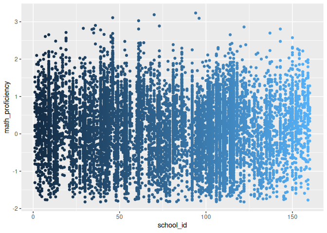
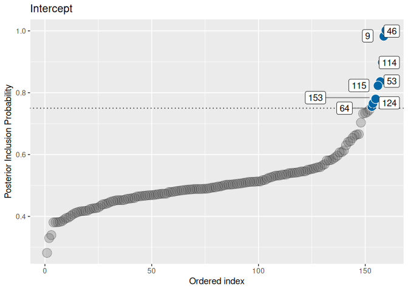
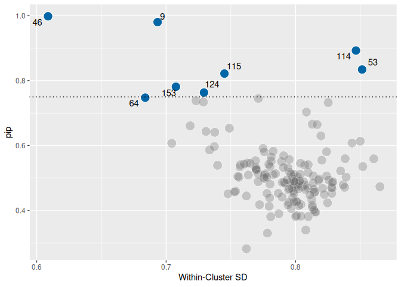
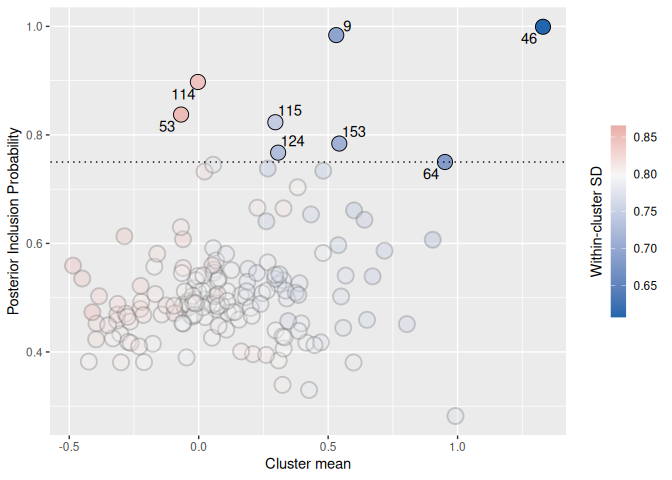
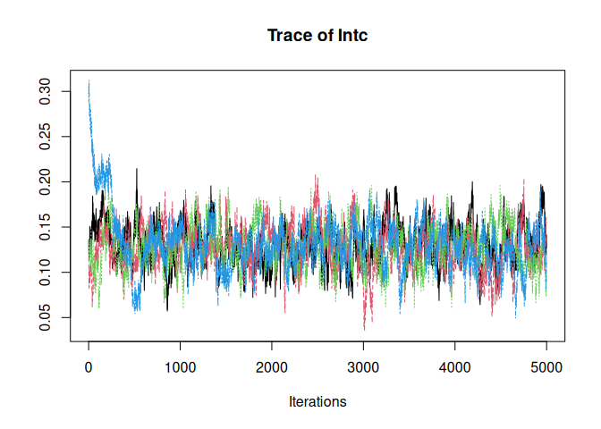
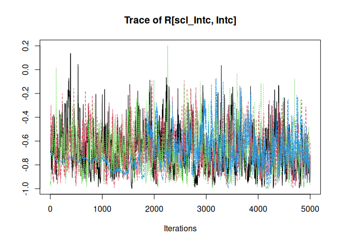

<!-- README.md is generated from README.Rmd. Please edit that file -->

<!-- knit with rmarkdown::render("README.Rmd", output_format = "md_document") -->

 \#
Individual Variance Detection

<!-- badges: start -->

[](https://github.com/consistentlyBetter/ivd/actions/workflows/R-CMD-check.yaml)
[](https://app.codecov.io/gh/consistentlyBetter/ivd)
<!-- badges: end -->

*ivd* is an R package for random effects selection in the scale part of
Mixed Effects Location Scale Modlels (MELSM). `ivd()` fits a random
intercepts model with a spike-and-slab prior on the random effects of
the scale.

## Installation

This package can be installed with

``` r
# install.packages("devtools")
# devtools::install_github("consistentlybetter/ivd")
```

## Example

``` r
library(ivd)
library(data.table)
#> 
#> Attaching package: 'data.table'
#> The following object is masked from 'package:base':
#> 
#>     %notin%
```

## Data

The illustration uses openly accessible data from The Basic Education
Evaluation System (Saeb) conducted by Brazil’s National Institute for
Educational Studies and Research (Inep), available at
<https://web.archive.org/web/20250202015037/https://www.gov.br/inep/pt-br/areas-de-atuacao/avaliacao-e-exames-educacionais/saeb/resultados>.
It is also available as the `saeb` dataset in the `ivd` package.

Separate within- from between-school effects. That is, besides
`student_ses`, compute `school_ses`.

``` r
## Calculate school-level SES
school_ses <- saeb[, .(school_ses = mean(student_ses, na.rm = TRUE)), by = school_id]

## Join the school_ses back to the original dataset
saeb <- saeb[school_ses, on = "school_id"]

## Define student level SES as deviation from the school SES
saeb$student_ses <- saeb$student_ses - saeb$school_ses

## Grand mean center school ses
saeb$school_ses <- c(scale(saeb$school_ses, scale = FALSE))
```

Illustration of school level variability:

``` r
library(ggplot2)
plot0 <- ggplot( data = saeb, aes( x = school_id, y = math_proficiency) )
plot0 + geom_point(aes(color =  school_id), show.legend =  FALSE)
```



## Estimate Model

We will predict `math_proficiency` which is a standardized variable
capturing math proficiency at the end of grade 12.

Both, location (means) and scale (residual variances) are modeled as a
function of student and school SES. Note that the formula objects for
both location and scale follow `lme4` notation.

``` r
out <- ivd(location_formula = math_proficiency ~ student_ses * school_ses + (1 | school_id),
           scale_formula =  ~ student_ses * school_ses + (1 | school_id),
           data = saeb,
           niter = 5000, nburnin = 6000,
           progress = TRUE,
           seed = 2026)
#> ivd: compiling and sampling 4 chains in parallel ...
```

The summary shows the fixed and random effects and it returns all
posterior inclusion probabilities (PIP) for each one of the 160 schools’
residual variance random effects. The PIP returns the probability of a
school belonging to the slab, that is, the probability of the model
having to include the random scale effect.

In other words, large PIP’s indicate schools that are substantially
deviating from the fixed scale effects either because they are much
*more* or much *less* variable compared to other schools in math
proficiency.

One can readily convert those PIP’s to odds, indicating that a school
with a PIP = .75 is three times as likely to belonging to the slab than
belonging to the spike. With an .50 inclusion prior, these odds can be
readily interpreted as Bayes Factors.

``` r
s_out <- summary(out)
#> Summary statistics for ivd model:
#> Chains (workers): 4 
#> 
#>                              Mean    SD Time-series SE   2.5%    50%  97.5%
#> R[scl_Intc, Intc]          -0.682 0.168          0.006 -0.941 -0.713 -0.301
#> Intc                        0.118 0.049          0.008 -0.073  0.127  0.174
#> student_ses                 0.082 0.010          0.000  0.063  0.082  0.101
#> school_ses                  0.657 0.111          0.010  0.368  0.667  0.832
#> student_ses:school_ses     -0.023 0.039          0.000 -0.100 -0.023  0.055
#> sd_Intc                     0.275 0.037          0.006  0.233  0.268  0.411
#> sd_scl_Intc                 0.155 0.344          0.100  0.052  0.080  1.545
#> pip[Intc, 1]                0.474 0.499          0.009  0.000  0.000  1.000
#> pip[Intc, 2]                0.508 0.500          0.011  0.000  1.000  1.000
#> pip[Intc, 3]                0.473 0.499          0.012  0.000  0.000  1.000
#> pip[Intc, 4]                0.494 0.500          0.009  0.000  0.000  1.000
#> pip[Intc, 5]                0.552 0.497          0.010  0.000  1.000  1.000
#> pip[Intc, 6]                0.453 0.498          0.013  0.000  0.000  1.000
#> pip[Intc, 7]                0.440 0.496          0.013  0.000  0.000  1.000
#> pip[Intc, 8]                0.487 0.500          0.012  0.000  0.000  1.000
#> pip[Intc, 9]                0.984 0.126          0.003  1.000  1.000  1.000
#> pip[Intc, 10]               0.467 0.499          0.012  0.000  0.000  1.000
#> pip[Intc, 11]               0.582 0.493          0.009  0.000  1.000  1.000
#> pip[Intc, 12]               0.390 0.488          0.014  0.000  0.000  1.000
#> pip[Intc, 13]               0.505 0.500          0.011  0.000  1.000  1.000
#> pip[Intc, 14]               0.608 0.488          0.010  0.000  1.000  1.000
#> pip[Intc, 15]               0.532 0.499          0.010  0.000  1.000  1.000
#> pip[Intc, 16]               0.502 0.500          0.012  0.000  1.000  1.000
#> pip[Intc, 17]               0.451 0.498          0.012  0.000  0.000  1.000
#> pip[Intc, 18]               0.553 0.497          0.010  0.000  1.000  1.000
#> pip[Intc, 19]               0.282 0.450          0.018  0.000  0.000  1.000
#> pip[Intc, 20]               0.546 0.498          0.010  0.000  1.000  1.000
#> pip[Intc, 21]               0.384 0.486          0.013  0.000  0.000  1.000
#> pip[Intc, 22]               0.591 0.492          0.009  0.000  1.000  1.000
#> pip[Intc, 23]               0.517 0.500          0.010  0.000  1.000  1.000
#> pip[Intc, 24]               0.497 0.500          0.011  0.000  0.000  1.000
#> pip[Intc, 25]               0.488 0.500          0.010  0.000  0.000  1.000
#> pip[Intc, 26]               0.535 0.499          0.009  0.000  1.000  1.000
#> pip[Intc, 27]               0.478 0.500          0.012  0.000  0.000  1.000
#> pip[Intc, 28]               0.396 0.489          0.009  0.000  0.000  1.000
#> pip[Intc, 29]               0.512 0.500          0.011  0.000  1.000  1.000
#> pip[Intc, 30]               0.479 0.500          0.012  0.000  0.000  1.000
#> pip[Intc, 31]               0.488 0.500          0.011  0.000  0.000  1.000
#> pip[Intc, 32]               0.511 0.500          0.011  0.000  1.000  1.000
#> pip[Intc, 33]               0.517 0.500          0.011  0.000  1.000  1.000
#> pip[Intc, 34]               0.565 0.496          0.010  0.000  1.000  1.000
#> pip[Intc, 35]               0.666 0.472          0.009  0.000  1.000  1.000
#> pip[Intc, 36]               0.395 0.489          0.011  0.000  0.000  1.000
#> pip[Intc, 37]               0.479 0.500          0.010  0.000  0.000  1.000
#> pip[Intc, 38]               0.453 0.498          0.009  0.000  0.000  1.000
#> pip[Intc, 39]               0.704 0.457          0.013  0.000  1.000  1.000
#> pip[Intc, 40]               0.490 0.500          0.012  0.000  0.000  1.000
#> pip[Intc, 41]               0.665 0.472          0.011  0.000  1.000  1.000
#> pip[Intc, 42]               0.489 0.500          0.011  0.000  0.000  1.000
#> pip[Intc, 43]               0.441 0.497          0.013  0.000  0.000  1.000
#> pip[Intc, 44]               0.464 0.499          0.013  0.000  0.000  1.000
#> pip[Intc, 45]               0.459 0.498          0.012  0.000  0.000  1.000
#> pip[Intc, 46]               0.999 0.027          0.000  1.000  1.000  1.000
#> pip[Intc, 47]               0.493 0.500          0.011  0.000  0.000  1.000
#> pip[Intc, 48]               0.613 0.487          0.009  0.000  1.000  1.000
#> pip[Intc, 49]               0.529 0.499          0.011  0.000  1.000  1.000
#> pip[Intc, 50]               0.531 0.499          0.008  0.000  1.000  1.000
#> pip[Intc, 51]               0.499 0.500          0.012  0.000  0.000  1.000
#> pip[Intc, 52]               0.551 0.497          0.008  0.000  1.000  1.000
#> pip[Intc, 53]               0.838 0.369          0.005  0.000  1.000  1.000
#> pip[Intc, 54]               0.630 0.483          0.008  0.000  1.000  1.000
#> pip[Intc, 55]               0.434 0.496          0.013  0.000  0.000  1.000
#> pip[Intc, 56]               0.501 0.500          0.011  0.000  1.000  1.000
#> pip[Intc, 57]               0.641 0.480          0.008  0.000  1.000  1.000
#> pip[Intc, 58]               0.425 0.494          0.011  0.000  0.000  1.000
#> pip[Intc, 59]               0.458 0.498          0.012  0.000  0.000  1.000
#> pip[Intc, 60]               0.540 0.498          0.010  0.000  1.000  1.000
#> pip[Intc, 61]               0.330 0.470          0.017  0.000  0.000  1.000
#> pip[Intc, 62]               0.444 0.497          0.013  0.000  0.000  1.000
#> pip[Intc, 63]               0.525 0.499          0.011  0.000  1.000  1.000
#> pip[Intc, 64]               0.750 0.433          0.005  0.000  1.000  1.000
#> pip[Intc, 65]               0.513 0.500          0.011  0.000  1.000  1.000
#> pip[Intc, 66]               0.661 0.473          0.008  0.000  1.000  1.000
#> pip[Intc, 67]               0.381 0.486          0.015  0.000  0.000  1.000
#> pip[Intc, 68]               0.406 0.491          0.014  0.000  0.000  1.000
#> pip[Intc, 69]               0.483 0.500          0.012  0.000  0.000  1.000
#> pip[Intc, 70]               0.429 0.495          0.012  0.000  0.000  1.000
#> pip[Intc, 71]               0.419 0.493          0.013  0.000  0.000  1.000
#> pip[Intc, 72]               0.415 0.493          0.014  0.000  0.000  1.000
#> pip[Intc, 73]               0.417 0.493          0.014  0.000  0.000  1.000
#> pip[Intc, 74]               0.503 0.500          0.007  0.000  1.000  1.000
#> pip[Intc, 75]               0.469 0.499          0.008  0.000  0.000  1.000
#> pip[Intc, 76]               0.471 0.499          0.010  0.000  0.000  1.000
#> pip[Intc, 77]               0.488 0.500          0.010  0.000  0.000  1.000
#> pip[Intc, 78]               0.469 0.499          0.012  0.000  0.000  1.000
#> pip[Intc, 79]               0.417 0.493          0.013  0.000  0.000  1.000
#> pip[Intc, 80]               0.513 0.500          0.004  0.000  1.000  1.000
#> pip[Intc, 81]               0.527 0.499          0.010  0.000  1.000  1.000
#> pip[Intc, 82]               0.545 0.498          0.010  0.000  1.000  1.000
#> pip[Intc, 83]               0.509 0.500          0.011  0.000  1.000  1.000
#> pip[Intc, 84]               0.522 0.500          0.008  0.000  1.000  1.000
#> pip[Intc, 85]               0.487 0.500          0.011  0.000  0.000  1.000
#> pip[Intc, 86]               0.539 0.498          0.011  0.000  1.000  1.000
#> pip[Intc, 87]               0.738 0.440          0.008  0.000  1.000  1.000
#> pip[Intc, 88]               0.503 0.500          0.010  0.000  1.000  1.000
#> pip[Intc, 89]               0.535 0.499          0.008  0.000  1.000  1.000
#> pip[Intc, 90]               0.486 0.500          0.005  0.000  0.000  1.000
#> pip[Intc, 91]               0.456 0.498          0.010  0.000  0.000  1.000
#> pip[Intc, 92]               0.733 0.443          0.007  0.000  1.000  1.000
#> pip[Intc, 93]               0.465 0.499          0.009  0.000  0.000  1.000
#> pip[Intc, 94]               0.507 0.500          0.011  0.000  1.000  1.000
#> pip[Intc, 95]               0.745 0.436          0.008  0.000  1.000  1.000
#> pip[Intc, 96]               0.465 0.499          0.011  0.000  0.000  1.000
#> pip[Intc, 97]               0.381 0.486          0.015  0.000  0.000  1.000
#> pip[Intc, 98]               0.488 0.500          0.011  0.000  0.000  1.000
#> pip[Intc, 99]               0.569 0.495          0.008  0.000  1.000  1.000
#> pip[Intc, 100]              0.468 0.499          0.010  0.000  0.000  1.000
#> pip[Intc, 101]              0.460 0.498          0.012  0.000  0.000  1.000
#> pip[Intc, 102]              0.532 0.499          0.010  0.000  1.000  1.000
#> pip[Intc, 103]              0.410 0.492          0.013  0.000  0.000  1.000
#> pip[Intc, 104]              0.482 0.500          0.012  0.000  0.000  1.000
#> pip[Intc, 105]              0.497 0.500          0.008  0.000  0.000  1.000
#> pip[Intc, 106]              0.473 0.499          0.012  0.000  0.000  1.000
#> pip[Intc, 107]              0.541 0.498          0.010  0.000  1.000  1.000
#> pip[Intc, 108]              0.557 0.497          0.011  0.000  1.000  1.000
#> pip[Intc, 109]              0.555 0.497          0.009  0.000  1.000  1.000
#> pip[Intc, 110]              0.426 0.495          0.013  0.000  0.000  1.000
#> pip[Intc, 111]              0.468 0.499          0.012  0.000  0.000  1.000
#> pip[Intc, 112]              0.471 0.499          0.010  0.000  0.000  1.000
#> pip[Intc, 113]              0.644 0.479          0.008  0.000  1.000  1.000
#> pip[Intc, 114]              0.897 0.303          0.004  0.000  1.000  1.000
#> pip[Intc, 115]              0.823 0.381          0.005  0.000  1.000  1.000
#> pip[Intc, 116]              0.481 0.500          0.012  0.000  0.000  1.000
#> pip[Intc, 117]              0.457 0.498          0.013  0.000  0.000  1.000
#> pip[Intc, 118]              0.418 0.493          0.014  0.000  0.000  1.000
#> pip[Intc, 119]              0.513 0.500          0.009  0.000  1.000  1.000
#> pip[Intc, 120]              0.581 0.493          0.009  0.000  1.000  1.000
#> pip[Intc, 121]              0.339 0.474          0.011  0.000  0.000  1.000
#> pip[Intc, 122]              0.559 0.496          0.011  0.000  1.000  1.000
#> pip[Intc, 123]              0.587 0.492          0.009  0.000  1.000  1.000
#> pip[Intc, 124]              0.767 0.423          0.006  0.000  1.000  1.000
#> pip[Intc, 125]              0.512 0.500          0.011  0.000  1.000  1.000
#> pip[Intc, 126]              0.506 0.500          0.009  0.000  1.000  1.000
#> pip[Intc, 127]              0.581 0.493          0.009  0.000  1.000  1.000
#> pip[Intc, 128]              0.541 0.498          0.010  0.000  1.000  1.000
#> pip[Intc, 129]              0.427 0.495          0.010  0.000  0.000  1.000
#> pip[Intc, 130]              0.485 0.500          0.011  0.000  0.000  1.000
#> pip[Intc, 131]              0.559 0.497          0.008  0.000  1.000  1.000
#> pip[Intc, 132]              0.423 0.494          0.011  0.000  0.000  1.000
#> pip[Intc, 133]              0.382 0.486          0.015  0.000  0.000  1.000
#> pip[Intc, 134]              0.535 0.499          0.010  0.000  1.000  1.000
#> pip[Intc, 135]              0.452 0.498          0.013  0.000  0.000  1.000
#> pip[Intc, 136]              0.401 0.490          0.009  0.000  0.000  1.000
#> pip[Intc, 137]              0.467 0.499          0.011  0.000  0.000  1.000
#> pip[Intc, 138]              0.448 0.497          0.010  0.000  0.000  1.000
#> pip[Intc, 139]              0.449 0.497          0.011  0.000  0.000  1.000
#> pip[Intc, 140]              0.597 0.491          0.009  0.000  1.000  1.000
#> pip[Intc, 141]              0.545 0.498          0.010  0.000  1.000  1.000
#> pip[Intc, 142]              0.503 0.500          0.010  0.000  1.000  1.000
#> pip[Intc, 143]              0.439 0.496          0.013  0.000  0.000  1.000
#> pip[Intc, 144]              0.491 0.500          0.010  0.000  0.000  1.000
#> pip[Intc, 145]              0.473 0.499          0.011  0.000  0.000  1.000
#> pip[Intc, 146]              0.484 0.500          0.011  0.000  0.000  1.000
#> pip[Intc, 147]              0.512 0.500          0.011  0.000  1.000  1.000
#> pip[Intc, 148]              0.653 0.476          0.007  0.000  1.000  1.000
#> pip[Intc, 149]              0.734 0.442          0.006  0.000  1.000  1.000
#> pip[Intc, 150]              0.413 0.492          0.013  0.000  0.000  1.000
#> pip[Intc, 151]              0.490 0.500          0.009  0.000  0.000  1.000
#> pip[Intc, 152]              0.494 0.500          0.012  0.000  0.000  1.000
#> pip[Intc, 153]              0.784 0.411          0.005  0.000  1.000  1.000
#> pip[Intc, 154]              0.381 0.486          0.015  0.000  0.000  1.000
#> pip[Intc, 155]              0.453 0.498          0.013  0.000  0.000  1.000
#> pip[Intc, 156]              0.607 0.488          0.009  0.000  1.000  1.000
#> pip[Intc, 157]              0.542 0.498          0.009  0.000  1.000  1.000
#> pip[Intc, 158]              0.489 0.500          0.012  0.000  0.000  1.000
#> pip[Intc, 159]              0.505 0.500          0.011  0.000  1.000  1.000
#> pip[Intc, 160]              0.543 0.498          0.010  0.000  1.000  1.000
#> scl_Intc                   -0.178 0.260          0.076 -0.250 -0.234  0.884
#> scl_student_ses             0.031 0.009          0.000  0.014  0.031  0.048
#> scl_school_ses              0.205 0.380          0.126  0.052  0.122  1.832
#> scl_student_ses:school_ses  0.075 0.037          0.001  0.004  0.075  0.147
#>                            n_eff R-hat
#> R[scl_Intc, Intc]            306 1.016
#> Intc                          14 1.253
#> student_ses                18754 1.000
#> school_ses                    24 1.069
#> student_ses:school_ses     18154 1.000
#> sd_Intc                       12 1.224
#> sd_scl_Intc                    9 1.261
#> pip[Intc, 1]                 209 1.000
#> pip[Intc, 2]                 112 1.013
#> pip[Intc, 3]                 106 1.010
#> pip[Intc, 4]                 160 1.003
#> pip[Intc, 5]                 161 1.010
#> pip[Intc, 6]                  95 1.012
#> pip[Intc, 7]                 103 1.015
#> pip[Intc, 8]                 111 1.011
#> pip[Intc, 9]                 450 1.001
#> pip[Intc, 10]                100 1.012
#> pip[Intc, 11]                178 1.009
#> pip[Intc, 12]                 66 1.017
#> pip[Intc, 13]                118 1.013
#> pip[Intc, 14]                275 1.001
#> pip[Intc, 15]                130 1.010
#> pip[Intc, 16]                113 1.011
#> pip[Intc, 17]                 94 1.015
#> pip[Intc, 18]                152 1.008
#> pip[Intc, 19]                 46 1.025
#> pip[Intc, 20]                135 1.012
#> pip[Intc, 21]                 68 1.012
#> pip[Intc, 22]                179 1.009
#> pip[Intc, 23]                147 1.010
#> pip[Intc, 24]                130 1.010
#> pip[Intc, 25]                145 1.008
#> pip[Intc, 26]                144 1.008
#> pip[Intc, 27]                107 1.012
#> pip[Intc, 28]                201 1.001
#> pip[Intc, 29]                119 1.011
#> pip[Intc, 30]                100 1.011
#> pip[Intc, 31]                120 1.009
#> pip[Intc, 32]                102 1.011
#> pip[Intc, 33]                128 1.009
#> pip[Intc, 34]                154 1.010
#> pip[Intc, 35]                171 1.002
#> pip[Intc, 36]                 97 1.007
#> pip[Intc, 37]                288 1.007
#> pip[Intc, 38]                209 1.001
#> pip[Intc, 39]                132 1.002
#> pip[Intc, 40]                100 1.010
#> pip[Intc, 41]                163 1.006
#> pip[Intc, 42]                103 1.012
#> pip[Intc, 43]                105 1.016
#> pip[Intc, 44]                104 1.017
#> pip[Intc, 45]                 97 1.014
#> pip[Intc, 46]              20101 1.000
#> pip[Intc, 47]                126 1.010
#> pip[Intc, 48]                236 1.001
#> pip[Intc, 49]                143 1.016
#> pip[Intc, 50]                221 1.002
#> pip[Intc, 51]                103 1.010
#> pip[Intc, 52]                206 1.003
#> pip[Intc, 53]                669 1.002
#> pip[Intc, 54]                235 1.005
#> pip[Intc, 55]                 99 1.011
#> pip[Intc, 56]                117 1.016
#> pip[Intc, 57]                211 1.009
#> pip[Intc, 58]                105 1.007
#> pip[Intc, 59]                110 1.009
#> pip[Intc, 60]                134 1.009
#> pip[Intc, 61]                 55 1.027
#> pip[Intc, 62]                 86 1.013
#> pip[Intc, 63]                128 1.010
#> pip[Intc, 64]                314 1.005
#> pip[Intc, 65]                116 1.011
#> pip[Intc, 66]                210 1.008
#> pip[Intc, 67]                 68 1.017
#> pip[Intc, 68]                 75 1.012
#> pip[Intc, 69]                107 1.012
#> pip[Intc, 70]                 84 1.011
#> pip[Intc, 71]                 85 1.013
#> pip[Intc, 72]                 87 1.018
#> pip[Intc, 73]                 92 1.017
#> pip[Intc, 74]                387 1.001
#> pip[Intc, 75]                271 1.001
#> pip[Intc, 76]                155 1.003
#> pip[Intc, 77]                158 1.007
#> pip[Intc, 78]                107 1.012
#> pip[Intc, 79]                 75 1.011
#> pip[Intc, 80]               1067 1.002
#> pip[Intc, 81]                107 1.009
#> pip[Intc, 82]                118 1.011
#> pip[Intc, 83]                132 1.013
#> pip[Intc, 84]                216 1.002
#> pip[Intc, 85]                110 1.010
#> pip[Intc, 86]                142 1.014
#> pip[Intc, 87]                331 1.005
#> pip[Intc, 88]                132 1.011
#> pip[Intc, 89]                262 1.000
#> pip[Intc, 90]               2082 1.001
#> pip[Intc, 91]                141 1.004
#> pip[Intc, 92]                455 1.007
#> pip[Intc, 93]                132 1.007
#> pip[Intc, 94]                120 1.008
#> pip[Intc, 95]                245 1.000
#> pip[Intc, 96]                129 1.009
#> pip[Intc, 97]                 65 1.016
#> pip[Intc, 98]                116 1.012
#> pip[Intc, 99]                212 1.001
#> pip[Intc, 100]               170 1.002
#> pip[Intc, 101]                99 1.012
#> pip[Intc, 102]               195 1.016
#> pip[Intc, 103]                86 1.015
#> pip[Intc, 104]               104 1.012
#> pip[Intc, 105]               244 1.001
#> pip[Intc, 106]                91 1.012
#> pip[Intc, 107]               141 1.012
#> pip[Intc, 108]                94 1.002
#> pip[Intc, 109]               155 1.006
#> pip[Intc, 110]                95 1.018
#> pip[Intc, 111]               106 1.013
#> pip[Intc, 112]               268 1.004
#> pip[Intc, 113]               221 1.007
#> pip[Intc, 114]              2140 1.002
#> pip[Intc, 115]               763 1.004
#> pip[Intc, 116]               114 1.017
#> pip[Intc, 117]                90 1.013
#> pip[Intc, 118]                72 1.012
#> pip[Intc, 119]               131 1.004
#> pip[Intc, 120]               157 1.008
#> pip[Intc, 121]               103 1.001
#> pip[Intc, 122]               572 1.005
#> pip[Intc, 123]               163 1.008
#> pip[Intc, 124]               291 1.005
#> pip[Intc, 125]               118 1.013
#> pip[Intc, 126]               207 1.001
#> pip[Intc, 127]               197 1.008
#> pip[Intc, 128]               140 1.009
#> pip[Intc, 129]               129 1.003
#> pip[Intc, 130]               139 1.010
#> pip[Intc, 131]               268 1.000
#> pip[Intc, 132]               102 1.010
#> pip[Intc, 133]                67 1.014
#> pip[Intc, 134]               120 1.010
#> pip[Intc, 135]               100 1.014
#> pip[Intc, 136]               184 1.002
#> pip[Intc, 137]               104 1.013
#> pip[Intc, 138]               153 1.003
#> pip[Intc, 139]               101 1.008
#> pip[Intc, 140]               152 1.008
#> pip[Intc, 141]               139 1.009
#> pip[Intc, 142]               122 1.008
#> pip[Intc, 143]                87 1.012
#> pip[Intc, 144]               135 1.009
#> pip[Intc, 145]               166 1.002
#> pip[Intc, 146]               106 1.010
#> pip[Intc, 147]               115 1.010
#> pip[Intc, 148]               231 1.004
#> pip[Intc, 149]               351 1.006
#> pip[Intc, 150]                76 1.014
#> pip[Intc, 151]               153 1.007
#> pip[Intc, 152]               116 1.011
#> pip[Intc, 153]               419 1.006
#> pip[Intc, 154]                70 1.013
#> pip[Intc, 155]                79 1.014
#> pip[Intc, 156]               155 1.010
#> pip[Intc, 157]               203 1.002
#> pip[Intc, 158]                98 1.010
#> pip[Intc, 159]                90 1.010
#> pip[Intc, 160]               132 1.010
#> scl_Intc                       7 1.245
#> scl_student_ses             1957 1.000
#> scl_school_ses                 7 1.284
#> scl_student_ses:school_ses  4078 1.001
#> 
#> WAIC: 27053.62 
#> elppd: -13359.37 
#> pWAIC: 167.4392
```

## Plots

### Posterior inclusion probability plot (PIP)

``` r
plot(out, type = "pip")
```



### PIP vs. Within-cluster SD

``` r
plot(out, type =  "funnel")
```



### PIP vs. math achievement

``` r
plot(out, type =  "outcome")
```



### Diagnostic plots based on coda plots:

``` r
codaplot(out, parameters =  "Intc")
```



``` r
codaplot(out, parameters =  "R[scl_Intc, Intc]")
```



## Acknowledgment

This work was supported by the Tools Competition catalyst award for the
project
[consistentlyBetter](https://tools-competition.org/winner/consistentlybetter/)
to PR. The content is solely the responsibility of the authors and does
not necessarily represent the official views of the funding agency.

## References

<div id="refs" class="references csl-bib-body hanging-indent"
entry-spacing="0" line-spacing="2">

<div id="ref-rodriguez2021" class="csl-entry">

Rodriguez, J. E., Williams, D. R., & Rast, P. (2024). Who is and is not"
average’"? Random effects selection with spike-and-slab priors.
*Psychological Methods*. <https://doi.org/10.1037/met0000535>

</div>

<div id="ref-williams2022" class="csl-entry">

Williams, D. R., Martin, S. R., & Rast, P. (2022). Putting the
individual into reliability: Bayesian testing of homogeneous
within-person variance in hierarchical models. *Behavior Research
Methods*, *54*(3), 1272–1290.
<https://doi.org/10.3758/s13428-021-01646-x>

</div>

</div>
