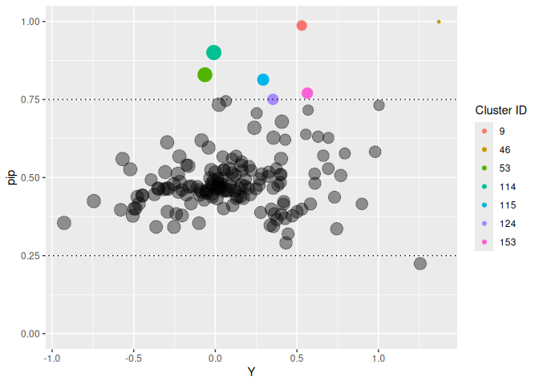

<!-- README.md is generated from README.Rmd. Please edit that file -->
<!-- knit with rmarkdown::render("README.Rmd", output_format = "md_document") -->

 \#
Individual Variance Detection

<!-- badges: start -->

<!-- badges: end -->

*ivd* is an R package for random effects selection in the scale part of
Mixed Effects Location Scale Modlels (MELSM). `ivd()` fits a random
intercepts model with a spike-and-slab prior on the random effects of
the scale.

## Installation

This package can be installed with

    # install.packages("devtools")
    devtools::install_github("consistentlybetter/ivd")

## Example

    library(ivd)
    library(data.table)

## Data

The illustration uses openly accessible data from The Basic Education
Evaluation System (Saeb) conducted by Brazil’s National Institute for
Educational Studies and Research (Inep), available at
<https://web.archive.org/web/20250202015037/https://www.gov.br/inep/pt-br/areas-de-atuacao/avaliacao-e-exames-educacionais/saeb/resultados>.
It is also available as the `saeb` dataset in the `ivd` package.

Separate within- from between-school effects. That is, besides
`student_ses`, compute `school_ses`.

    ## Calculate school-level SES
    school_ses <- saeb[, .(school_ses = mean(student_ses, na.rm = TRUE)), by = school_id]

    ## Join the school_ses back to the original dataset
    saeb <- saeb[school_ses, on = "school_id"]

    ## Define student level SES as deviation from the school SES
    saeb$student_ses <- saeb$student_ses - saeb$school_ses

    ## Grand mean center school ses
    saeb$school_ses <- c(scale(saeb$school_ses, scale = FALSE))

Illustration of school level variability:

    library(ggplot2)
    plot0 <- ggplot( data = saeb, aes( x = school_id, y = math_proficiency) )
    plot0 + geom_point(aes(color =  school_id), show.legend =  FALSE)

## Estimate Model

We will predict `math_proficiency` which is a standardized variable
capturing math proficiency at the end of grade 12.

Both, location (means) and scale (residual variances) are modeled as a
function of student and school SES. Note that the formula objects for
both location and scale follow `lme4` notation.

    out <- ivd(location_formula = math_proficiency ~ student_ses * school_ses + (1 | school_id),
               scale_formula =  ~ student_ses * school_ses + (1 | school_id),
               data = saeb,
               niter = 2000, nburnin = 4000, WAIC = TRUE, workers = 6)
    #> ===== Monitors =====
    #> thin = 1: beta, sigma_rand, ss, Ustar, z, zeta
    #> ===== Samplers =====
    #> RW_lkj_corr_cholesky sampler (1)
    #>   - Ustar[1:2, 1:2] 
    #> RW sampler (326)
    #>   - z[]  (320 elements)
    #>   - zeta[]  (4 elements)
    #>   - sigma_rand[]  (2 elements)
    #> conjugate sampler (4)
    #>   - beta[]  (4 elements)
    #> binary sampler (320)
    #>   - ss[]  (320 elements)
    #> thin = 1: beta, mu, R, sigma_rand, ss, tau, u, zeta
    #> |-------------|-------------|-------------|-------------|
    #> |-------------------------------------------------------|
    #>   [Warning] There are 30 individual pWAIC values that are greater than 0.4. This may indicate that the WAIC estimate is unstable (Vehtari et al., 2017), at least in cases without grouping of data nodes or multivariate data nodes.
    #> Defining model
    #> Building model
    #> Setting data and initial values
    #>   [Note] 'Z' is provided in 'data' but is not a variable in the model and is being ignored.
    #>   [Note] 'Z_scale' is provided in 'data' but is not a variable in the model and is being ignored.
    #> Running calculate on model
    #>   [Note] Any error reports that follow may simply reflect missing values in model variables.
    #> Checking model sizes and dimensions
    #>   [Note] This model is not fully initialized. This is not an error.
    #>          To see which variables are not initialized, use model$initializeInfo().
    #>          For more information on model initialization, see help(modelInitialization).
    #> Compiling
    #>   [Note] This may take a minute.
    #>   [Note] Use 'showCompilerOutput = TRUE' to see C++ compilation details.
    #> Compiling
    #>   [Note] This may take a minute.
    #>   [Note] Use 'showCompilerOutput = TRUE' to see C++ compilation details.
    #>   [Note] 'Z' is provided in 'data' but is not a variable in the model and is being ignored.
    #>   [Note] 'Z_scale' is provided in 'data' but is not a variable in the model and is being ignored.
    #> running chain 1...
    #> ===== Monitors =====
    #> thin = 1: beta, sigma_rand, ss, Ustar, z, zeta
    #> ===== Samplers =====
    #> RW_lkj_corr_cholesky sampler (1)
    #>   - Ustar[1:2, 1:2] 
    #> RW sampler (326)
    #>   - z[]  (320 elements)
    #>   - zeta[]  (4 elements)
    #>   - sigma_rand[]  (2 elements)
    #> conjugate sampler (4)
    #>   - beta[]  (4 elements)
    #> binary sampler (320)
    #>   - ss[]  (320 elements)
    #> thin = 1: beta, mu, R, sigma_rand, ss, tau, u, zeta
    #> warning: logProb of data node Y[9076]: logProb less than -1e12.
    #> |-------------|-------------|-------------|-------------|
    #> |-------------------------------------------------------|
    #>   [Warning] There are 4 individual pWAIC values that are greater than 0.4. This may indicate that the WAIC estimate is unstable (Vehtari et al., 2017), at least in cases without grouping of data nodes or multivariate data nodes.
    #> Defining model
    #> Building model
    #> Setting data and initial values
    #>   [Note] 'Z' is provided in 'data' but is not a variable in the model and is being ignored.
    #>   [Note] 'Z_scale' is provided in 'data' but is not a variable in the model and is being ignored.
    #> Running calculate on model
    #>   [Note] Any error reports that follow may simply reflect missing values in model variables.
    #> Checking model sizes and dimensions
    #>   [Note] This model is not fully initialized. This is not an error.
    #>          To see which variables are not initialized, use model$initializeInfo().
    #>          For more information on model initialization, see help(modelInitialization).
    #> Compiling
    #>   [Note] This may take a minute.
    #>   [Note] Use 'showCompilerOutput = TRUE' to see C++ compilation details.
    #> Compiling
    #>   [Note] This may take a minute.
    #>   [Note] Use 'showCompilerOutput = TRUE' to see C++ compilation details.
    #>   [Note] 'Z' is provided in 'data' but is not a variable in the model and is being ignored.
    #>   [Note] 'Z_scale' is provided in 'data' but is not a variable in the model and is being ignored.
    #> running chain 1...
    #> ===== Monitors =====
    #> thin = 1: beta, sigma_rand, ss, Ustar, z, zeta
    #> ===== Samplers =====
    #> RW_lkj_corr_cholesky sampler (1)
    #>   - Ustar[1:2, 1:2] 
    #> RW sampler (326)
    #>   - z[]  (320 elements)
    #>   - zeta[]  (4 elements)
    #>   - sigma_rand[]  (2 elements)
    #> conjugate sampler (4)
    #>   - beta[]  (4 elements)
    #> binary sampler (320)
    #>   - ss[]  (320 elements)
    #> thin = 1: beta, mu, R, sigma_rand, ss, tau, u, zeta
    #> warning: logProb of data node Y[2425]: logProb less than -1e12.
    #> warning: logProb of data node Y[2434]: logProb less than -1e12.
    #> warning: logProb of data node Y[2698]: logProb less than -1e12.
    #> warning: logProb of data node Y[2747]: logProb less than -1e12.
    #> warning: logProb of data node Y[4879]: logProb less than -1e12.
    #> warning: logProb of data node Y[4883]: logProb less than -1e12.
    #> warning: logProb of data node Y[4884]: logProb less than -1e12.
    #> warning: logProb of data node Y[4885]: logProb less than -1e12.
    #> warning: logProb of data node Y[4886]: logProb less than -1e12.
    #> warning: logProb of data node Y[4888]: logProb less than -1e12.
    #> warning: logProb of data node Y[4889]: logProb less than -1e12.
    #> warning: logProb of data node Y[4890]: logProb less than -1e12.
    #> warning: logProb of data node Y[4891]: logProb less than -1e12.
    #> warning: logProb of data node Y[4892]: logProb less than -1e12.
    #> warning: logProb of data node Y[4894]: logProb less than -1e12.
    #> warning: logProb of data node Y[4895]: logProb less than -1e12.
    #> warning: logProb of data node Y[4896]: logProb less than -1e12.
    #> warning: logProb of data node Y[4897]: logProb less than -1e12.
    #> warning: logProb of data node Y[4898]: logProb less than -1e12.
    #> warning: logProb of data node Y[4899]: logProb less than -1e12.
    #> warning: logProb of data node Y[4900]: logProb less than -1e12.
    #> warning: logProb of data node Y[4901]: logProb less than -1e12.
    #> warning: logProb of data node Y[4902]: logProb less than -1e12.
    #> warning: logProb of data node Y[4904]: logProb less than -1e12.
    #> warning: logProb of data node Y[4905]: logProb less than -1e12.
    #> warning: logProb of data node Y[4907]: logProb less than -1e12.
    #> warning: logProb of data node Y[4908]: logProb less than -1e12.
    #> warning: logProb of data node Y[4909]: logProb less than -1e12.
    #> warning: logProb of data node Y[4911]: logProb less than -1e12.
    #> warning: logProb of data node Y[4913]: logProb less than -1e12.
    #> warning: logProb of data node Y[4914]: logProb less than -1e12.
    #> warning: logProb of data node Y[5768]: logProb less than -1e12.
    #> warning: logProb of data node Y[10501]: logProb less than -1e12.
    #> warning: logProb of data node Y[10504]: logProb less than -1e12.
    #> warning: logProb of data node Y[10505]: logProb less than -1e12.
    #> warning: logProb of data node Y[10509]: logProb less than -1e12.
    #> warning: logProb of data node Y[10510]: logProb less than -1e12.
    #> warning: logProb of data node Y[10512]: logProb less than -1e12.
    #> warning: logProb of data node Y[10513]: logProb less than -1e12.
    #> warning: logProb of data node Y[10514]: logProb less than -1e12.
    #> warning: logProb of data node Y[10515]: logProb less than -1e12.
    #> warning: logProb of data node Y[10517]: logProb less than -1e12.
    #> warning: logProb of data node Y[10518]: logProb less than -1e12.
    #> warning: logProb of data node Y[10521]: logProb less than -1e12.
    #> warning: logProb of data node Y[10523]: logProb less than -1e12.
    #> warning: logProb of data node Y[10524]: logProb less than -1e12.
    #> warning: logProb of data node Y[10526]: logProb less than -1e12.
    #> warning: logProb of data node Y[10528]: logProb less than -1e12.
    #> warning: logProb of data node Y[10529]: logProb less than -1e12.
    #> warning: logProb of data node Y[10530]: logProb less than -1e12.
    #> warning: logProb of data node Y[10531]: logProb less than -1e12.
    #> warning: logProb of data node Y[10532]: logProb less than -1e12.
    #> warning: logProb of data node Y[10534]: logProb less than -1e12.
    #> warning: logProb of data node Y[10535]: logProb less than -1e12.
    #> warning: logProb of data node Y[10536]: logProb less than -1e12.
    #> warning: logProb of data node Y[10538]: logProb less than -1e12.
    #> warning: logProb of data node Y[10540]: logProb less than -1e12.
    #> warning: logProb of data node Y[10541]: logProb less than -1e12.
    #> warning: logProb of data node Y[10543]: logProb less than -1e12.
    #> warning: logProb of data node Y[10544]: logProb less than -1e12.
    #> warning: logProb of data node Y[10546]: logProb less than -1e12.
    #> warning: logProb of data node Y[10548]: logProb less than -1e12.
    #> warning: logProb of data node Y[10549]: logProb less than -1e12.
    #> warning: logProb of data node Y[10550]: logProb less than -1e12.
    #> warning: logProb of data node Y[10551]: logProb less than -1e12.
    #> warning: logProb of data node Y[10552]: logProb less than -1e12.
    #> warning: logProb of data node Y[10554]: logProb less than -1e12.
    #> warning: logProb of data node Y[10555]: logProb less than -1e12.
    #> warning: logProb of data node Y[10556]: logProb less than -1e12.
    #> warning: logProb of data node Y[10557]: logProb less than -1e12.
    #> warning: logProb of data node Y[10558]: logProb less than -1e12.
    #> warning: logProb of data node Y[10560]: logProb less than -1e12.
    #> warning: logProb of data node Y[10561]: logProb less than -1e12.
    #> warning: logProb of data node Y[10564]: logProb less than -1e12.
    #> warning: logProb of data node Y[10566]: logProb less than -1e12.
    #> warning: logProb of data node Y[10567]: logProb less than -1e12.
    #> warning: logProb of data node Y[10568]: logProb less than -1e12.
    #> warning: logProb of data node Y[10570]: logProb less than -1e12.
    #> warning: logProb of data node Y[10571]: logProb less than -1e12.
    #> warning: logProb of data node Y[10572]: logProb less than -1e12.
    #> warning: logProb of data node Y[10573]: logProb less than -1e12.
    #> warning: logProb of data node Y[10575]: logProb less than -1e12.
    #> warning: logProb of data node Y[10576]: logProb less than -1e12.
    #> warning: logProb of data node Y[10578]: logProb less than -1e12.
    #> warning: logProb of data node Y[10582]: logProb less than -1e12.
    #> warning: logProb of data node Y[10583]: logProb less than -1e12.
    #> warning: logProb of data node Y[10584]: logProb less than -1e12.
    #> warning: logProb of data node Y[10586]: logProb less than -1e12.
    #> warning: logProb of data node Y[10587]: logProb less than -1e12.
    #> warning: logProb of data node Y[10588]: logProb less than -1e12.
    #> warning: logProb of data node Y[10590]: logProb less than -1e12.
    #> warning: logProb of data node Y[10591]: logProb less than -1e12.
    #> warning: logProb of data node Y[10592]: logProb less than -1e12.
    #> warning: logProb of data node Y[10593]: logProb less than -1e12.
    #> warning: logProb of data node Y[10594]: logProb less than -1e12.
    #> warning: logProb of data node Y[10595]: logProb less than -1e12.
    #> |-------------|-------------|-------------|-------------|
    #> |-------------------------------------------------------|
    #>   [Warning] There are 4 individual pWAIC values that are greater than 0.4. This may indicate that the WAIC estimate is unstable (Vehtari et al., 2017), at least in cases without grouping of data nodes or multivariate data nodes.
    #> Defining model
    #> Building model
    #> Setting data and initial values
    #>   [Note] 'Z' is provided in 'data' but is not a variable in the model and is being ignored.
    #>   [Note] 'Z_scale' is provided in 'data' but is not a variable in the model and is being ignored.
    #> Running calculate on model
    #>   [Note] Any error reports that follow may simply reflect missing values in model variables.
    #> Checking model sizes and dimensions
    #>   [Note] This model is not fully initialized. This is not an error.
    #>          To see which variables are not initialized, use model$initializeInfo().
    #>          For more information on model initialization, see help(modelInitialization).
    #> Compiling
    #>   [Note] This may take a minute.
    #>   [Note] Use 'showCompilerOutput = TRUE' to see C++ compilation details.
    #> Compiling
    #>   [Note] This may take a minute.
    #>   [Note] Use 'showCompilerOutput = TRUE' to see C++ compilation details.
    #>   [Note] 'Z' is provided in 'data' but is not a variable in the model and is being ignored.
    #>   [Note] 'Z_scale' is provided in 'data' but is not a variable in the model and is being ignored.
    #> running chain 1...
    #> ===== Monitors =====
    #> thin = 1: beta, sigma_rand, ss, Ustar, z, zeta
    #> ===== Samplers =====
    #> RW_lkj_corr_cholesky sampler (1)
    #>   - Ustar[1:2, 1:2] 
    #> RW sampler (326)
    #>   - z[]  (320 elements)
    #>   - zeta[]  (4 elements)
    #>   - sigma_rand[]  (2 elements)
    #> conjugate sampler (4)
    #>   - beta[]  (4 elements)
    #> binary sampler (320)
    #>   - ss[]  (320 elements)
    #> thin = 1: beta, mu, R, sigma_rand, ss, tau, u, zeta
    #> |-------------|-------------|-------------|-------------|
    #> |-------------------------------------------------------|
    #>   [Warning] There are 3 individual pWAIC values that are greater than 0.4. This may indicate that the WAIC estimate is unstable (Vehtari et al., 2017), at least in cases without grouping of data nodes or multivariate data nodes.
    #> Defining model
    #> Building model
    #> Setting data and initial values
    #>   [Note] 'Z' is provided in 'data' but is not a variable in the model and is being ignored.
    #>   [Note] 'Z_scale' is provided in 'data' but is not a variable in the model and is being ignored.
    #> Running calculate on model
    #>   [Note] Any error reports that follow may simply reflect missing values in model variables.
    #> Checking model sizes and dimensions
    #>   [Note] This model is not fully initialized. This is not an error.
    #>          To see which variables are not initialized, use model$initializeInfo().
    #>          For more information on model initialization, see help(modelInitialization).
    #> Compiling
    #>   [Note] This may take a minute.
    #>   [Note] Use 'showCompilerOutput = TRUE' to see C++ compilation details.
    #> Compiling
    #>   [Note] This may take a minute.
    #>   [Note] Use 'showCompilerOutput = TRUE' to see C++ compilation details.
    #>   [Note] 'Z' is provided in 'data' but is not a variable in the model and is being ignored.
    #>   [Note] 'Z_scale' is provided in 'data' but is not a variable in the model and is being ignored.
    #> running chain 1...
    #> ===== Monitors =====
    #> thin = 1: beta, sigma_rand, ss, Ustar, z, zeta
    #> ===== Samplers =====
    #> RW_lkj_corr_cholesky sampler (1)
    #>   - Ustar[1:2, 1:2] 
    #> RW sampler (326)
    #>   - z[]  (320 elements)
    #>   - zeta[]  (4 elements)
    #>   - sigma_rand[]  (2 elements)
    #> conjugate sampler (4)
    #>   - beta[]  (4 elements)
    #> binary sampler (320)
    #>   - ss[]  (320 elements)
    #> thin = 1: beta, mu, R, sigma_rand, ss, tau, u, zeta
    #> |-------------|-------------|-------------|-------------|
    #> |-------------------------------------------------------|
    #>   [Warning] There are 3 individual pWAIC values that are greater than 0.4. This may indicate that the WAIC estimate is unstable (Vehtari et al., 2017), at least in cases without grouping of data nodes or multivariate data nodes.
    #> Defining model
    #> Building model
    #> Setting data and initial values
    #>   [Note] 'Z' is provided in 'data' but is not a variable in the model and is being ignored.
    #>   [Note] 'Z_scale' is provided in 'data' but is not a variable in the model and is being ignored.
    #> Running calculate on model
    #>   [Note] Any error reports that follow may simply reflect missing values in model variables.
    #> Checking model sizes and dimensions
    #>   [Note] This model is not fully initialized. This is not an error.
    #>          To see which variables are not initialized, use model$initializeInfo().
    #>          For more information on model initialization, see help(modelInitialization).
    #> Compiling
    #>   [Note] This may take a minute.
    #>   [Note] Use 'showCompilerOutput = TRUE' to see C++ compilation details.
    #> Compiling
    #>   [Note] This may take a minute.
    #>   [Note] Use 'showCompilerOutput = TRUE' to see C++ compilation details.
    #>   [Note] 'Z' is provided in 'data' but is not a variable in the model and is being ignored.
    #>   [Note] 'Z_scale' is provided in 'data' but is not a variable in the model and is being ignored.
    #> running chain 1...
    #> ===== Monitors =====
    #> thin = 1: beta, sigma_rand, ss, Ustar, z, zeta
    #> ===== Samplers =====
    #> RW_lkj_corr_cholesky sampler (1)
    #>   - Ustar[1:2, 1:2] 
    #> RW sampler (326)
    #>   - z[]  (320 elements)
    #>   - zeta[]  (4 elements)
    #>   - sigma_rand[]  (2 elements)
    #> conjugate sampler (4)
    #>   - beta[]  (4 elements)
    #> binary sampler (320)
    #>   - ss[]  (320 elements)
    #> thin = 1: beta, mu, R, sigma_rand, ss, tau, u, zeta
    #> warning: logProb of data node Y[2698]: logProb less than -1e12.
    #> warning: logProb of data node Y[3289]: logProb less than -1e12.
    #> warning: logProb of data node Y[3897]: logProb less than -1e12.
    #> warning: logProb of data node Y[5135]: logProb less than -1e12.
    #> warning: logProb of data node Y[5136]: logProb less than -1e12.
    #> warning: logProb of data node Y[5137]: logProb less than -1e12.
    #> warning: logProb of data node Y[5138]: logProb less than -1e12.
    #> warning: logProb of data node Y[5139]: logProb less than -1e12.
    #> warning: logProb of data node Y[5140]: logProb less than -1e12.
    #> warning: logProb of data node Y[5142]: logProb less than -1e12.
    #> warning: logProb of data node Y[5143]: logProb less than -1e12.
    #> warning: logProb of data node Y[5144]: logProb less than -1e12.
    #> warning: logProb of data node Y[5145]: logProb less than -1e12.
    #> warning: logProb of data node Y[5148]: logProb less than -1e12.
    #> warning: logProb of data node Y[5149]: logProb less than -1e12.
    #> warning: logProb of data node Y[5151]: logProb less than -1e12.
    #> warning: logProb of data node Y[5152]: logProb less than -1e12.
    #> warning: logProb of data node Y[5153]: logProb less than -1e12.
    #> warning: logProb of data node Y[5154]: logProb less than -1e12.
    #> warning: logProb of data node Y[5155]: logProb less than -1e12.
    #> warning: logProb of data node Y[5156]: logProb less than -1e12.
    #> warning: logProb of data node Y[5157]: logProb less than -1e12.
    #> warning: logProb of data node Y[5158]: logProb less than -1e12.
    #> warning: logProb of data node Y[5159]: logProb less than -1e12.
    #> warning: logProb of data node Y[5161]: logProb less than -1e12.
    #> warning: logProb of data node Y[5162]: logProb less than -1e12.
    #> warning: logProb of data node Y[5164]: logProb less than -1e12.
    #> warning: logProb of data node Y[5165]: logProb less than -1e12.
    #> warning: logProb of data node Y[5166]: logProb less than -1e12.
    #> warning: logProb of data node Y[5167]: logProb less than -1e12.
    #> warning: logProb of data node Y[5168]: logProb less than -1e12.
    #> warning: logProb of data node Y[5169]: logProb less than -1e12.
    #> warning: logProb of data node Y[5170]: logProb less than -1e12.
    #> warning: logProb of data node Y[5171]: logProb less than -1e12.
    #> warning: logProb of data node Y[5172]: logProb less than -1e12.
    #> warning: logProb of data node Y[5173]: logProb less than -1e12.
    #> warning: logProb of data node Y[5174]: logProb less than -1e12.
    #> warning: logProb of data node Y[5175]: logProb less than -1e12.
    #> warning: logProb of data node Y[5177]: logProb less than -1e12.
    #> warning: logProb of data node Y[5179]: logProb less than -1e12.
    #> warning: logProb of data node Y[5181]: logProb less than -1e12.
    #> warning: logProb of data node Y[5182]: logProb less than -1e12.
    #> warning: logProb of data node Y[5183]: logProb less than -1e12.
    #> warning: logProb of data node Y[5184]: logProb less than -1e12.
    #> warning: logProb of data node Y[5185]: logProb less than -1e12.
    #> warning: logProb of data node Y[5944]: logProb less than -1e12.
    #> warning: logProb of data node Y[5945]: logProb less than -1e12.
    #> warning: logProb of data node Y[5946]: logProb less than -1e12.
    #> warning: logProb of data node Y[5947]: logProb less than -1e12.
    #> warning: logProb of data node Y[5949]: logProb less than -1e12.
    #> warning: logProb of data node Y[5950]: logProb less than -1e12.
    #> warning: logProb of data node Y[5951]: logProb less than -1e12.
    #> warning: logProb of data node Y[5952]: logProb less than -1e12.
    #> warning: logProb of data node Y[5953]: logProb less than -1e12.
    #> warning: logProb of data node Y[5954]: logProb less than -1e12.
    #> warning: logProb of data node Y[5955]: logProb less than -1e12.
    #> warning: logProb of data node Y[5956]: logProb less than -1e12.
    #> warning: logProb of data node Y[5958]: logProb less than -1e12.
    #> warning: logProb of data node Y[5959]: logProb less than -1e12.
    #> warning: logProb of data node Y[5960]: logProb less than -1e12.
    #> warning: logProb of data node Y[5961]: logProb less than -1e12.
    #> warning: logProb of data node Y[5962]: logProb less than -1e12.
    #> warning: logProb of data node Y[5963]: logProb less than -1e12.
    #> warning: logProb of data node Y[5965]: logProb less than -1e12.
    #> warning: logProb of data node Y[5966]: logProb less than -1e12.
    #> warning: logProb of data node Y[5967]: logProb less than -1e12.
    #> warning: logProb of data node Y[5968]: logProb less than -1e12.
    #> warning: logProb of data node Y[5970]: logProb less than -1e12.
    #> warning: logProb of data node Y[5971]: logProb less than -1e12.
    #> warning: logProb of data node Y[5972]: logProb less than -1e12.
    #> warning: logProb of data node Y[5973]: logProb less than -1e12.
    #> warning: logProb of data node Y[5974]: logProb less than -1e12.
    #> warning: logProb of data node Y[5977]: logProb less than -1e12.
    #> warning: logProb of data node Y[5978]: logProb less than -1e12.
    #> warning: logProb of data node Y[5979]: logProb less than -1e12.
    #> warning: logProb of data node Y[5981]: logProb less than -1e12.
    #> warning: logProb of data node Y[5982]: logProb less than -1e12.
    #> warning: logProb of data node Y[5983]: logProb less than -1e12.
    #> warning: logProb of data node Y[5986]: logProb less than -1e12.
    #> warning: logProb of data node Y[5987]: logProb less than -1e12.
    #> warning: logProb of data node Y[5988]: logProb less than -1e12.
    #> warning: logProb of data node Y[5989]: logProb less than -1e12.
    #> warning: logProb of data node Y[5990]: logProb less than -1e12.
    #> warning: logProb of data node Y[5992]: logProb less than -1e12.
    #> warning: logProb of data node Y[5994]: logProb less than -1e12.
    #> warning: logProb of data node Y[5995]: logProb less than -1e12.
    #> warning: logProb of data node Y[5996]: logProb less than -1e12.
    #> warning: logProb of data node Y[5997]: logProb less than -1e12.
    #> warning: logProb of data node Y[5998]: logProb less than -1e12.
    #> warning: logProb of data node Y[6553]: logProb less than -1e12.
    #> warning: logProb of data node Y[6568]: logProb less than -1e12.
    #> warning: logProb of data node Y[10206]: logProb less than -1e12.
    #> |-------------|-------------|-------------|-------------|
    #> |-------------------------------------------------------|
    #>   [Warning] There are 57 individual pWAIC values that are greater than 0.4. This may indicate that the WAIC estimate is unstable (Vehtari et al., 2017), at least in cases without grouping of data nodes or multivariate data nodes.
    #> Defining model
    #> Building model
    #> Setting data and initial values
    #>   [Note] 'Z' is provided in 'data' but is not a variable in the model and is being ignored.
    #>   [Note] 'Z_scale' is provided in 'data' but is not a variable in the model and is being ignored.
    #> Running calculate on model
    #>   [Note] Any error reports that follow may simply reflect missing values in model variables.
    #> Checking model sizes and dimensions
    #>   [Note] This model is not fully initialized. This is not an error.
    #>          To see which variables are not initialized, use model$initializeInfo().
    #>          For more information on model initialization, see help(modelInitialization).
    #> Compiling
    #>   [Note] This may take a minute.
    #>   [Note] Use 'showCompilerOutput = TRUE' to see C++ compilation details.
    #> Compiling
    #>   [Note] This may take a minute.
    #>   [Note] Use 'showCompilerOutput = TRUE' to see C++ compilation details.
    #>   [Note] 'Z' is provided in 'data' but is not a variable in the model and is being ignored.
    #>   [Note] 'Z_scale' is provided in 'data' but is not a variable in the model and is being ignored.
    #> running chain 1...

The summary shows the fixed and random effects and it returns all
posterior inclusion probabilities (PIP) for each one of the 160 schools’
residual variance random effects. The PIP returns the probability of a
school belonging to the slab, that is, the probability of the model
having to include the random scale effect.

In other words, large PIP’s indicate schools that are substantially
deviating from the fixed scale effects either because they are much
*more* or much *less* variable compared to other schools in math
proficiency.

One can readily convert those PIP’s to odds, indicating that a school
with a PIP = .75 is three times as likely to belonging to the slab than
belonging to the spike. With an .50 inclusion prior, these odds can be
readily interpreted as Bayes Factors.

    s_out <- summary(out)
    #> Summary statistics for ivd model:
    #> Chains (workers): 6 
    #> 
    #>                              Mean    SD Time-series SE   2.5%    50% 97.5% n_eff  R-hat
    #> R[scl_Intc, Intc]          -0.352 0.569          0.178 -0.952 -0.587 0.983    24  2.532
    #> Intc                        0.269 0.364          0.149  0.080  0.138 1.542    28  3.669
    #> student_ses                 0.082 0.010          0.000  0.063  0.082 0.101  8615  1.002
    #> school_ses                  0.889 0.365          0.116  0.610  0.789 2.168    28  3.404
    #> student_ses:school_ses     -0.034 0.038          0.001 -0.108 -0.034 0.040   978  1.007
    #> sd_Intc                     0.388 0.340          0.150  0.236  0.274 1.562    26  4.296
    #> sd_scl_Intc                 0.845 1.510          0.872  0.051  0.083 4.627    25 10.627
    #> pip[Intc, 1]                0.594 0.491          0.042  0.000  1.000 1.000   115  1.115
    #> pip[Intc, 2]                0.616 0.486          0.043  0.000  1.000 1.000  1896  1.134
    #> pip[Intc, 3]                0.593 0.491          0.044  0.000  1.000 1.000  2110  1.150
    #> pip[Intc, 4]                0.593 0.491          0.038  0.000  1.000 1.000   156  1.123
    #> pip[Intc, 5]                0.650 0.477          0.033  0.000  1.000 1.000  1195  1.115
    #> pip[Intc, 6]                0.579 0.494          0.050  0.000  1.000 1.000  1245  1.161
    #> pip[Intc, 7]                0.549 0.498          0.048  0.000  1.000 1.000   506  1.183
    #> pip[Intc, 8]                0.599 0.490          0.046  0.000  1.000 1.000  3164  1.144
    #> pip[Intc, 9]                0.991 0.095          0.001  1.000  1.000 1.000  3055  1.002
    #> pip[Intc, 10]               0.590 0.492          0.045  0.000  1.000 1.000  1639  1.152
    #> pip[Intc, 11]               0.681 0.466          0.026  0.000  1.000 1.000   209  1.085
    #> pip[Intc, 12]               0.534 0.499          0.055  0.000  1.000 1.000  1263  1.202
    #> pip[Intc, 13]               0.596 0.491          0.042  0.000  1.000 1.000  1172  1.149
    #> pip[Intc, 14]               0.678 0.467          0.025  0.000  1.000 1.000   119  1.073
    #> pip[Intc, 15]               0.641 0.480          0.038  0.000  1.000 1.000  1231  1.115
    #> pip[Intc, 16]               0.610 0.488          0.043  0.000  1.000 1.000  1970  1.137
    #> pip[Intc, 17]               0.571 0.495          0.049  0.000  1.000 1.000   889  1.167
    #> pip[Intc, 18]               0.651 0.477          0.036  0.000  1.000 1.000  2128  1.112
    #> pip[Intc, 19]               0.442 0.497          0.072  0.000  0.000 1.000   249  1.330
    #> pip[Intc, 20]               0.643 0.479          0.036  0.000  1.000 1.000   806  1.111
    #> pip[Intc, 21]               0.518 0.500          0.056  0.000  1.000 1.000   176  1.205
    #> pip[Intc, 22]               0.669 0.470          0.032  0.000  1.000 1.000   948  1.103
    #> pip[Intc, 23]               0.618 0.486          0.038  0.000  1.000 1.000  1617  1.132
    #> pip[Intc, 24]               0.615 0.487          0.043  0.000  1.000 1.000   381  1.130
    #> pip[Intc, 25]               0.595 0.491          0.045  0.000  1.000 1.000   390  1.140
    #> pip[Intc, 26]               0.642 0.480          0.035  0.000  1.000 1.000   229  1.109
    #> pip[Intc, 27]               0.572 0.495          0.054  0.000  1.000 1.000   787  1.168
    #> pip[Intc, 28]               0.539 0.499          0.045  0.000  1.000 1.000    83  1.148
    #> pip[Intc, 29]               0.616 0.486          0.039  0.000  1.000 1.000   611  1.133
    #> pip[Intc, 30]               0.587 0.492          0.043  0.000  1.000 1.000   279  1.155
    #> pip[Intc, 31]               0.609 0.488          0.042  0.000  1.000 1.000   939  1.137
    #> pip[Intc, 32]               0.624 0.484          0.038  0.000  1.000 1.000  1052  1.129
    #> pip[Intc, 33]               0.614 0.487          0.041  0.000  1.000 1.000   267  1.134
    #> pip[Intc, 34]               0.683 0.465          0.028  0.000  1.000 1.000   178  1.093
    #> pip[Intc, 35]               0.733 0.443          0.021  0.000  1.000 1.000   203  1.072
    #> pip[Intc, 36]               0.511 0.500          0.045  0.000  1.000 1.000    94  1.191
    #> pip[Intc, 37]               0.581 0.493          0.040  0.000  1.000 1.000    89  1.115
    #> pip[Intc, 38]               0.581 0.493          0.044  0.000  1.000 1.000   123  1.130
    #> pip[Intc, 39]               0.793 0.405          0.016  0.000  1.000 1.000   244  1.052
    #> pip[Intc, 40]               0.592 0.492          0.045  0.000  1.000 1.000  1706  1.150
    #> pip[Intc, 41]               0.717 0.451          0.022  0.000  1.000 1.000   262  1.079
    #> pip[Intc, 42]               0.587 0.492          0.046  0.000  1.000 1.000   804  1.155
    #> pip[Intc, 43]               0.563 0.496          0.052  0.000  1.000 1.000  1991  1.175
    #> pip[Intc, 44]               0.584 0.493          0.047  0.000  1.000 1.000  1799  1.156
    #> pip[Intc, 45]               0.574 0.495          0.048  0.000  1.000 1.000  2047  1.166
    #> pip[Intc, 46]               0.999 0.035          0.000  1.000  1.000 1.000  8859  1.000
    #> pip[Intc, 47]               0.593 0.491          0.044  0.000  1.000 1.000   352  1.142
    #> pip[Intc, 48]               0.696 0.460          0.026  0.000  1.000 1.000   128  1.064
    #> pip[Intc, 49]               0.641 0.480          0.034  0.000  1.000 1.000  1187  1.121
    #> pip[Intc, 50]               0.631 0.483          0.037  0.000  1.000 1.000   169  1.105
    #> pip[Intc, 51]               0.601 0.490          0.043  0.000  1.000 1.000  1866  1.144
    #> pip[Intc, 52]               0.651 0.477          0.033  0.000  1.000 1.000   443  1.104
    #> pip[Intc, 53]               0.846 0.361          0.013  0.000  1.000 1.000   130  1.035
    #> pip[Intc, 54]               0.689 0.463          0.028  0.000  1.000 1.000   257  1.095
    #> pip[Intc, 55]               0.554 0.497          0.048  0.000  1.000 1.000   360  1.178
    #> pip[Intc, 56]               0.613 0.487          0.042  0.000  1.000 1.000  2477  1.136
    #> pip[Intc, 57]               0.710 0.454          0.024  0.000  1.000 1.000   441  1.076
    #> pip[Intc, 58]               0.563 0.496          0.051  0.000  1.000 1.000   168  1.177
    #> pip[Intc, 59]               0.572 0.495          0.053  0.000  1.000 1.000   334  1.161
    #> pip[Intc, 60]               0.630 0.483          0.038  0.000  1.000 1.000   943  1.122
    #> pip[Intc, 61]               0.474 0.499          0.061  0.000  0.000 1.000   425  1.282
    #> pip[Intc, 62]               0.560 0.496          0.047  0.000  1.000 1.000  1764  1.177
    #> pip[Intc, 63]               0.630 0.483          0.040  0.000  1.000 1.000  2241  1.125
    #> pip[Intc, 64]               0.763 0.425          0.019  0.000  1.000 1.000  1782  1.062
    #> pip[Intc, 65]               0.612 0.487          0.042  0.000  1.000 1.000   382  1.126
    #> pip[Intc, 66]               0.713 0.452          0.024  0.000  1.000 1.000  1229  1.082
    #> pip[Intc, 67]               0.516 0.500          0.056  0.000  1.000 1.000  1193  1.223
    #> pip[Intc, 68]               0.529 0.499          0.054  0.000  1.000 1.000   392  1.201
    #> pip[Intc, 69]               0.586 0.493          0.050  0.000  1.000 1.000  1043  1.152
    #> pip[Intc, 70]               0.541 0.498          0.046  0.000  1.000 1.000   368  1.187
    #> pip[Intc, 71]               0.542 0.498          0.055  0.000  1.000 1.000   185  1.194
    #> pip[Intc, 72]               0.541 0.498          0.056  0.000  1.000 1.000   899  1.195
    #> pip[Intc, 73]               0.543 0.498          0.041  0.000  1.000 1.000   335  1.196
    #> pip[Intc, 74]               0.591 0.492          0.038  0.000  1.000 1.000   127  1.108
    #> pip[Intc, 75]               0.585 0.493          0.044  0.000  1.000 1.000   103  1.120
    #> pip[Intc, 76]               0.587 0.492          0.044  0.000  1.000 1.000   135  1.130
    #> pip[Intc, 77]               0.594 0.491          0.043  0.000  1.000 1.000   188  1.131
    #> pip[Intc, 78]               0.582 0.493          0.049  0.000  1.000 1.000   477  1.154
    #> pip[Intc, 79]               0.535 0.499          0.059  0.000  1.000 1.000   979  1.198
    #> pip[Intc, 80]               0.575 0.494          0.021  0.000  1.000 1.000  1219  1.054
    #> pip[Intc, 81]               0.632 0.482          0.036  0.000  1.000 1.000  2120  1.124
    #> pip[Intc, 82]               0.640 0.480          0.036  0.000  1.000 1.000  1860  1.119
    #> pip[Intc, 83]               0.613 0.487          0.044  0.000  1.000 1.000  2297  1.136
    #> pip[Intc, 84]               0.620 0.485          0.037  0.000  1.000 1.000    94  1.093
    #> pip[Intc, 85]               0.600 0.490          0.046  0.000  1.000 1.000  2787  1.144
    #> pip[Intc, 86]               0.622 0.485          0.040  0.000  1.000 1.000  1560  1.130
    #> pip[Intc, 87]               0.782 0.413          0.016  0.000  1.000 1.000  1015  1.055
    #> pip[Intc, 88]               0.611 0.488          0.040  0.000  1.000 1.000  1337  1.138
    #> pip[Intc, 89]               0.625 0.484          0.033  0.000  1.000 1.000    61  1.079
    #> pip[Intc, 90]               0.580 0.494          0.034  0.000  1.000 1.000   179  1.091
    #> pip[Intc, 91]               0.582 0.493          0.047  0.000  1.000 1.000   356  1.151
    #> pip[Intc, 92]               0.766 0.424          0.017  0.000  1.000 1.000   129  1.064
    #> pip[Intc, 93]               0.574 0.494          0.046  0.000  1.000 1.000   230  1.152
    #> pip[Intc, 94]               0.603 0.489          0.044  0.000  1.000 1.000   369  1.136
    #> pip[Intc, 95]               0.801 0.400          0.014  0.000  1.000 1.000  2073  1.046
    #> pip[Intc, 96]               0.580 0.494          0.048  0.000  1.000 1.000   734  1.157
    #> pip[Intc, 97]               0.522 0.500          0.060  0.000  1.000 1.000   353  1.213
    #> pip[Intc, 98]               0.600 0.490          0.042  0.000  1.000 1.000  1413  1.144
    #> pip[Intc, 99]               0.663 0.473          0.033  0.000  1.000 1.000   278  1.096
    #> pip[Intc, 100]              0.583 0.493          0.046  0.000  1.000 1.000   215  1.142
    #> pip[Intc, 101]              0.577 0.494          0.048  0.000  1.000 1.000  1523  1.162
    #> pip[Intc, 102]              0.650 0.477          0.031  0.000  1.000 1.000   633  1.113
    #> pip[Intc, 103]              0.537 0.499          0.055  0.000  1.000 1.000   788  1.197
    #> pip[Intc, 104]              0.587 0.492          0.045  0.000  1.000 1.000  1929  1.154
    #> pip[Intc, 105]              0.602 0.490          0.039  0.000  1.000 1.000   115  1.110
    #> pip[Intc, 106]              0.579 0.494          0.042  0.000  1.000 1.000   400  1.161
    #> pip[Intc, 107]              0.647 0.478          0.037  0.000  1.000 1.000  1418  1.115
    #> pip[Intc, 108]              0.659 0.474          0.027  0.000  1.000 1.000   590  1.109
    #> pip[Intc, 109]              0.640 0.480          0.034  0.000  1.000 1.000   186  1.100
    #> pip[Intc, 110]              0.553 0.497          0.052  0.000  1.000 1.000  1685  1.184
    #> pip[Intc, 111]              0.594 0.491          0.042  0.000  1.000 1.000   394  1.150
    #> pip[Intc, 112]              0.581 0.493          0.037  0.000  1.000 1.000    93  1.116
    #> pip[Intc, 113]              0.711 0.453          0.028  0.000  1.000 1.000   761  1.082
    #> pip[Intc, 114]              0.910 0.286          0.011  0.000  1.000 1.000   127  1.023
    #> pip[Intc, 115]              0.870 0.337          0.010  0.000  1.000 1.000  1299  1.029
    #> pip[Intc, 116]              0.609 0.488          0.038  0.000  1.000 1.000   600  1.141
    #> pip[Intc, 117]              0.577 0.494          0.048  0.000  1.000 1.000  1716  1.164
    #> pip[Intc, 118]              0.561 0.496          0.051  0.000  1.000 1.000  1097  1.177
    #> pip[Intc, 119]              0.624 0.484          0.039  0.000  1.000 1.000   317  1.120
    #> pip[Intc, 120]              0.656 0.475          0.035  0.000  1.000 1.000   528  1.102
    #> pip[Intc, 121]              0.485 0.500          0.057  0.000  0.000 1.000    74  1.206
    #> pip[Intc, 122]              0.652 0.476          0.027  0.000  1.000 1.000   191  1.093
    #> pip[Intc, 123]              0.675 0.468          0.032  0.000  1.000 1.000   924  1.099
    #> pip[Intc, 124]              0.808 0.394          0.014  0.000  1.000 1.000  1874  1.046
    #> pip[Intc, 125]              0.608 0.488          0.042  0.000  1.000 1.000  1334  1.139
    #> pip[Intc, 126]              0.609 0.488          0.035  0.000  1.000 1.000    94  1.097
    #> pip[Intc, 127]              0.668 0.471          0.032  0.000  1.000 1.000  2174  1.102
    #> pip[Intc, 128]              0.630 0.483          0.041  0.000  1.000 1.000   918  1.125
    #> pip[Intc, 129]              0.548 0.498          0.048  0.000  1.000 1.000    95  1.149
    #> pip[Intc, 130]              0.589 0.492          0.047  0.000  1.000 1.000   304  1.142
    #> pip[Intc, 131]              0.640 0.480          0.033  0.000  1.000 1.000    66  1.073
    #> pip[Intc, 132]              0.555 0.497          0.055  0.000  1.000 1.000   275  1.172
    #> pip[Intc, 133]              0.527 0.499          0.062  0.000  1.000 1.000    94  1.212
    #> pip[Intc, 134]              0.642 0.479          0.038  0.000  1.000 1.000   751  1.118
    #> pip[Intc, 135]              0.575 0.494          0.051  0.000  1.000 1.000  1601  1.165
    #> pip[Intc, 136]              0.523 0.499          0.051  0.000  1.000 1.000    70  1.155
    #> pip[Intc, 137]              0.581 0.493          0.045  0.000  1.000 1.000   950  1.157
    #> pip[Intc, 138]              0.580 0.494          0.043  0.000  1.000 1.000   131  1.133
    #> pip[Intc, 139]              0.564 0.496          0.052  0.000  1.000 1.000   200  1.159
    #> pip[Intc, 140]              0.682 0.466          0.032  0.000  1.000 1.000  2957  1.095
    #> pip[Intc, 141]              0.651 0.477          0.036  0.000  1.000 1.000   166  1.112
    #> pip[Intc, 142]              0.605 0.489          0.044  0.000  1.000 1.000   223  1.127
    #> pip[Intc, 143]              0.569 0.495          0.052  0.000  1.000 1.000  1817  1.169
    #> pip[Intc, 144]              0.605 0.489          0.043  0.000  1.000 1.000   201  1.128
    #> pip[Intc, 145]              0.570 0.495          0.032  0.000  1.000 1.000    83  1.096
    #> pip[Intc, 146]              0.595 0.491          0.044  0.000  1.000 1.000  2007  1.148
    #> pip[Intc, 147]              0.615 0.487          0.043  0.000  1.000 1.000   435  1.127
    #> pip[Intc, 148]              0.722 0.448          0.022  0.000  1.000 1.000   496  1.070
    #> pip[Intc, 149]              0.775 0.417          0.018  0.000  1.000 1.000  2417  1.057
    #> pip[Intc, 150]              0.558 0.497          0.047  0.000  1.000 1.000  1340  1.179
    #> pip[Intc, 151]              0.597 0.490          0.044  0.000  1.000 1.000   258  1.139
    #> pip[Intc, 152]              0.601 0.490          0.044  0.000  1.000 1.000   326  1.144
    #> pip[Intc, 153]              0.823 0.382          0.013  0.000  1.000 1.000  1173  1.043
    #> pip[Intc, 154]              0.516 0.500          0.051  0.000  1.000 1.000   237  1.213
    #> pip[Intc, 155]              0.580 0.494          0.047  0.000  1.000 1.000  1276  1.161
    #> pip[Intc, 156]              0.651 0.477          0.037  0.000  1.000 1.000  3117  1.113
    #> pip[Intc, 157]              0.645 0.479          0.037  0.000  1.000 1.000   381  1.106
    #> pip[Intc, 158]              0.599 0.490          0.048  0.000  1.000 1.000  3171  1.144
    #> pip[Intc, 159]              0.607 0.488          0.043  0.000  1.000 1.000  1762  1.140
    #> pip[Intc, 160]              0.640 0.480          0.036  0.000  1.000 1.000  3138  1.117
    #> scl_Intc                    0.393 1.209          0.678 -0.247 -0.226 3.360    28  8.805
    #> scl_student_ses             0.031 0.009          0.000  0.014  0.031 0.048  1479  1.006
    #> scl_school_ses              0.413 0.487          0.175  0.081  0.160 1.655    26  3.641
    #> scl_student_ses:school_ses  0.071 0.035          0.001  0.001  0.071 0.142   931  1.029
    #> 
    #> WAIC: 27072.35 
    #> elppd: -13346.96 
    #> pWAIC: 189.215

## Plots

### Posterior inclusion probability plot (PIP)

    plot(out, type = "pip")
    #> Warning: ggrepel: 3 unlabeled data points (too many overlaps). Consider increasing max.overlaps

### PIP vs. Within-cluster SD

    plot(out, type =  "funnel")

### PIP vs. math achievement

    plot(out, type =  "outcome")

### Diagnostic plots based on coda plots:

    codaplot(out, parameters =  "Intc")

    codaplot(out, parameters =  "R[scl_Intc, Intc]")

## Acknowledgment

This work was supported by the Tools Competition catalyst award for the
project
[consistentlyBetter](https://tools-competition.org/winner/consistentlybetter/)
to PR. The content is solely the responsibility of the authors and does
not necessarily represent the official views of the funding agency.

## References

Rodriguez, J. E., Williams, D. R., & Rast, P. (2024). Who is and is not"
average’"? Random effects selection with spike-and-slab priors.
*Psychological Methods*. <https://doi.org/10.1037/met0000535>

Williams, D. R., Martin, S. R., & Rast, P. (2022). Putting the
individual into reliability: Bayesian testing of homogeneous
within-person variance in hierarchical models. *Behavior Research
Methods*, *54*(3), 1272–1290.
<https://doi.org/10.3758/s13428-021-01646-x>
