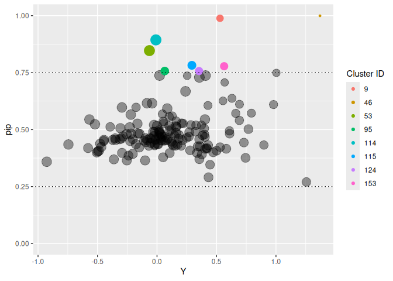
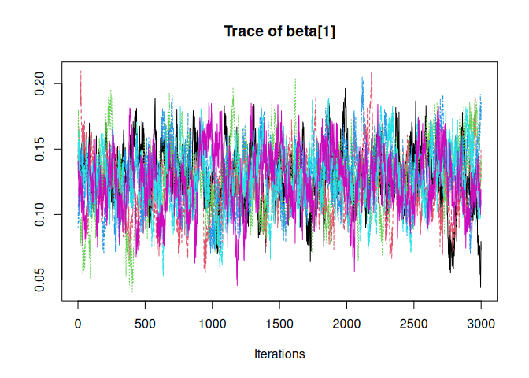

<!-- README.md is generated from README.Rmd. Please edit that file -->
<!-- knit with rmarkdown::render("README.Rmd", output_format = "md_document") -->

Individual Variance Detection
=============================

<!-- badges: start -->

<!-- badges: end -->

SSranef is an R package for random effects selection that corresponds to
the models described in Rodriguez, Williams, and Rast (2021).
Specifically, `ss_ranef_alpha()` fits a random intercepts model with a
spike-and-slab prior on the random effects and `ss_ranef_beta()` fits a
model with both random intercepts and random slopes, with a
spike-and-slab prior on the random effects for the slope. The function
`ss_ranef_mv()` fits a multivariate mixed-effects models for two
outcomes and places a spike-and-slab prior on the random slope for each
outcome.

This package is repurposed from the orginal verision at
[josue-rodriguez/SSranef](https://www.github.com/josue-rodriguez/SSranef)

Installation
------------

This package can be installed with

    # install.packages("devtools")
    # devtools::install_github("rast-ph/ivd")

Example
-------

    library(ivd)

    d <- mlmRev::Hsb82

Alpha model
-----------

    d$y <- c(scale(d$mAch))

    alpha <- ss_ranef_alpha(y = d$y, unit = d$school)
    #> Compiling model graph
    #>    Resolving undeclared variables
    #>    Allocating nodes
    #> Graph information:
    #>    Observed stochastic nodes: 7185
    #>    Unobserved stochastic nodes: 323
    #>    Total graph size: 15483
    #> 
    #> Initializing model
    #> 
    #>   |                                                          |                                                  |   0%  |                                                          |+                                                 |   2%  |                                                          |++                                                |   4%  |                                                          |+++                                               |   6%  |                                                          |++++                                              |   8%  |                                                          |+++++                                             |  10%  |                                                          |++++++                                            |  12%  |                                                          |+++++++                                           |  14%  |                                                          |++++++++                                          |  16%  |                                                          |+++++++++                                         |  18%  |                                                          |++++++++++                                        |  20%  |                                                          |+++++++++++                                       |  22%  |                                                          |++++++++++++                                      |  24%  |                                                          |+++++++++++++                                     |  26%  |                                                          |++++++++++++++                                    |  28%  |                                                          |+++++++++++++++                                   |  30%  |                                                          |++++++++++++++++                                  |  32%  |                                                          |+++++++++++++++++                                 |  34%  |                                                          |++++++++++++++++++                                |  36%  |                                                          |+++++++++++++++++++                               |  38%  |                                                          |++++++++++++++++++++                              |  40%  |                                                          |+++++++++++++++++++++                             |  42%  |                                                          |++++++++++++++++++++++                            |  44%  |                                                          |+++++++++++++++++++++++                           |  46%  |                                                          |++++++++++++++++++++++++                          |  48%  |                                                          |+++++++++++++++++++++++++                         |  50%  |                                                          |++++++++++++++++++++++++++                        |  52%  |                                                          |+++++++++++++++++++++++++++                       |  54%  |                                                          |++++++++++++++++++++++++++++                      |  56%  |                                                          |+++++++++++++++++++++++++++++                     |  58%  |                                                          |++++++++++++++++++++++++++++++                    |  60%  |                                                          |+++++++++++++++++++++++++++++++                   |  62%  |                                                          |++++++++++++++++++++++++++++++++                  |  64%  |                                                          |+++++++++++++++++++++++++++++++++                 |  66%  |                                                          |++++++++++++++++++++++++++++++++++                |  68%  |                                                          |+++++++++++++++++++++++++++++++++++               |  70%  |                                                          |++++++++++++++++++++++++++++++++++++              |  72%  |                                                          |+++++++++++++++++++++++++++++++++++++             |  74%  |                                                          |++++++++++++++++++++++++++++++++++++++            |  76%  |                                                          |+++++++++++++++++++++++++++++++++++++++           |  78%  |                                                          |++++++++++++++++++++++++++++++++++++++++          |  80%  |                                                          |+++++++++++++++++++++++++++++++++++++++++         |  82%  |                                                          |++++++++++++++++++++++++++++++++++++++++++        |  84%  |                                                          |+++++++++++++++++++++++++++++++++++++++++++       |  86%  |                                                          |++++++++++++++++++++++++++++++++++++++++++++      |  88%  |                                                          |+++++++++++++++++++++++++++++++++++++++++++++     |  90%  |                                                          |++++++++++++++++++++++++++++++++++++++++++++++    |  92%  |                                                          |+++++++++++++++++++++++++++++++++++++++++++++++   |  94%  |                                                          |++++++++++++++++++++++++++++++++++++++++++++++++  |  96%  |                                                          |+++++++++++++++++++++++++++++++++++++++++++++++++ |  98%  |                                                          |++++++++++++++++++++++++++++++++++++++++++++++++++| 100%
    #>   |                                                          |                                                  |   0%  |                                                          |*                                                 |   2%  |                                                          |**                                                |   4%  |                                                          |***                                               |   6%  |                                                          |****                                              |   8%  |                                                          |*****                                             |  10%  |                                                          |******                                            |  12%  |                                                          |*******                                           |  14%  |                                                          |********                                          |  16%  |                                                          |*********                                         |  18%  |                                                          |**********                                        |  20%  |                                                          |***********                                       |  22%  |                                                          |************                                      |  24%  |                                                          |*************                                     |  26%  |                                                          |**************                                    |  28%  |                                                          |***************                                   |  30%  |                                                          |****************                                  |  32%  |                                                          |*****************                                 |  34%  |                                                          |******************                                |  36%  |                                                          |*******************                               |  38%  |                                                          |********************                              |  40%  |                                                          |*********************                             |  42%  |                                                          |**********************                            |  44%  |                                                          |***********************                           |  46%  |                                                          |************************                          |  48%  |                                                          |*************************                         |  50%  |                                                          |**************************                        |  52%  |                                                          |***************************                       |  54%  |                                                          |****************************                      |  56%  |                                                          |*****************************                     |  58%  |                                                          |******************************                    |  60%  |                                                          |*******************************                   |  62%  |                                                          |********************************                  |  64%  |                                                          |*********************************                 |  66%  |                                                          |**********************************                |  68%  |                                                          |***********************************               |  70%  |                                                          |************************************              |  72%  |                                                          |*************************************             |  74%  |                                                          |**************************************            |  76%  |                                                          |***************************************           |  78%  |                                                          |****************************************          |  80%  |                                                          |*****************************************         |  82%  |                                                          |******************************************        |  84%  |                                                          |*******************************************       |  86%  |                                                          |********************************************      |  88%  |                                                          |*********************************************     |  90%  |                                                          |**********************************************    |  92%  |                                                          |***********************************************   |  94%  |                                                          |************************************************  |  96%  |                                                          |************************************************* |  98%  |                                                          |**************************************************| 100%
    #>   |                                                          |                                                  |   0%  |                                                          |*                                                 |   2%  |                                                          |**                                                |   4%  |                                                          |***                                               |   6%  |                                                          |****                                              |   8%  |                                                          |*****                                             |  10%  |                                                          |******                                            |  12%  |                                                          |*******                                           |  14%  |                                                          |********                                          |  16%  |                                                          |*********                                         |  18%  |                                                          |**********                                        |  20%  |                                                          |***********                                       |  22%  |                                                          |************                                      |  24%  |                                                          |*************                                     |  26%  |                                                          |**************                                    |  28%  |                                                          |***************                                   |  30%  |                                                          |****************                                  |  32%  |                                                          |*****************                                 |  34%  |                                                          |******************                                |  36%  |                                                          |*******************                               |  38%  |                                                          |********************                              |  40%  |                                                          |*********************                             |  42%  |                                                          |**********************                            |  44%  |                                                          |***********************                           |  46%  |                                                          |************************                          |  48%  |                                                          |*************************                         |  50%  |                                                          |**************************                        |  52%  |                                                          |***************************                       |  54%  |                                                          |****************************                      |  56%  |                                                          |*****************************                     |  58%  |                                                          |******************************                    |  60%  |                                                          |*******************************                   |  62%  |                                                          |********************************                  |  64%  |                                                          |*********************************                 |  66%  |                                                          |**********************************                |  68%  |                                                          |***********************************               |  70%  |                                                          |************************************              |  72%  |                                                          |*************************************             |  74%  |                                                          |**************************************            |  76%  |                                                          |***************************************           |  78%  |                                                          |****************************************          |  80%  |                                                          |*****************************************         |  82%  |                                                          |******************************************        |  84%  |                                                          |*******************************************       |  86%  |                                                          |********************************************      |  88%  |                                                          |*********************************************     |  90%  |                                                          |**********************************************    |  92%  |                                                          |***********************************************   |  94%  |                                                          |************************************************  |  96%  |                                                          |************************************************* |  98%  |                                                          |**************************************************| 100%

    posterior_summary(alpha, ci = 0.90, digits = 2)
    #> Linear mixed model fit with SSranef
    #> Call: ss_ranef_alpha(y = d$y, unit = d$school)
    #> 
    #>       Post_mean q05  q95 
    #> alpha 0.05      0.00 0.11
    #> sigma 0.91      0.90 0.92
    #> tau   0.54      0.47 0.61

    ranef_summary(alpha, ci = 0.95, digits = 2)
    #> Linear mixed model fit with SSranef
    #> Call: ss_ranef_alpha(y = d$y, unit = d$school)
    #> 
    #>            Post_mean q025  q975  PIP  BF_10   BF_01
    #> theta_1224 -1.03     -1.46 -0.57 1.00     Inf 0.00 
    #> theta_1288 -1.18     -1.49 -0.86 1.00     Inf 0.00 
    #> theta_1296 -1.00     -1.26 -0.75 1.00     Inf 0.00 
    #> theta_1308 -1.19     -1.48 -0.89 1.00     Inf 0.00 
    #> theta_1317 -0.98     -1.23 -0.74 1.00     Inf 0.00 
    #> theta_1358 -0.76     -1.11 -0.41 1.00 1999.00 0.00 
    #> theta_1374 -0.69     -0.95 -0.42 1.00     Inf 0.00 
    #> theta_1433 -0.03     -0.32  0.10 0.27    0.37 2.70 
    #> theta_1436 -0.45     -0.71 -0.19 0.99  172.91 0.01 
    #> theta_1461 -0.13     -0.54  0.01 0.52    1.08 0.93 
    #> theta_1462 -0.09     -0.48  0.07 0.43    0.75 1.34 
    #> theta_1477 -0.23     -0.50  0.00 0.82    4.61 0.22 
    #> theta_1499 -0.77     -1.09 -0.46 1.00     Inf 0.00 
    #> theta_1637 -0.53     -0.82 -0.24 1.00  209.53 0.00 
    #> theta_1906 -0.50     -0.76 -0.24 1.00  362.64 0.00 
    #> theta_1909 -0.66     -0.91 -0.41 1.00     Inf 0.00 
    #> theta_1942 -0.62     -0.89 -0.36 1.00     Inf 0.00 
    #> theta_1946 -0.47     -0.80  0.00 0.96   27.57 0.04 
    #> theta_2030 -0.27     -0.66  0.00 0.74    2.88 0.35 
    #> theta_2208 -0.52     -0.79 -0.26 1.00  570.43 0.00 
    #> theta_2277  0.03     -0.08  0.30 0.27    0.37 2.70 
    #> theta_2305 -0.14     -0.54  0.02 0.52    1.07 0.94 
    #> theta_2336 -0.65     -0.91 -0.39 1.00     Inf 0.00 
    #> theta_2458  0.09      0.00  0.40 0.46    0.84 1.20 
    #> theta_2467 -0.53     -0.77 -0.30 1.00     Inf 0.00 
    #> theta_2526  0.04     -0.05  0.32 0.31    0.45 2.22 
    #> theta_2626  0.00     -0.19  0.21 0.24    0.32 3.09 
    #> theta_2629 -0.02     -0.22  0.09 0.22    0.29 3.48 
    #> theta_2639 -0.06     -0.42  0.07 0.33    0.50 2.00 
    #> theta_2651 -0.56     -0.80 -0.34 1.00     Inf 0.00 
    #> theta_2655  0.12      0.00  0.43 0.54    1.19 0.84 
    #> theta_2658  0.01     -0.09  0.18 0.20    0.26 3.88 
    #> theta_2755 -0.88     -1.16 -0.61 1.00     Inf 0.00 
    #> theta_2768 -0.53     -0.80 -0.27 1.00  306.69 0.00 
    #> theta_2771 -0.06     -0.35  0.02 0.36    0.57 1.74 
    #> theta_2818  0.01     -0.08  0.20 0.20    0.25 4.01 
    #> theta_2917 -0.35     -0.64  0.00 0.92   11.50 0.09 
    #> theta_2990 -0.35     -0.62  0.00 0.94   17.02 0.06 
    #> theta_2995 -0.75     -1.01 -0.49 1.00     Inf 0.00 
    #> theta_3013 -0.06     -0.39  0.05 0.35    0.54 1.85 
    #> theta_3020 -0.35     -0.63  0.00 0.93   13.44 0.07 
    #> theta_3039 -0.51     -0.76 -0.27 1.00     Inf 0.00 
    #> theta_3088 -0.03     -0.28  0.05 0.27    0.37 2.72 
    #> theta_3152 -0.21     -0.50  0.00 0.75    2.93 0.34 
    #> theta_3332 -0.24     -0.72  0.00 0.66    1.96 0.51 
    #> theta_3351  0.00     -0.15  0.20 0.22    0.29 3.47 
    #> theta_3377  0.04     -0.05  0.34 0.30    0.44 2.28 
    #> theta_3427 -0.22     -0.53  0.00 0.76    3.25 0.31 
    #> theta_3498  0.06     -0.03  0.35 0.34    0.51 1.96 
    #> theta_3499  0.01     -0.12  0.22 0.22    0.29 3.44 
    #> theta_3533 -0.01     -0.26  0.15 0.23    0.31 3.27 
    #> theta_3610  0.01     -0.13  0.22 0.23    0.29 3.43 
    #> theta_3657  0.02     -0.11  0.27 0.23    0.29 3.40 
    #> theta_3688 -0.01     -0.19  0.12 0.20    0.24 4.10 
    #> theta_3705 -0.75     -1.00 -0.51 1.00     Inf 0.00 
    #> theta_3716 -0.02     -0.27  0.10 0.26    0.35 2.84 
    #> theta_3838  0.01     -0.17  0.27 0.25    0.33 3.03 
    #> theta_3881 -0.37     -0.70  0.00 0.92   11.58 0.09 
    #> theta_3967 -0.46     -0.72 -0.18 0.99   75.92 0.01 
    #> theta_3992 -0.01     -0.16  0.11 0.19    0.24 4.19 
    #> theta_3999  0.27      0.00  0.52 0.88    7.64 0.13 
    #> theta_4042 -0.05     -0.35  0.03 0.34    0.52 1.91 
    #> theta_4173 -0.07     -0.38  0.02 0.40    0.66 1.51 
    #> theta_4223  0.00     -0.13  0.16 0.20    0.25 4.05 
    #> theta_4253  0.17      0.00  0.47 0.66    1.98 0.50 
    #> theta_4292  0.10      0.00  0.43 0.45    0.83 1.20 
    #> theta_4325 -0.35     -0.60  0.00 0.96   23.10 0.04 
    #> theta_4350 -0.15     -0.54  0.01 0.54    1.18 0.85 
    #> theta_4383 -0.80     -1.12 -0.48 1.00     Inf 0.00 
    #> theta_4410  0.02     -0.06  0.25 0.24    0.31 3.23 
    #> theta_4420  0.46      0.00  0.81 0.96   23.54 0.04 
    #> theta_4458  0.12      0.00  0.48 0.51    1.04 0.96 
    #> theta_4511 -0.34     -0.65  0.00 0.91    9.81 0.10 
    #> theta_4523  0.06     -0.06  0.43 0.36    0.55 1.81 
    #> theta_4530 -0.18     -0.53  0.00 0.63    1.70 0.59 
    #> theta_4642 -0.41     -0.66 -0.11 0.98   59.61 0.02 
    #> theta_4868 -0.41     -0.77  0.00 0.91   10.56 0.09 
    #> theta_4931 -0.10     -0.40  0.00 0.50    0.98 1.02 
    #> theta_5192  0.02     -0.05  0.24 0.22    0.28 3.53 
    #> theta_5404  0.06     -0.01  0.36 0.36    0.57 1.75 
    #> theta_5619  0.45      0.18  0.70 0.99  152.85 0.01 
    #> theta_5640 -0.06     -0.37  0.03 0.34    0.51 1.95 
    #> theta_5650 -0.49     -0.75 -0.23 1.00  570.43 0.00 
    #> theta_5667  0.02     -0.12  0.28 0.26    0.36 2.81 
    #> theta_5720  0.10     -0.01  0.43 0.48    0.91 1.10 
    #> theta_5761 -0.63     -0.87 -0.37 1.00     Inf 0.00 
    #> theta_5762 -0.37     -0.62  0.00 0.97   29.77 0.03 
    #> theta_5783 -0.02     -0.24  0.07 0.22    0.28 3.55 
    #> theta_5815 -0.70     -0.96 -0.44 1.00     Inf 0.00 
    #> theta_5819  0.05     -0.13  0.42 0.33    0.50 2.00 
    #> theta_5838  0.45      0.19  0.71 0.99  141.86 0.01 
    #> theta_5937  0.51      0.26  0.76 1.00     Inf 0.00 
    #> theta_6074 -0.04     -0.33  0.05 0.31    0.44 2.26 
    #> theta_6089  0.14      0.00  0.47 0.56    1.26 0.79 
    #> theta_6144  0.07      0.00  0.35 0.40    0.67 1.50 
    #> theta_6170  0.06     -0.08  0.41 0.33    0.50 1.99 
    #> theta_6291  0.01     -0.11  0.23 0.23    0.30 3.36 
    #> theta_6366  0.02     -0.06  0.25 0.24    0.32 3.15 
    #> theta_6397  0.03     -0.10  0.30 0.25    0.34 2.93 
    #> theta_6415  0.38      0.00  0.63 0.97   32.06 0.03 
    #> theta_6443  0.11      0.00  0.43 0.51    1.03 0.97 
    #> theta_6464 -0.22     -0.55  0.00 0.73    2.75 0.36 
    #> theta_6469 -0.01     -0.21  0.10 0.20    0.25 3.98 
    #> theta_6484  0.00     -0.12  0.16 0.19    0.23 4.34 
    #> theta_6578 -0.20     -0.51  0.00 0.73    2.71 0.37 
    #> theta_6600 -0.01     -0.21  0.16 0.23    0.30 3.32 
    #> theta_6808  0.19      0.00  0.51 0.70    2.34 0.43 
    #> theta_6816  0.19      0.00  0.49 0.70    2.32 0.43 
    #> theta_6897 -0.21     -0.66  0.00 0.63    1.72 0.58 
    #> theta_6990 -0.08     -0.45  0.04 0.40    0.66 1.52 
    #> theta_7011 -0.04     -0.34  0.05 0.31    0.45 2.24 
    #> theta_7101  0.10     -0.02  0.44 0.45    0.81 1.24 
    #> theta_7172  0.04     -0.04  0.29 0.28    0.39 2.53 
    #> theta_7232  0.28      0.00  0.55 0.89    7.87 0.13 
    #> theta_7276  0.00     -0.13  0.15 0.19    0.24 4.20 
    #> theta_7332  0.40      0.00  0.64 0.97   38.22 0.03 
    #> theta_7341  0.24      0.00  0.54 0.79    3.74 0.27 
    #> theta_7342  0.28      0.00  0.55 0.88    7.57 0.13 
    #> theta_7345  0.24      0.00  0.61 0.75    2.94 0.34 
    #> theta_7364  0.05     -0.02  0.33 0.35    0.53 1.89 
    #> theta_7635 -0.17     -0.61  0.00 0.55    1.23 0.81 
    #> theta_7688  0.45      0.00  0.85 0.92   11.46 0.09 
    #> theta_7697 -0.05     -0.34  0.04 0.32    0.47 2.13 
    #> theta_7734 -0.01     -0.18  0.08 0.19    0.23 4.35 
    #> theta_7890  0.31      0.00  0.76 0.77    3.29 0.30 
    #> theta_7919  0.89      0.58  1.18 1.00     Inf 0.00 
    #> theta_8009  0.68      0.42  0.94 1.00     Inf 0.00 
    #> theta_8150  0.49      0.09  0.80 0.98   50.28 0.02 
    #> theta_8165 -0.80     -1.13 -0.45 1.00     Inf 0.00 
    #> theta_8175  0.66      0.34  0.98 1.00 1999.00 0.00 
    #> theta_8188 -0.01     -0.21  0.14 0.22    0.28 3.53 
    #> theta_8193  0.46      0.15  0.72 0.99   69.18 0.01 
    #> theta_8202  0.54      0.30  0.79 1.00     Inf 0.00 
    #> theta_8357  0.01     -0.13  0.22 0.22    0.28 3.55 
    #> theta_8367  0.46      0.18  0.73 0.99  104.26 0.01 
    #> theta_8477 -0.07     -0.38  0.00 0.41    0.68 1.47 
    #> theta_8531  0.73      0.48  0.99 1.00     Inf 0.00 
    #> theta_8627  0.08      0.00  0.38 0.42    0.73 1.37 
    #> theta_8628  0.00     -0.13  0.14 0.17    0.21 4.75 
    #> theta_8707  0.06     -0.04  0.36 0.35    0.54 1.86 
    #> theta_8775 -0.11     -0.46  0.00 0.46    0.85 1.18 
    #> theta_8800  0.91      0.65  1.16 1.00     Inf 0.00 
    #> theta_8854 -0.49     -0.75 -0.24 1.00  443.44 0.00 
    #> theta_8857  0.11      0.00  0.41 0.52    1.07 0.94 
    #> theta_8874  0.28      0.00  0.55 0.87    6.74 0.15 
    #> theta_8946  0.30      0.00  0.53 0.92   11.78 0.08 
    #> theta_8983  0.33      0.00  0.59 0.93   13.65 0.07 
    #> theta_9021  0.74      0.51  0.97 1.00     Inf 0.00 
    #> theta_9104  0.02     -0.11  0.30 0.26    0.34 2.91 
    #> theta_9158 -0.01     -0.21  0.09 0.22    0.28 3.61 
    #> theta_9198  0.10      0.00  0.42 0.48    0.91 1.10 
    #> theta_9225 -0.17     -0.47  0.00 0.66    1.97 0.51 
    #> theta_9292  0.73      0.48  0.98 1.00     Inf 0.00 
    #> theta_9340  0.28      0.00  0.64 0.81    4.14 0.24 
    #> theta_9347  0.41      0.00  0.70 0.97   32.06 0.03 
    #> theta_9359 -0.07     -0.42  0.04 0.38    0.61 1.64 
    #> theta_9397 -0.27     -0.55  0.00 0.85    5.55 0.18 
    #> theta_9508  0.47      0.23  0.70 1.00  570.43 0.00 
    #> theta_9550  0.79      0.48  1.10 1.00     Inf 0.00 
    #> theta_9586  0.16      0.00  0.46 0.66    1.91 0.52

    caterpillar_plot(alpha, legend = FALSE)

    pip_plot(alpha, legend = FALSE)

Beta model
----------

    beta <- ss_ranef_beta(y = d$y, X = d$ses, unit = d$school)
    #> Compiling model graph
    #>    Resolving undeclared variables
    #>    Allocating nodes
    #> Graph information:
    #>    Observed stochastic nodes: 7185
    #>    Unobserved stochastic nodes: 486
    #>    Total graph size: 44271
    #> 
    #> Initializing model
    #> 
    #>   |                                                          |                                                  |   0%  |                                                          |+                                                 |   2%  |                                                          |++                                                |   4%  |                                                          |+++                                               |   6%  |                                                          |++++                                              |   8%  |                                                          |+++++                                             |  10%  |                                                          |++++++                                            |  12%  |                                                          |+++++++                                           |  14%  |                                                          |++++++++                                          |  16%  |                                                          |+++++++++                                         |  18%  |                                                          |++++++++++                                        |  20%  |                                                          |+++++++++++                                       |  22%  |                                                          |++++++++++++                                      |  24%  |                                                          |+++++++++++++                                     |  26%  |                                                          |++++++++++++++                                    |  28%  |                                                          |+++++++++++++++                                   |  30%  |                                                          |++++++++++++++++                                  |  32%  |                                                          |+++++++++++++++++                                 |  34%  |                                                          |++++++++++++++++++                                |  36%  |                                                          |+++++++++++++++++++                               |  38%  |                                                          |++++++++++++++++++++                              |  40%  |                                                          |+++++++++++++++++++++                             |  42%  |                                                          |++++++++++++++++++++++                            |  44%  |                                                          |+++++++++++++++++++++++                           |  46%  |                                                          |++++++++++++++++++++++++                          |  48%  |                                                          |+++++++++++++++++++++++++                         |  50%  |                                                          |++++++++++++++++++++++++++                        |  52%  |                                                          |+++++++++++++++++++++++++++                       |  54%  |                                                          |++++++++++++++++++++++++++++                      |  56%  |                                                          |+++++++++++++++++++++++++++++                     |  58%  |                                                          |++++++++++++++++++++++++++++++                    |  60%  |                                                          |+++++++++++++++++++++++++++++++                   |  62%  |                                                          |++++++++++++++++++++++++++++++++                  |  64%  |                                                          |+++++++++++++++++++++++++++++++++                 |  66%  |                                                          |++++++++++++++++++++++++++++++++++                |  68%  |                                                          |+++++++++++++++++++++++++++++++++++               |  70%  |                                                          |++++++++++++++++++++++++++++++++++++              |  72%  |                                                          |+++++++++++++++++++++++++++++++++++++             |  74%  |                                                          |++++++++++++++++++++++++++++++++++++++            |  76%  |                                                          |+++++++++++++++++++++++++++++++++++++++           |  78%  |                                                          |++++++++++++++++++++++++++++++++++++++++          |  80%  |                                                          |+++++++++++++++++++++++++++++++++++++++++         |  82%  |                                                          |++++++++++++++++++++++++++++++++++++++++++        |  84%  |                                                          |+++++++++++++++++++++++++++++++++++++++++++       |  86%  |                                                          |++++++++++++++++++++++++++++++++++++++++++++      |  88%  |                                                          |+++++++++++++++++++++++++++++++++++++++++++++     |  90%  |                                                          |++++++++++++++++++++++++++++++++++++++++++++++    |  92%  |                                                          |+++++++++++++++++++++++++++++++++++++++++++++++   |  94%  |                                                          |++++++++++++++++++++++++++++++++++++++++++++++++  |  96%  |                                                          |+++++++++++++++++++++++++++++++++++++++++++++++++ |  98%  |                                                          |++++++++++++++++++++++++++++++++++++++++++++++++++| 100%
    #>   |                                                          |                                                  |   0%  |                                                          |*                                                 |   2%  |                                                          |**                                                |   4%  |                                                          |***                                               |   6%  |                                                          |****                                              |   8%  |                                                          |*****                                             |  10%  |                                                          |******                                            |  12%  |                                                          |*******                                           |  14%  |                                                          |********                                          |  16%  |                                                          |*********                                         |  18%  |                                                          |**********                                        |  20%  |                                                          |***********                                       |  22%  |                                                          |************                                      |  24%  |                                                          |*************                                     |  26%  |                                                          |**************                                    |  28%  |                                                          |***************                                   |  30%  |                                                          |****************                                  |  32%  |                                                          |*****************                                 |  34%  |                                                          |******************                                |  36%  |                                                          |*******************                               |  38%  |                                                          |********************                              |  40%  |                                                          |*********************                             |  42%  |                                                          |**********************                            |  44%  |                                                          |***********************                           |  46%  |                                                          |************************                          |  48%  |                                                          |*************************                         |  50%  |                                                          |**************************                        |  52%  |                                                          |***************************                       |  54%  |                                                          |****************************                      |  56%  |                                                          |*****************************                     |  58%  |                                                          |******************************                    |  60%  |                                                          |*******************************                   |  62%  |                                                          |********************************                  |  64%  |                                                          |*********************************                 |  66%  |                                                          |**********************************                |  68%  |                                                          |***********************************               |  70%  |                                                          |************************************              |  72%  |                                                          |*************************************             |  74%  |                                                          |**************************************            |  76%  |                                                          |***************************************           |  78%  |                                                          |****************************************          |  80%  |                                                          |*****************************************         |  82%  |                                                          |******************************************        |  84%  |                                                          |*******************************************       |  86%  |                                                          |********************************************      |  88%  |                                                          |*********************************************     |  90%  |                                                          |**********************************************    |  92%  |                                                          |***********************************************   |  94%  |                                                          |************************************************  |  96%  |                                                          |************************************************* |  98%  |                                                          |**************************************************| 100%
    #>   |                                                          |                                                  |   0%  |                                                          |*                                                 |   2%  |                                                          |**                                                |   4%  |                                                          |***                                               |   6%  |                                                          |****                                              |   8%  |                                                          |*****                                             |  10%  |                                                          |******                                            |  12%  |                                                          |*******                                           |  14%  |                                                          |********                                          |  16%  |                                                          |*********                                         |  18%  |                                                          |**********                                        |  20%  |                                                          |***********                                       |  22%  |                                                          |************                                      |  24%  |                                                          |*************                                     |  26%  |                                                          |**************                                    |  28%  |                                                          |***************                                   |  30%  |                                                          |****************                                  |  32%  |                                                          |*****************                                 |  34%  |                                                          |******************                                |  36%  |                                                          |*******************                               |  38%  |                                                          |********************                              |  40%  |                                                          |*********************                             |  42%  |                                                          |**********************                            |  44%  |                                                          |***********************                           |  46%  |                                                          |************************                          |  48%  |                                                          |*************************                         |  50%  |                                                          |**************************                        |  52%  |                                                          |***************************                       |  54%  |                                                          |****************************                      |  56%  |                                                          |*****************************                     |  58%  |                                                          |******************************                    |  60%  |                                                          |*******************************                   |  62%  |                                                          |********************************                  |  64%  |                                                          |*********************************                 |  66%  |                                                          |**********************************                |  68%  |                                                          |***********************************               |  70%  |                                                          |************************************              |  72%  |                                                          |*************************************             |  74%  |                                                          |**************************************            |  76%  |                                                          |***************************************           |  78%  |                                                          |****************************************          |  80%  |                                                          |*****************************************         |  82%  |                                                          |******************************************        |  84%  |                                                          |*******************************************       |  86%  |                                                          |********************************************      |  88%  |                                                          |*********************************************     |  90%  |                                                          |**********************************************    |  92%  |                                                          |***********************************************   |  94%  |                                                          |************************************************  |  96%  |                                                          |************************************************* |  98%  |                                                          |**************************************************| 100%
    posterior_summary(beta, digits = 2)
    #> Linear mixed model fit with SSranef
    #> Call: ss_ranef_beta(y = d$y, X = d$ses, unit = d$school)
    #> 
    #>       Post_mean q05   q95 
    #> alpha -0.01     -0.06 0.04
    #> beta   0.35      0.32 0.38
    #> sigma  0.88      0.87 0.90
    #> tau1   0.32      0.29 0.36
    #> tau2   0.11      0.02 0.18
    #> rho   -0.10     -0.75 0.48

    ranef_summary(beta, digits = 2)
    #> Linear mixed model fit with SSranef
    #> Call: ss_ranef_beta(y = d$y, X = d$ses, unit = d$school)
    #> 
    #>             Post_mean q05   q95   PIP  BF_10 BF_01
    #> theta1_1224 -0.77     -1.08 -0.45   NA   NA    NA 
    #> theta1_1288 -0.76     -1.02 -0.52   NA   NA    NA 
    #> theta1_1296 -0.53     -0.75 -0.31   NA   NA    NA 
    #> theta1_1308 -0.66     -0.90 -0.41   NA   NA    NA 
    #> theta1_1317 -0.71     -0.91 -0.51   NA   NA    NA 
    #> theta1_1358 -0.41     -0.67 -0.14   NA   NA    NA 
    #> theta1_1374 -0.48     -0.69 -0.27   NA   NA    NA 
    #> theta1_1433 -0.14     -0.38  0.10   NA   NA    NA 
    #> theta1_1436 -0.32     -0.51 -0.12   NA   NA    NA 
    #> theta1_1461 -0.16     -0.40  0.07   NA   NA    NA 
    #> theta1_1462 -0.16     -0.41  0.10   NA   NA    NA 
    #> theta1_1477 -0.05     -0.26  0.15   NA   NA    NA 
    #> theta1_1499 -0.42     -0.67 -0.18   NA   NA    NA 
    #> theta1_1637 -0.29     -0.51 -0.07   NA   NA    NA 
    #> theta1_1906 -0.30     -0.50 -0.10   NA   NA    NA 
    #> theta1_1909 -0.40     -0.61 -0.20   NA   NA    NA 
    #> theta1_1942 -0.38     -0.59 -0.17   NA   NA    NA 
    #> theta1_1946 -0.29     -0.53 -0.04   NA   NA    NA 
    #> theta1_2030 -0.24     -0.49  0.01   NA   NA    NA 
    #> theta1_2208 -0.39     -0.60 -0.18   NA   NA    NA 
    #> theta1_2277  0.12     -0.09  0.33   NA   NA    NA 
    #> theta1_2305 -0.05     -0.31  0.19   NA   NA    NA 
    #> theta1_2336 -0.52     -0.72 -0.32   NA   NA    NA 
    #> theta1_2458  0.09     -0.11  0.28   NA   NA    NA 
    #> theta1_2467 -0.28     -0.53 -0.07   NA   NA    NA 
    #> theta1_2526  0.03     -0.17  0.23   NA   NA    NA 
    #> theta1_2626  0.01     -0.23  0.24   NA   NA    NA 
    #> theta1_2629  0.01     -0.18  0.20   NA   NA    NA 
    #> theta1_2639 -0.09     -0.34  0.16   NA   NA    NA 
    #> theta1_2651 -0.28     -0.46 -0.10   NA   NA    NA 
    #> theta1_2655  0.07     -0.13  0.27   NA   NA    NA 
    #> theta1_2658  0.12     -0.06  0.31   NA   NA    NA 
    #> theta1_2755 -0.47     -0.71 -0.24   NA   NA    NA 
    #> theta1_2768 -0.28     -0.50 -0.07   NA   NA    NA 
    #> theta1_2771  0.07     -0.12  0.27   NA   NA    NA 
    #> theta1_2818  0.05     -0.14  0.23   NA   NA    NA 
    #> theta1_2917 -0.35     -0.56 -0.15   NA   NA    NA 
    #> theta1_2990 -0.25     -0.44 -0.05   NA   NA    NA 
    #> theta1_2995 -0.51     -0.71 -0.30   NA   NA    NA 
    #> theta1_3013 -0.14     -0.37  0.09   NA   NA    NA 
    #> theta1_3020 -0.33     -0.53 -0.13   NA   NA    NA 
    #> theta1_3039 -0.32     -0.52 -0.13   NA   NA    NA 
    #> theta1_3088  0.20     -0.01  0.42   NA   NA    NA 
    #> theta1_3152 -0.06     -0.25  0.13   NA   NA    NA 
    #> theta1_3332 -0.10     -0.39  0.20   NA   NA    NA 
    #> theta1_3351 -0.05     -0.28  0.17   NA   NA    NA 
    #> theta1_3377  0.22      0.01  0.42   NA   NA    NA 
    #> theta1_3427 -0.13     -0.32  0.07   NA   NA    NA 
    #> theta1_3498  0.19     -0.01  0.39   NA   NA    NA 
    #> theta1_3499 -0.04     -0.26  0.17   NA   NA    NA 
    #> theta1_3533 -0.04     -0.29  0.21   NA   NA    NA 
    #> theta1_3610  0.07     -0.13  0.28   NA   NA    NA 
    #> theta1_3657  0.15     -0.08  0.38   NA   NA    NA 
    #> theta1_3688 -0.02     -0.23  0.18   NA   NA    NA 
    #> theta1_3705 -0.48     -0.69 -0.29   NA   NA    NA 
    #> theta1_3716  0.04     -0.19  0.26   NA   NA    NA 
    #> theta1_3838  0.06     -0.21  0.32   NA   NA    NA 
    #> theta1_3881 -0.15     -0.38  0.08   NA   NA    NA 
    #> theta1_3967 -0.24     -0.44 -0.04   NA   NA    NA 
    #> theta1_3992  0.15     -0.04  0.34   NA   NA    NA 
    #> theta1_3999  0.20      0.00  0.39   NA   NA    NA 
    #> theta1_4042 -0.01     -0.20  0.18   NA   NA    NA 
    #> theta1_4173 -0.04     -0.22  0.14   NA   NA    NA 
    #> theta1_4223 -0.03     -0.24  0.17   NA   NA    NA 
    #> theta1_4253  0.33      0.14  0.51   NA   NA    NA 
    #> theta1_4292  0.27      0.06  0.48   NA   NA    NA 
    #> theta1_4325 -0.10     -0.31  0.10   NA   NA    NA 
    #> theta1_4350 -0.19     -0.44  0.05   NA   NA    NA 
    #> theta1_4383 -0.45     -0.70 -0.20   NA   NA    NA 
    #> theta1_4410  0.04     -0.15  0.24   NA   NA    NA 
    #> theta1_4420  0.29      0.04  0.55   NA   NA    NA 
    #> theta1_4458  0.12     -0.10  0.35   NA   NA    NA 
    #> theta1_4511 -0.12     -0.33  0.10   NA   NA    NA 
    #> theta1_4523  0.13     -0.12  0.37   NA   NA    NA 
    #> theta1_4530 -0.21     -0.43  0.00   NA   NA    NA 
    #> theta1_4642 -0.22     -0.41 -0.02   NA   NA    NA 
    #> theta1_4868 -0.33     -0.58 -0.09   NA   NA    NA 
    #> theta1_4931 -0.10     -0.29  0.08   NA   NA    NA 
    #> theta1_5192  0.01     -0.18  0.20   NA   NA    NA 
    #> theta1_5404  0.19      0.00  0.38   NA   NA    NA 
    #> theta1_5619  0.30      0.09  0.51   NA   NA    NA 
    #> theta1_5640 -0.12     -0.34  0.08   NA   NA    NA 
    #> theta1_5650 -0.30     -0.50 -0.09   NA   NA    NA 
    #> theta1_5667  0.08     -0.16  0.32   NA   NA    NA 
    #> theta1_5720  0.13     -0.08  0.34   NA   NA    NA 
    #> theta1_5761 -0.39     -0.58 -0.19   NA   NA    NA 
    #> theta1_5762 -0.19     -0.37  0.00   NA   NA    NA 
    #> theta1_5783  0.01     -0.18  0.21   NA   NA    NA 
    #> theta1_5815 -0.35     -0.57 -0.13   NA   NA    NA 
    #> theta1_5819  0.24     -0.04  0.51   NA   NA    NA 
    #> theta1_5838  0.39      0.19  0.59   NA   NA    NA 
    #> theta1_5937  0.31      0.10  0.51   NA   NA    NA 
    #> theta1_6074 -0.17     -0.38  0.04   NA   NA    NA 
    #> theta1_6089  0.19     -0.02  0.40   NA   NA    NA 
    #> theta1_6144  0.09     -0.09  0.27   NA   NA    NA 
    #> theta1_6170  0.22     -0.02  0.47   NA   NA    NA 
    #> theta1_6291 -0.02     -0.24  0.19   NA   NA    NA 
    #> theta1_6366  0.23      0.03  0.41   NA   NA    NA 
    #> theta1_6397  0.21     -0.02  0.44   NA   NA    NA 
    #> theta1_6415  0.26      0.06  0.46   NA   NA    NA 
    #> theta1_6443  0.15     -0.04  0.35   NA   NA    NA 
    #> theta1_6464 -0.19     -0.39  0.01   NA   NA    NA 
    #> theta1_6469  0.00     -0.22  0.21   NA   NA    NA 
    #> theta1_6484  0.09     -0.10  0.28   NA   NA    NA 
    #> theta1_6578 -0.09     -0.28  0.10   NA   NA    NA 
    #> theta1_6600  0.08     -0.16  0.31   NA   NA    NA 
    #> theta1_6808  0.20      0.00  0.40   NA   NA    NA 
    #> theta1_6816  0.23      0.03  0.43   NA   NA    NA 
    #> theta1_6897 -0.08     -0.36  0.20   NA   NA    NA 
    #> theta1_6990 -0.07     -0.30  0.17   NA   NA    NA 
    #> theta1_7011  0.03     -0.19  0.26   NA   NA    NA 
    #> theta1_7101  0.17     -0.06  0.39   NA   NA    NA 
    #> theta1_7172  0.10     -0.08  0.28   NA   NA    NA 
    #> theta1_7232  0.31      0.13  0.49   NA   NA    NA 
    #> theta1_7276  0.12     -0.06  0.32   NA   NA    NA 
    #> theta1_7332  0.39      0.20  0.58   NA   NA    NA 
    #> theta1_7341  0.24      0.05  0.44   NA   NA    NA 
    #> theta1_7342  0.22      0.03  0.41   NA   NA    NA 
    #> theta1_7345  0.32      0.09  0.55   NA   NA    NA 
    #> theta1_7364  0.16     -0.02  0.34   NA   NA    NA 
    #> theta1_7635 -0.18     -0.43  0.07   NA   NA    NA 
    #> theta1_7688  0.37      0.08  0.64   NA   NA    NA 
    #> theta1_7697 -0.12     -0.32  0.08   NA   NA    NA 
    #> theta1_7734  0.08     -0.10  0.26   NA   NA    NA 
    #> theta1_7890  0.25     -0.04  0.54   NA   NA    NA 
    #> theta1_7919  0.63      0.39  0.87   NA   NA    NA 
    #> theta1_8009  0.51      0.30  0.73   NA   NA    NA 
    #> theta1_8150  0.26      0.00  0.51   NA   NA    NA 
    #> theta1_8165 -0.43     -0.69 -0.18   NA   NA    NA 
    #> theta1_8175  0.45      0.19  0.71   NA   NA    NA 
    #> theta1_8188  0.03     -0.19  0.24   NA   NA    NA 
    #> theta1_8193  0.35      0.15  0.56   NA   NA    NA 
    #> theta1_8202  0.48      0.29  0.66   NA   NA    NA 
    #> theta1_8357  0.11     -0.11  0.32   NA   NA    NA 
    #> theta1_8367  0.32      0.11  0.54   NA   NA    NA 
    #> theta1_8477  0.00     -0.19  0.19   NA   NA    NA 
    #> theta1_8531  0.54      0.32  0.75   NA   NA    NA 
    #> theta1_8627  0.15     -0.02  0.34   NA   NA    NA 
    #> theta1_8628  0.06     -0.13  0.26   NA   NA    NA 
    #> theta1_8707  0.02     -0.21  0.24   NA   NA    NA 
    #> theta1_8775 -0.24     -0.45 -0.03   NA   NA    NA 
    #> theta1_8800  0.86      0.67  1.06   NA   NA    NA 
    #> theta1_8854 -0.18     -0.39  0.03   NA   NA    NA 
    #> theta1_8857  0.21      0.03  0.40   NA   NA    NA 
    #> theta1_8874  0.11     -0.10  0.32   NA   NA    NA 
    #> theta1_8946  0.20      0.01  0.39   NA   NA    NA 
    #> theta1_8983  0.29      0.11  0.48   NA   NA    NA 
    #> theta1_9021  0.52      0.32  0.72   NA   NA    NA 
    #> theta1_9104  0.14     -0.08  0.37   NA   NA    NA 
    #> theta1_9158 -0.03     -0.22  0.16   NA   NA    NA 
    #> theta1_9198  0.16     -0.04  0.36   NA   NA    NA 
    #> theta1_9225 -0.19     -0.37  0.00   NA   NA    NA 
    #> theta1_9292  0.68      0.49  0.87   NA   NA    NA 
    #> theta1_9340  0.28      0.04  0.52   NA   NA    NA 
    #> theta1_9347  0.49      0.28  0.70   NA   NA    NA 
    #> theta1_9359 -0.14     -0.36  0.09   NA   NA    NA 
    #> theta1_9397 -0.25     -0.45 -0.06   NA   NA    NA 
    #> theta1_9508  0.54      0.36  0.72   NA   NA    NA 
    #> theta1_9550  0.60      0.36  0.85   NA   NA    NA 
    #> theta1_9586  0.10     -0.09  0.30   NA   NA    NA 
    #> theta2_1224 -0.01     -0.20  0.13 0.48 0.91  1.10 
    #> theta2_1288  0.02     -0.08  0.18 0.48 0.92  1.09 
    #> theta2_1296  0.01     -0.09  0.14 0.46 0.86  1.16 
    #> theta2_1308  0.01     -0.10  0.15 0.46 0.85  1.18 
    #> theta2_1317 -0.02     -0.17  0.07 0.44 0.77  1.29 
    #> theta2_1358  0.02     -0.09  0.18 0.51 1.03  0.97 
    #> theta2_1374 -0.01     -0.15  0.09 0.45 0.80  1.24 
    #> theta2_1433 -0.02     -0.16  0.07 0.48 0.94  1.06 
    #> theta2_1436 -0.01     -0.14  0.08 0.46 0.85  1.17 
    #> theta2_1461  0.04     -0.05  0.22 0.55 1.24  0.81 
    #> theta2_1462  0.04     -0.06  0.23 0.53 1.11  0.90 
    #> theta2_1477 -0.09     -0.32  0.01 0.69 2.23  0.45 
    #> theta2_1499  0.02     -0.06  0.15 0.48 0.92  1.09 
    #> theta2_1637  0.00     -0.11  0.10 0.44 0.80  1.25 
    #> theta2_1906 -0.02     -0.17  0.08 0.48 0.92  1.09 
    #> theta2_1909 -0.04     -0.23  0.05 0.50 1.02  0.98 
    #> theta2_1942  0.02     -0.07  0.15 0.47 0.88  1.14 
    #> theta2_1946 -0.05     -0.25  0.05 0.54 1.18  0.84 
    #> theta2_2030 -0.01     -0.13  0.10 0.47 0.89  1.13 
    #> theta2_2208  0.00     -0.11  0.11 0.47 0.88  1.14 
    #> theta2_2277  0.00     -0.10  0.12 0.46 0.85  1.18 
    #> theta2_2305  0.01     -0.09  0.14 0.48 0.92  1.08 
    #> theta2_2336  0.01     -0.10  0.13 0.45 0.82  1.22 
    #> theta2_2458 -0.02     -0.15  0.06 0.48 0.93  1.07 
    #> theta2_2467 -0.13     -0.38  0.01 0.74 2.89  0.35 
    #> theta2_2526 -0.01     -0.14  0.09 0.49 0.95  1.05 
    #> theta2_2626  0.01     -0.09  0.14 0.48 0.94  1.07 
    #> theta2_2629  0.02     -0.08  0.16 0.49 0.94  1.06 
    #> theta2_2639 -0.01     -0.15  0.08 0.47 0.90  1.11 
    #> theta2_2651 -0.01     -0.13  0.09 0.46 0.86  1.16 
    #> theta2_2655  0.00     -0.10  0.12 0.48 0.91  1.10 
    #> theta2_2658 -0.04     -0.23  0.04 0.54 1.18  0.85 
    #> theta2_2755 -0.02     -0.18  0.08 0.47 0.89  1.12 
    #> theta2_2768 -0.05     -0.25  0.04 0.55 1.21  0.83 
    #> theta2_2771  0.00     -0.11  0.10 0.47 0.87  1.15 
    #> theta2_2818  0.00     -0.10  0.12 0.45 0.83  1.21 
    #> theta2_2917 -0.02     -0.17  0.07 0.48 0.91  1.10 
    #> theta2_2990 -0.03     -0.22  0.06 0.52 1.10  0.91 
    #> theta2_2995 -0.01     -0.14  0.10 0.44 0.80  1.25 
    #> theta2_3013  0.03     -0.05  0.19 0.50 1.01  0.99 
    #> theta2_3020  0.00     -0.11  0.12 0.46 0.85  1.17 
    #> theta2_3039 -0.07     -0.27  0.03 0.61 1.54  0.65 
    #> theta2_3088  0.04     -0.04  0.24 0.55 1.21  0.83 
    #> theta2_3152 -0.01     -0.15  0.08 0.47 0.87  1.14 
    #> theta2_3332  0.00     -0.13  0.11 0.47 0.89  1.12 
    #> theta2_3351 -0.02     -0.16  0.07 0.49 0.95  1.05 
    #> theta2_3377 -0.02     -0.19  0.07 0.50 0.98  1.02 
    #> theta2_3427 -0.01     -0.15  0.08 0.49 0.95  1.05 
    #> theta2_3498 -0.04     -0.22  0.04 0.55 1.21  0.83 
    #> theta2_3499  0.00     -0.10  0.12 0.47 0.90  1.11 
    #> theta2_3533  0.03     -0.07  0.19 0.52 1.07  0.94 
    #> theta2_3610  0.01     -0.09  0.13 0.46 0.87  1.15 
    #> theta2_3657  0.01     -0.09  0.14 0.49 0.95  1.05 
    #> theta2_3688  0.02     -0.06  0.16 0.48 0.93  1.08 
    #> theta2_3705  0.04     -0.03  0.21 0.53 1.11  0.90 
    #> theta2_3716  0.02     -0.06  0.18 0.51 1.02  0.98 
    #> theta2_3838  0.01     -0.10  0.14 0.48 0.94  1.06 
    #> theta2_3881  0.02     -0.07  0.18 0.51 1.03  0.97 
    #> theta2_3967  0.01     -0.09  0.13 0.46 0.85  1.18 
    #> theta2_3992 -0.08     -0.29  0.02 0.65 1.85  0.54 
    #> theta2_3999 -0.02     -0.17  0.06 0.50 1.00  1.00 
    #> theta2_4042  0.01     -0.08  0.14 0.47 0.90  1.11 
    #> theta2_4173  0.02     -0.05  0.17 0.50 0.99  1.01 
    #> theta2_4223 -0.01     -0.15  0.08 0.48 0.93  1.08 
    #> theta2_4253 -0.06     -0.26  0.02 0.59 1.46  0.69 
    #> theta2_4292  0.00     -0.12  0.11 0.48 0.92  1.09 
    #> theta2_4325 -0.05     -0.26  0.03 0.57 1.32  0.76 
    #> theta2_4350  0.02     -0.06  0.18 0.48 0.92  1.09 
    #> theta2_4383  0.01     -0.11  0.13 0.47 0.88  1.13 
    #> theta2_4410 -0.03     -0.19  0.04 0.51 1.05  0.95 
    #> theta2_4420 -0.01     -0.14  0.11 0.49 0.94  1.06 
    #> theta2_4458  0.02     -0.07  0.17 0.48 0.94  1.07 
    #> theta2_4511  0.11      0.00  0.36 0.73 2.64  0.38 
    #> theta2_4523  0.01     -0.10  0.13 0.48 0.93  1.08 
    #> theta2_4530  0.04     -0.04  0.22 0.53 1.14  0.88 
    #> theta2_4642  0.01     -0.08  0.16 0.49 0.95  1.05 
    #> theta2_4868  0.02     -0.07  0.18 0.50 0.99  1.01 
    #> theta2_4931  0.06     -0.02  0.25 0.58 1.39  0.72 
    #> theta2_5192  0.02     -0.06  0.17 0.51 1.03  0.97 
    #> theta2_5404  0.00     -0.10  0.11 0.45 0.83  1.21 
    #> theta2_5619 -0.03     -0.21  0.05 0.52 1.09  0.91 
    #> theta2_5640  0.00     -0.11  0.12 0.48 0.91  1.10 
    #> theta2_5650 -0.01     -0.14  0.07 0.46 0.84  1.19 
    #> theta2_5667 -0.01     -0.13  0.11 0.48 0.92  1.08 
    #> theta2_5720 -0.01     -0.14  0.10 0.47 0.89  1.12 
    #> theta2_5761  0.05     -0.03  0.22 0.56 1.29  0.77 
    #> theta2_5762 -0.01     -0.13  0.07 0.44 0.77  1.30 
    #> theta2_5783  0.04     -0.04  0.24 0.55 1.21  0.83 
    #> theta2_5815 -0.01     -0.14  0.06 0.45 0.83  1.21 
    #> theta2_5819  0.02     -0.07  0.19 0.49 0.97  1.03 
    #> theta2_5838 -0.01     -0.13  0.09 0.46 0.86  1.16 
    #> theta2_5937  0.00     -0.12  0.12 0.47 0.89  1.12 
    #> theta2_6074 -0.01     -0.16  0.08 0.48 0.93  1.08 
    #> theta2_6089 -0.04     -0.22  0.04 0.55 1.23  0.81 
    #> theta2_6144 -0.01     -0.13  0.07 0.46 0.86  1.16 
    #> theta2_6170  0.00     -0.10  0.10 0.45 0.81  1.23 
    #> theta2_6291  0.01     -0.08  0.15 0.49 0.95  1.05 
    #> theta2_6366 -0.02     -0.15  0.07 0.48 0.92  1.08 
    #> theta2_6397  0.00     -0.10  0.12 0.47 0.88  1.14 
    #> theta2_6415  0.00     -0.11  0.12 0.46 0.86  1.16 
    #> theta2_6443 -0.03     -0.20  0.06 0.52 1.08  0.92 
    #> theta2_6464  0.03     -0.04  0.18 0.51 1.06  0.95 
    #> theta2_6469  0.01     -0.08  0.15 0.48 0.92  1.08 
    #> theta2_6484  0.01     -0.08  0.12 0.45 0.83  1.20 
    #> theta2_6578  0.01     -0.07  0.14 0.47 0.89  1.12 
    #> theta2_6600 -0.03     -0.19  0.06 0.51 1.06  0.94 
    #> theta2_6808  0.02     -0.06  0.17 0.48 0.93  1.07 
    #> theta2_6816  0.00     -0.10  0.12 0.46 0.86  1.16 
    #> theta2_6897  0.07     -0.02  0.30 0.62 1.66  0.60 
    #> theta2_6990 -0.01     -0.13  0.09 0.48 0.91  1.10 
    #> theta2_7011  0.03     -0.06  0.19 0.51 1.03  0.97 
    #> theta2_7101  0.01     -0.10  0.13 0.47 0.90  1.11 
    #> theta2_7172  0.01     -0.08  0.13 0.46 0.86  1.17 
    #> theta2_7232  0.01     -0.09  0.13 0.47 0.87  1.15 
    #> theta2_7276  0.02     -0.07  0.16 0.49 0.97  1.04 
    #> theta2_7332 -0.04     -0.22  0.04 0.54 1.17  0.86 
    #> theta2_7341 -0.05     -0.26  0.03 0.57 1.33  0.75 
    #> theta2_7342  0.00     -0.09  0.12 0.47 0.88  1.14 
    #> theta2_7345 -0.01     -0.14  0.09 0.47 0.90  1.11 
    #> theta2_7364 -0.02     -0.18  0.06 0.51 1.04  0.96 
    #> theta2_7635  0.02     -0.07  0.16 0.49 0.98  1.03 
    #> theta2_7688  0.01     -0.11  0.14 0.48 0.93  1.07 
    #> theta2_7697 -0.01     -0.13  0.09 0.48 0.92  1.08 
    #> theta2_7734  0.01     -0.08  0.11 0.45 0.82  1.22 
    #> theta2_7890 -0.01     -0.14  0.11 0.50 0.99  1.01 
    #> theta2_7919  0.01     -0.11  0.16 0.48 0.91  1.10 
    #> theta2_8009  0.00     -0.14  0.12 0.48 0.93  1.08 
    #> theta2_8150  0.08     -0.03  0.32 0.63 1.70  0.59 
    #> theta2_8165  0.03     -0.06  0.19 0.50 1.01  0.99 
    #> theta2_8175 -0.01     -0.15  0.12 0.48 0.92  1.09 
    #> theta2_8188  0.02     -0.07  0.16 0.49 0.98  1.03 
    #> theta2_8193  0.00     -0.12  0.11 0.46 0.86  1.16 
    #> theta2_8202 -0.04     -0.22  0.04 0.53 1.14  0.88 
    #> theta2_8357  0.02     -0.08  0.16 0.49 0.98  1.02 
    #> theta2_8367 -0.02     -0.18  0.06 0.50 0.98  1.02 
    #> theta2_8477  0.02     -0.06  0.18 0.50 1.01  0.99 
    #> theta2_8531 -0.01     -0.15  0.09 0.47 0.88  1.14 
    #> theta2_8627 -0.01     -0.13  0.08 0.48 0.91  1.10 
    #> theta2_8628  0.01     -0.07  0.12 0.45 0.80  1.25 
    #> theta2_8707  0.00     -0.13  0.10 0.49 0.95  1.06 
    #> theta2_8775  0.00     -0.11  0.10 0.46 0.86  1.16 
    #> theta2_8800 -0.07     -0.30  0.03 0.60 1.52  0.66 
    #> theta2_8854  0.04     -0.03  0.20 0.53 1.13  0.89 
    #> theta2_8857  0.01     -0.07  0.15 0.47 0.87  1.14 
    #> theta2_8874 -0.01     -0.15  0.09 0.48 0.93  1.08 
    #> theta2_8946  0.07     -0.03  0.29 0.62 1.63  0.61 
    #> theta2_8983 -0.02     -0.15  0.07 0.48 0.93  1.07 
    #> theta2_9021  0.00     -0.13  0.11 0.46 0.85  1.18 
    #> theta2_9104  0.03     -0.06  0.21 0.52 1.09  0.92 
    #> theta2_9158  0.03     -0.04  0.18 0.50 1.00  1.00 
    #> theta2_9198  0.00     -0.10  0.11 0.47 0.87  1.15 
    #> theta2_9225  0.05     -0.02  0.24 0.58 1.38  0.72 
    #> theta2_9292 -0.04     -0.23  0.05 0.50 1.00  1.00 
    #> theta2_9340  0.01     -0.11  0.15 0.47 0.89  1.12 
    #> theta2_9347 -0.01     -0.15  0.10 0.49 0.96  1.04 
    #> theta2_9359  0.02     -0.07  0.17 0.51 1.02  0.98 
    #> theta2_9397 -0.01     -0.14  0.09 0.47 0.88  1.14 
    #> theta2_9508 -0.03     -0.19  0.06 0.51 1.03  0.97 
    #> theta2_9550  0.01     -0.11  0.16 0.47 0.90  1.12 
    #> theta2_9586 -0.01     -0.13  0.07 0.47 0.90  1.11

    caterpillar_plot(beta, legend = FALSE)

    pip_plot(beta, legend = FALSE)

Multivariate model
------------------

    mv_data <- gen_mv_data(5, 5)
    str(mv_data)
    #> 'data.frame':    25 obs. of  4 variables:
    #>  $ y1: num  -4.521 -4.743 -0.671 -1.072 1.543 ...
    #>  $ y2: num  7.24 4.69 7.86 5.11 7.83 ...
    #>  $ x : num  1 0 1 0 1 0 0 0 1 0 ...
    #>  $ id: Factor w/ 5 levels "1","2","3","4",..: 1 1 1 1 1 2 2 2 2 2 ...

    mv_model <- ss_ranef_mv(Y = cbind(mv_data$y1, mv_data$y2),
                            X = mv_data$x,
                            unit = mv_data$id,
                            burnin = 100,
                            iter = 500,
                            chains = 4)
    #> Compiling model graph
    #>    Resolving undeclared variables
    #>    Allocating nodes
    #> Graph information:
    #>    Observed stochastic nodes: 25
    #>    Unobserved stochastic nodes: 23
    #>    Total graph size: 338
    #> 
    #> Initializing model
    #> 
    #>   |                                                          |                                                  |   0%  |                                                          |+                                                 |   2%  |                                                          |++                                                |   4%  |                                                          |+++                                               |   6%  |                                                          |++++                                              |   8%  |                                                          |+++++                                             |  10%  |                                                          |++++++                                            |  12%  |                                                          |+++++++                                           |  14%  |                                                          |++++++++                                          |  16%  |                                                          |+++++++++                                         |  18%  |                                                          |++++++++++                                        |  20%  |                                                          |+++++++++++                                       |  22%  |                                                          |++++++++++++                                      |  24%  |                                                          |+++++++++++++                                     |  26%  |                                                          |++++++++++++++                                    |  28%  |                                                          |+++++++++++++++                                   |  30%  |                                                          |++++++++++++++++                                  |  32%  |                                                          |+++++++++++++++++                                 |  34%  |                                                          |++++++++++++++++++                                |  36%  |                                                          |+++++++++++++++++++                               |  38%  |                                                          |++++++++++++++++++++                              |  40%  |                                                          |+++++++++++++++++++++                             |  42%  |                                                          |++++++++++++++++++++++                            |  44%  |                                                          |+++++++++++++++++++++++                           |  46%  |                                                          |++++++++++++++++++++++++                          |  48%  |                                                          |+++++++++++++++++++++++++                         |  50%  |                                                          |++++++++++++++++++++++++++                        |  52%  |                                                          |+++++++++++++++++++++++++++                       |  54%  |                                                          |++++++++++++++++++++++++++++                      |  56%  |                                                          |+++++++++++++++++++++++++++++                     |  58%  |                                                          |++++++++++++++++++++++++++++++                    |  60%  |                                                          |+++++++++++++++++++++++++++++++                   |  62%  |                                                          |++++++++++++++++++++++++++++++++                  |  64%  |                                                          |+++++++++++++++++++++++++++++++++                 |  66%  |                                                          |++++++++++++++++++++++++++++++++++                |  68%  |                                                          |+++++++++++++++++++++++++++++++++++               |  70%  |                                                          |++++++++++++++++++++++++++++++++++++              |  72%  |                                                          |+++++++++++++++++++++++++++++++++++++             |  74%  |                                                          |++++++++++++++++++++++++++++++++++++++            |  76%  |                                                          |+++++++++++++++++++++++++++++++++++++++           |  78%  |                                                          |++++++++++++++++++++++++++++++++++++++++          |  80%  |                                                          |+++++++++++++++++++++++++++++++++++++++++         |  82%  |                                                          |++++++++++++++++++++++++++++++++++++++++++        |  84%  |                                                          |+++++++++++++++++++++++++++++++++++++++++++       |  86%  |                                                          |++++++++++++++++++++++++++++++++++++++++++++      |  88%  |                                                          |+++++++++++++++++++++++++++++++++++++++++++++     |  90%  |                                                          |++++++++++++++++++++++++++++++++++++++++++++++    |  92%  |                                                          |+++++++++++++++++++++++++++++++++++++++++++++++   |  94%  |                                                          |++++++++++++++++++++++++++++++++++++++++++++++++  |  96%  |                                                          |+++++++++++++++++++++++++++++++++++++++++++++++++ |  98%  |                                                          |++++++++++++++++++++++++++++++++++++++++++++++++++| 100%
    #>   |                                                          |                                                  |   0%  |                                                          |*                                                 |   2%  |                                                          |**                                                |   4%  |                                                          |***                                               |   6%  |                                                          |****                                              |   8%  |                                                          |*****                                             |  10%  |                                                          |******                                            |  12%  |                                                          |*******                                           |  14%  |                                                          |********                                          |  16%  |                                                          |*********                                         |  18%  |                                                          |**********                                        |  20%  |                                                          |***********                                       |  22%  |                                                          |************                                      |  24%  |                                                          |*************                                     |  26%  |                                                          |**************                                    |  28%  |                                                          |***************                                   |  30%  |                                                          |****************                                  |  32%  |                                                          |*****************                                 |  34%  |                                                          |******************                                |  36%  |                                                          |*******************                               |  38%  |                                                          |********************                              |  40%  |                                                          |*********************                             |  42%  |                                                          |**********************                            |  44%  |                                                          |***********************                           |  46%  |                                                          |************************                          |  48%  |                                                          |*************************                         |  50%  |                                                          |**************************                        |  52%  |                                                          |***************************                       |  54%  |                                                          |****************************                      |  56%  |                                                          |*****************************                     |  58%  |                                                          |******************************                    |  60%  |                                                          |*******************************                   |  62%  |                                                          |********************************                  |  64%  |                                                          |*********************************                 |  66%  |                                                          |**********************************                |  68%  |                                                          |***********************************               |  70%  |                                                          |************************************              |  72%  |                                                          |*************************************             |  74%  |                                                          |**************************************            |  76%  |                                                          |***************************************           |  78%  |                                                          |****************************************          |  80%  |                                                          |*****************************************         |  82%  |                                                          |******************************************        |  84%  |                                                          |*******************************************       |  86%  |                                                          |********************************************      |  88%  |                                                          |*********************************************     |  90%  |                                                          |**********************************************    |  92%  |                                                          |***********************************************   |  94%  |                                                          |************************************************  |  96%  |                                                          |************************************************* |  98%  |                                                          |**************************************************| 100%
    #>   |                                                          |                                                  |   0%  |                                                          |*                                                 |   2%  |                                                          |**                                                |   4%  |                                                          |***                                               |   6%  |                                                          |****                                              |   8%  |                                                          |*****                                             |  10%  |                                                          |******                                            |  12%  |                                                          |*******                                           |  14%  |                                                          |********                                          |  16%  |                                                          |*********                                         |  18%  |                                                          |**********                                        |  20%  |                                                          |***********                                       |  22%  |                                                          |************                                      |  24%  |                                                          |*************                                     |  26%  |                                                          |**************                                    |  28%  |                                                          |***************                                   |  30%  |                                                          |****************                                  |  32%  |                                                          |*****************                                 |  34%  |                                                          |******************                                |  36%  |                                                          |*******************                               |  38%  |                                                          |********************                              |  40%  |                                                          |*********************                             |  42%  |                                                          |**********************                            |  44%  |                                                          |***********************                           |  46%  |                                                          |************************                          |  48%  |                                                          |*************************                         |  50%  |                                                          |**************************                        |  52%  |                                                          |***************************                       |  54%  |                                                          |****************************                      |  56%  |                                                          |*****************************                     |  58%  |                                                          |******************************                    |  60%  |                                                          |*******************************                   |  62%  |                                                          |********************************                  |  64%  |                                                          |*********************************                 |  66%  |                                                          |**********************************                |  68%  |                                                          |***********************************               |  70%  |                                                          |************************************              |  72%  |                                                          |*************************************             |  74%  |                                                          |**************************************            |  76%  |                                                          |***************************************           |  78%  |                                                          |****************************************          |  80%  |                                                          |*****************************************         |  82%  |                                                          |******************************************        |  84%  |                                                          |*******************************************       |  86%  |                                                          |********************************************      |  88%  |                                                          |*********************************************     |  90%  |                                                          |**********************************************    |  92%  |                                                          |***********************************************   |  94%  |                                                          |************************************************  |  96%  |                                                          |************************************************* |  98%  |                                                          |**************************************************| 100%

    posterior_summary(mv_model)
    #> Linear mixed model fit with SSranef
    #> Call: ss_ranef_mv(Y = cbind(mv_data$y1, mv_data$y2), X = mv_data$x, 
    #>     unit = mv_data$id, burnin = 100, iter = 500, chains = 4)
    #> 
    #>         Post_mean q05   q95  
    #> B_1_1    1.52      0.09  2.89
    #> B_1_2    0.66     -1.91  3.27
    #> B_2_1    4.27      3.45  5.06
    #> B_2_2    4.96      2.25  7.60
    #> rb_1_2   0.07     -0.98  0.99
    #> rb_1_3  -0.07     -0.98  0.98
    #> rb_1_4   0.16     -0.98  0.99
    #> rb_2_3  -0.14     -0.98  0.97
    #> rb_2_4   0.69     -0.80  0.99
    #> rb_3_4  -0.20     -0.99  0.98
    #> rw      -0.35     -0.61  0.00
    #> sigma_1  3.10      2.40  3.98
    #> sigma_2  1.68      1.31  2.17
    #> Tau_1_1 13.87      0.30 57.95
    #> Tau_2_2  9.51      0.38 31.58
    #> Tau_3_3  7.89      0.25 30.21
    #> Tau_4_4 18.47      3.39 53.14

Priors
------

Priors can be passed on to either of the `ss_ranef` functions through a
named list and using JAGS code, e.g.,

    # change prior for mean intercept
    priors <- list(alpha = "alpha ~ dt(0, 1, 3)",
                   # for each jth unit, change prior probability of inclusion
                   gamma = "gamma[j] ~ dbern(0.75)") 

    fit <- ss_ranef_alpha(y = d$y, unit = d$school, priors = priors)
    #> Compiling model graph
    #>    Resolving undeclared variables
    #>    Allocating nodes
    #> Graph information:
    #>    Observed stochastic nodes: 7185
    #>    Unobserved stochastic nodes: 323
    #>    Total graph size: 15482
    #> 
    #> Initializing model
    #> 
    #>   |                                                          |                                                  |   0%  |                                                          |+                                                 |   2%  |                                                          |++                                                |   4%  |                                                          |+++                                               |   6%  |                                                          |++++                                              |   8%  |                                                          |+++++                                             |  10%  |                                                          |++++++                                            |  12%  |                                                          |+++++++                                           |  14%  |                                                          |++++++++                                          |  16%  |                                                          |+++++++++                                         |  18%  |                                                          |++++++++++                                        |  20%  |                                                          |+++++++++++                                       |  22%  |                                                          |++++++++++++                                      |  24%  |                                                          |+++++++++++++                                     |  26%  |                                                          |++++++++++++++                                    |  28%  |                                                          |+++++++++++++++                                   |  30%  |                                                          |++++++++++++++++                                  |  32%  |                                                          |+++++++++++++++++                                 |  34%  |                                                          |++++++++++++++++++                                |  36%  |                                                          |+++++++++++++++++++                               |  38%  |                                                          |++++++++++++++++++++                              |  40%  |                                                          |+++++++++++++++++++++                             |  42%  |                                                          |++++++++++++++++++++++                            |  44%  |                                                          |+++++++++++++++++++++++                           |  46%  |                                                          |++++++++++++++++++++++++                          |  48%  |                                                          |+++++++++++++++++++++++++                         |  50%  |                                                          |++++++++++++++++++++++++++                        |  52%  |                                                          |+++++++++++++++++++++++++++                       |  54%  |                                                          |++++++++++++++++++++++++++++                      |  56%  |                                                          |+++++++++++++++++++++++++++++                     |  58%  |                                                          |++++++++++++++++++++++++++++++                    |  60%  |                                                          |+++++++++++++++++++++++++++++++                   |  62%  |                                                          |++++++++++++++++++++++++++++++++                  |  64%  |                                                          |+++++++++++++++++++++++++++++++++                 |  66%  |                                                          |++++++++++++++++++++++++++++++++++                |  68%  |                                                          |+++++++++++++++++++++++++++++++++++               |  70%  |                                                          |++++++++++++++++++++++++++++++++++++              |  72%  |                                                          |+++++++++++++++++++++++++++++++++++++             |  74%  |                                                          |++++++++++++++++++++++++++++++++++++++            |  76%  |                                                          |+++++++++++++++++++++++++++++++++++++++           |  78%  |                                                          |++++++++++++++++++++++++++++++++++++++++          |  80%  |                                                          |+++++++++++++++++++++++++++++++++++++++++         |  82%  |                                                          |++++++++++++++++++++++++++++++++++++++++++        |  84%  |                                                          |+++++++++++++++++++++++++++++++++++++++++++       |  86%  |                                                          |++++++++++++++++++++++++++++++++++++++++++++      |  88%  |                                                          |+++++++++++++++++++++++++++++++++++++++++++++     |  90%  |                                                          |++++++++++++++++++++++++++++++++++++++++++++++    |  92%  |                                                          |+++++++++++++++++++++++++++++++++++++++++++++++   |  94%  |                                                          |++++++++++++++++++++++++++++++++++++++++++++++++  |  96%  |                                                          |+++++++++++++++++++++++++++++++++++++++++++++++++ |  98%  |                                                          |++++++++++++++++++++++++++++++++++++++++++++++++++| 100%
    #>   |                                                          |                                                  |   0%  |                                                          |*                                                 |   2%  |                                                          |**                                                |   4%  |                                                          |***                                               |   6%  |                                                          |****                                              |   8%  |                                                          |*****                                             |  10%  |                                                          |******                                            |  12%  |                                                          |*******                                           |  14%  |                                                          |********                                          |  16%  |                                                          |*********                                         |  18%  |                                                          |**********                                        |  20%  |                                                          |***********                                       |  22%  |                                                          |************                                      |  24%  |                                                          |*************                                     |  26%  |                                                          |**************                                    |  28%  |                                                          |***************                                   |  30%  |                                                          |****************                                  |  32%  |                                                          |*****************                                 |  34%  |                                                          |******************                                |  36%  |                                                          |*******************                               |  38%  |                                                          |********************                              |  40%  |                                                          |*********************                             |  42%  |                                                          |**********************                            |  44%  |                                                          |***********************                           |  46%  |                                                          |************************                          |  48%  |                                                          |*************************                         |  50%  |                                                          |**************************                        |  52%  |                                                          |***************************                       |  54%  |                                                          |****************************                      |  56%  |                                                          |*****************************                     |  58%  |                                                          |******************************                    |  60%  |                                                          |*******************************                   |  62%  |                                                          |********************************                  |  64%  |                                                          |*********************************                 |  66%  |                                                          |**********************************                |  68%  |                                                          |***********************************               |  70%  |                                                          |************************************              |  72%  |                                                          |*************************************             |  74%  |                                                          |**************************************            |  76%  |                                                          |***************************************           |  78%  |                                                          |****************************************          |  80%  |                                                          |*****************************************         |  82%  |                                                          |******************************************        |  84%  |                                                          |*******************************************       |  86%  |                                                          |********************************************      |  88%  |                                                          |*********************************************     |  90%  |                                                          |**********************************************    |  92%  |                                                          |***********************************************   |  94%  |                                                          |************************************************  |  96%  |                                                          |************************************************* |  98%  |                                                          |**************************************************| 100%
    #>   |                                                          |                                                  |   0%  |                                                          |*                                                 |   2%  |                                                          |**                                                |   4%  |                                                          |***                                               |   6%  |                                                          |****                                              |   8%  |                                                          |*****                                             |  10%  |                                                          |******                                            |  12%  |                                                          |*******                                           |  14%  |                                                          |********                                          |  16%  |                                                          |*********                                         |  18%  |                                                          |**********                                        |  20%  |                                                          |***********                                       |  22%  |                                                          |************                                      |  24%  |                                                          |*************                                     |  26%  |                                                          |**************                                    |  28%  |                                                          |***************                                   |  30%  |                                                          |****************                                  |  32%  |                                                          |*****************                                 |  34%  |                                                          |******************                                |  36%  |                                                          |*******************                               |  38%  |                                                          |********************                              |  40%  |                                                          |*********************                             |  42%  |                                                          |**********************                            |  44%  |                                                          |***********************                           |  46%  |                                                          |************************                          |  48%  |                                                          |*************************                         |  50%  |                                                          |**************************                        |  52%  |                                                          |***************************                       |  54%  |                                                          |****************************                      |  56%  |                                                          |*****************************                     |  58%  |                                                          |******************************                    |  60%  |                                                          |*******************************                   |  62%  |                                                          |********************************                  |  64%  |                                                          |*********************************                 |  66%  |                                                          |**********************************                |  68%  |                                                          |***********************************               |  70%  |                                                          |************************************              |  72%  |                                                          |*************************************             |  74%  |                                                          |**************************************            |  76%  |                                                          |***************************************           |  78%  |                                                          |****************************************          |  80%  |                                                          |*****************************************         |  82%  |                                                          |******************************************        |  84%  |                                                          |*******************************************       |  86%  |                                                          |********************************************      |  88%  |                                                          |*********************************************     |  90%  |                                                          |**********************************************    |  92%  |                                                          |***********************************************   |  94%  |                                                          |************************************************  |  96%  |                                                          |************************************************* |  98%  |                                                          |**************************************************| 100%
    ranef_summary(fit)
    #> Linear mixed model fit with SSranef
    #> Call: ss_ranef_alpha(y = d$y, unit = d$school, priors = priors)
    #> 
    #>            Post_mean q05   q95   PIP  BF_10  BF_01
    #> theta_1224 -0.97     -1.33 -0.61 1.00    Inf 0.00 
    #> theta_1288 -1.14     -1.40 -0.87 1.00    Inf 0.00 
    #> theta_1296 -0.96     -1.17 -0.75 1.00    Inf 0.00 
    #> theta_1308 -1.14     -1.38 -0.90 1.00    Inf 0.00 
    #> theta_1317 -0.94     -1.15 -0.74 1.00    Inf 0.00 
    #> theta_1358 -0.72     -1.00 -0.44 1.00    Inf 0.00 
    #> theta_1374 -0.65     -0.87 -0.43 1.00    Inf 0.00 
    #> theta_1433 -0.04     -0.27  0.11 0.51   1.03 0.97 
    #> theta_1436 -0.42     -0.64 -0.21 0.99 189.48 0.01 
    #> theta_1461 -0.16     -0.46  0.01 0.73   2.64 0.38 
    #> theta_1462 -0.12     -0.43  0.06 0.65   1.88 0.53 
    #> theta_1477 -0.21     -0.42  0.00 0.87   6.55 0.15 
    #> theta_1499 -0.73     -0.99 -0.47 1.00    Inf 0.00 
    #> theta_1637 -0.50     -0.73 -0.26 1.00 399.00 0.00 
    #> theta_1906 -0.47     -0.69 -0.24 1.00 306.69 0.00 
    #> theta_1909 -0.62     -0.83 -0.41 1.00    Inf 0.00 
    #> theta_1942 -0.59     -0.81 -0.36 1.00    Inf 0.00 
    #> theta_1946 -0.44     -0.71 -0.14 0.98  47.19 0.02 
    #> theta_2030 -0.28     -0.59  0.00 0.86   6.30 0.16 
    #> theta_2208 -0.49     -0.71 -0.26 1.00 306.69 0.00 
    #> theta_2277  0.08     -0.05  0.32 0.57   1.31 0.76 
    #> theta_2305 -0.16     -0.47  0.03 0.73   2.75 0.36 
    #> theta_2336 -0.62     -0.83 -0.40 1.00    Inf 0.00 
    #> theta_2458  0.19      0.00  0.42 0.82   4.42 0.23 
    #> theta_2467 -0.50     -0.69 -0.30 1.00    Inf 0.00 
    #> theta_2526  0.11     -0.02  0.36 0.66   1.93 0.52 
    #> theta_2626  0.02     -0.17  0.24 0.51   1.03 0.98 
    #> theta_2629 -0.02     -0.19  0.11 0.44   0.80 1.25 
    #> theta_2639 -0.08     -0.36  0.09 0.60   1.52 0.66 
    #> theta_2651 -0.53     -0.72 -0.34 1.00    Inf 0.00 
    #> theta_2655  0.22      0.00  0.44 0.86   6.37 0.16 
    #> theta_2658  0.03     -0.08  0.22 0.47   0.89 1.13 
    #> theta_2755 -0.84     -1.07 -0.61 1.00    Inf 0.00 
    #> theta_2768 -0.50     -0.72 -0.27 1.00 999.00 0.00 
    #> theta_2771 -0.07     -0.30  0.04 0.57   1.31 0.76 
    #> theta_2818  0.04     -0.07  0.25 0.50   1.00 1.00 
    #> theta_2917 -0.34     -0.56 -0.05 0.96  25.67 0.04 
    #> theta_2990 -0.33     -0.56 -0.04 0.96  23.39 0.04 
    #> theta_2995 -0.71     -0.93 -0.49 1.00    Inf 0.00 
    #> theta_3013 -0.08     -0.35  0.08 0.58   1.40 0.71 
    #> theta_3020 -0.33     -0.57 -0.04 0.96  25.32 0.04 
    #> theta_3039 -0.48     -0.68 -0.27 1.00    Inf 0.00 
    #> theta_3088 -0.04     -0.25  0.08 0.48   0.92 1.09 
    #> theta_3152 -0.20     -0.43  0.00 0.83   4.96 0.20 
    #> theta_3332 -0.27     -0.62  0.00 0.82   4.68 0.21 
    #> theta_3351  0.03     -0.13  0.24 0.50   1.00 1.00 
    #> theta_3377  0.11     -0.03  0.37 0.65   1.88 0.53 
    #> theta_3427 -0.23     -0.46  0.00 0.86   6.27 0.16 
    #> theta_3498  0.13     -0.01  0.39 0.68   2.17 0.46 
    #> theta_3499  0.03     -0.10  0.24 0.49   0.95 1.05 
    #> theta_3533 -0.01     -0.22  0.19 0.48   0.94 1.07 
    #> theta_3610  0.04     -0.11  0.27 0.51   1.02 0.98 
    #> theta_3657  0.05     -0.11  0.30 0.54   1.19 0.84 
    #> theta_3688  0.00     -0.17  0.15 0.44   0.78 1.28 
    #> theta_3705 -0.72     -0.93 -0.51 1.00    Inf 0.00 
    #> theta_3716 -0.02     -0.23  0.14 0.49   0.96 1.05 
    #> theta_3838  0.04     -0.14  0.31 0.53   1.12 0.89 
    #> theta_3881 -0.35     -0.62  0.00 0.95  18.80 0.05 
    #> theta_3967 -0.43     -0.65 -0.21 0.99 113.29 0.01 
    #> theta_3992  0.00     -0.14  0.13 0.41   0.70 1.43 
    #> theta_3999  0.32      0.10  0.52 0.98  39.82 0.03 
    #> theta_4042 -0.07     -0.30  0.05 0.56   1.28 0.78 
    #> theta_4173 -0.09     -0.32  0.03 0.59   1.45 0.69 
    #> theta_4223  0.02     -0.12  0.20 0.47   0.89 1.13 
    #> theta_4253  0.25      0.00  0.47 0.91  10.20 0.10 
    #> theta_4292  0.18      0.00  0.44 0.78   3.62 0.28 
    #> theta_4325 -0.32     -0.53 -0.07 0.96  26.97 0.04 
    #> theta_4350 -0.18     -0.49  0.00 0.76   3.09 0.32 
    #> theta_4383 -0.76     -1.03 -0.48 1.00    Inf 0.00 
    #> theta_4410  0.07     -0.04  0.28 0.56   1.27 0.79 
    #> theta_4420  0.50      0.23  0.76 0.99 165.67 0.01 
    #> theta_4458  0.21      0.00  0.49 0.82   4.45 0.22 
    #> theta_4511 -0.32     -0.57  0.00 0.94  15.19 0.07 
    #> theta_4523  0.13     -0.04  0.43 0.67   2.06 0.49 
    #> theta_4530 -0.19     -0.46  0.00 0.76   3.25 0.31 
    #> theta_4642 -0.37     -0.58 -0.14 0.98  49.00 0.02 
    #> theta_4868 -0.40     -0.67 -0.07 0.96  27.17 0.04 
    #> theta_4931 -0.11     -0.34  0.01 0.65   1.85 0.54 
    #> theta_5192  0.07     -0.04  0.29 0.56   1.26 0.79 
    #> theta_5404  0.13      0.00  0.37 0.69   2.18 0.46 
    #> theta_5619  0.48      0.26  0.69 0.99 189.48 0.01 
    #> theta_5640 -0.08     -0.33  0.06 0.58   1.40 0.71 
    #> theta_5650 -0.45     -0.68 -0.22 0.99 152.85 0.01 
    #> theta_5667  0.06     -0.10  0.31 0.54   1.16 0.86 
    #> theta_5720  0.19      0.00  0.45 0.78   3.48 0.29 
    #> theta_5761 -0.59     -0.80 -0.39 1.00    Inf 0.00 
    #> theta_5762 -0.34     -0.54 -0.13 0.98  64.57 0.02 
    #> theta_5783 -0.02     -0.21  0.10 0.46   0.86 1.16 
    #> theta_5815 -0.66     -0.88 -0.43 1.00    Inf 0.00 
    #> theta_5819  0.10     -0.09  0.43 0.62   1.64 0.61 
    #> theta_5838  0.48      0.26  0.70 1.00 499.00 0.00 
    #> theta_5937  0.53      0.32  0.74 1.00 665.67 0.00 
    #> theta_6074 -0.06     -0.29  0.06 0.55   1.22 0.82 
    #> theta_6089  0.22      0.00  0.48 0.83   4.93 0.20 
    #> theta_6144  0.15      0.00  0.37 0.77   3.29 0.30 
    #> theta_6170  0.12     -0.05  0.43 0.64   1.80 0.56 
    #> theta_6291  0.04     -0.10  0.27 0.52   1.07 0.93 
    #> theta_6366  0.07     -0.04  0.28 0.57   1.34 0.75 
    #> theta_6397  0.08     -0.10  0.34 0.60   1.49 0.67 
    #> theta_6415  0.42      0.21  0.63 1.00 234.29 0.00 
    #> theta_6443  0.20      0.00  0.43 0.84   5.08 0.20 
    #> theta_6464 -0.23     -0.47  0.00 0.87   6.58 0.15 
    #> theta_6469 -0.01     -0.19  0.13 0.45   0.82 1.23 
    #> theta_6484  0.02     -0.10  0.20 0.45   0.81 1.24 
    #> theta_6578 -0.20     -0.43  0.00 0.83   4.95 0.20 
    #> theta_6600  0.00     -0.19  0.19 0.47   0.89 1.12 
    #> theta_6808  0.28      0.00  0.51 0.92  10.87 0.09 
    #> theta_6816  0.27      0.00  0.50 0.91   9.67 0.10 
    #> theta_6897 -0.23     -0.57  0.00 0.80   4.05 0.25 
    #> theta_6990 -0.10     -0.38  0.05 0.63   1.71 0.58 
    #> theta_7011 -0.06     -0.32  0.08 0.55   1.24 0.81 
    #> theta_7101  0.18      0.00  0.46 0.75   3.05 0.33 
    #> theta_7172  0.09     -0.02  0.33 0.61   1.56 0.64 
    #> theta_7232  0.33      0.13  0.53 0.98  53.79 0.02 
    #> theta_7276  0.02     -0.11  0.18 0.44   0.78 1.28 
    #> theta_7332  0.43      0.22  0.65 1.00 221.22 0.00 
    #> theta_7341  0.31      0.00  0.53 0.95  20.05 0.05 
    #> theta_7342  0.33      0.10  0.54 0.97  35.70 0.03 
    #> theta_7345  0.33      0.00  0.60 0.94  16.09 0.06 
    #> theta_7364  0.13      0.00  0.36 0.72   2.52 0.40 
    #> theta_7635 -0.20     -0.52  0.01 0.78   3.45 0.29 
    #> theta_7688  0.50      0.17  0.81 0.98  52.33 0.02 
    #> theta_7697 -0.06     -0.28  0.06 0.54   1.18 0.85 
    #> theta_7734 -0.01     -0.16  0.12 0.42   0.71 1.41 
    #> theta_7890  0.38      0.00  0.72 0.93  12.38 0.08 
    #> theta_7919  0.90      0.65  1.15 1.00    Inf 0.00 
    #> theta_8009  0.70      0.47  0.93 1.00    Inf 0.00 
    #> theta_8150  0.52      0.26  0.78 0.99 136.93 0.01 
    #> theta_8165 -0.76     -1.03 -0.48 1.00    Inf 0.00 
    #> theta_8175  0.68      0.41  0.95 1.00    Inf 0.00 
    #> theta_8188  0.00     -0.18  0.18 0.47   0.88 1.14 
    #> theta_8193  0.49      0.27  0.71 1.00 570.43 0.00 
    #> theta_8202  0.57      0.37  0.77 1.00    Inf 0.00 
    #> theta_8357  0.03     -0.11  0.24 0.49   0.96 1.04 
    #> theta_8367  0.48      0.27  0.70 1.00 665.67 0.00 
    #> theta_8477 -0.09     -0.33  0.02 0.60   1.50 0.67 
    #> theta_8531  0.75      0.54  0.97 1.00    Inf 0.00 
    #> theta_8627  0.16      0.00  0.39 0.74   2.88 0.35 
    #> theta_8628  0.02     -0.11  0.19 0.45   0.82 1.22 
    #> theta_8707  0.12     -0.02  0.39 0.66   1.96 0.51 
    #> theta_8775 -0.14     -0.40  0.02 0.70   2.39 0.42 
    #> theta_8800  0.93      0.71  1.14 1.00    Inf 0.00 
    #> theta_8854 -0.46     -0.67 -0.25 1.00 799.00 0.00 
    #> theta_8857  0.20      0.00  0.42 0.85   5.59 0.18 
    #> theta_8874  0.34      0.11  0.55 0.98  42.48 0.02 
    #> theta_8946  0.34      0.14  0.54 0.99  69.18 0.01 
    #> theta_8983  0.37      0.17  0.57 0.99  84.11 0.01 
    #> theta_9021  0.76      0.56  0.97 1.00    Inf 0.00 
    #> theta_9104  0.06     -0.08  0.33 0.53   1.12 0.89 
    #> theta_9158 -0.01     -0.19  0.12 0.44   0.79 1.26 
    #> theta_9198  0.19      0.00  0.44 0.81   4.22 0.24 
    #> theta_9225 -0.18     -0.41  0.00 0.80   3.93 0.25 
    #> theta_9292  0.75      0.54  0.96 1.00    Inf 0.00 
    #> theta_9340  0.34      0.00  0.62 0.94  14.81 0.07 
    #> theta_9347  0.44      0.21  0.66 0.99  94.24 0.01 
    #> theta_9359 -0.10     -0.36  0.05 0.61   1.57 0.64 
    #> theta_9397 -0.25     -0.48  0.00 0.90   8.90 0.11 
    #> theta_9508  0.50      0.31  0.70 1.00    Inf 0.00 
    #> theta_9550  0.81      0.55  1.07 1.00    Inf 0.00 
    #> theta_9586  0.25      0.00  0.46 0.91  10.14 0.10

Building on top of SSranef models
---------------------------------

The code for each model can also be extracted to make more extensive
modifications or build more complex models

    jags_model_text <- fit$model_text
    cat(jags_model_text)
    #> model{
    #>   for (i in 1:N) {
    #>     # likelihood
    #>     y[i] ~ dnorm(alpha_j[unit[i]], precision)
    #>   }
    #>   for (j in 1:J) {
    #>     gamma[j] ~ dbern(0.75)
    #>     # non-centered parameterization
    #>     alpha_raw[j] ~ dnorm(0, 1)
    #>     theta[j] <- tau * alpha_raw[j] * gamma[j]
    #>     alpha_j[j] <- alpha + theta[j]
    #>     lambda[j] <- (tau^2 / (tau^2 + sigma^2/n_j[j])) * gamma[j]
    #>   }
    #>   alpha ~ dt(0, 1, 3)
    #>   tau ~ dt(0, 1, 3)T(0, )
    #>   precision <- pow(sigma, -2)
    #>   sigma ~ dt(0, 1, 3)T(0, )
    #> }

References
==========

Rodriguez, Josue E, Donald R Williams, and Philippe Rast. 2021. Who Is
and Is Not" Average"? Random Effects Selection with Spike-and-Slab
Priors. <https://doi.org/10.31234/osf.io/4d9tv>.
