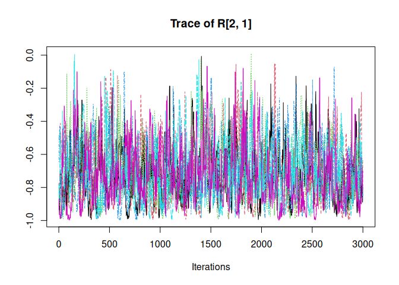

<!-- README.md is generated from README.Rmd. Please edit that file -->
<!-- knit with rmarkdown::render("README.Rmd", output_format = "md_document") -->

# Individual Variance Detection

<!-- badges: start -->

<!-- badges: end -->

*ivd* is an R package for random effects selection in the scale part of
Mixed Effects Location Scale Modlels (MELSM). `ivd()` fits a random
intercepts model with a spike-and-slab prior on the random effects of
the scale.

## Installation

This package can be installed with

    # install.packages("devtools")
    devtools::install_github("consistentlybetter/ivd")

## Example

    library(ivd)
    library(data.table)

## Data

The illustration uses openly accessible data from The Basic Education
Evaluation System (Saeb) conducted by Brazil’s National Institute for
Educational Studies and Research (Inep), available at
<https://www.gov.br/inep/pt-br/areas-de-atuacao/avaliacao-e-exames-educacionais/saeb/resultados>.
It is also available as the `saeb` dataset in the `ivd` package.

Separate within- from between-school effects. That is, besides
`student_ses`, compute `school_ses`.

    ## Grand mean center student SES
    #saeb$student_ses <- c(scale(saeb$student_ses, scale = FALSE))

    ## Calculate school-level SES
    school_ses <- saeb[, .(school_ses = mean(student_ses, na.rm = TRUE)), by = school_id]

    ## Join the school_ses back to the original dataset
    saeb <- saeb[school_ses, on = "school_id"]

    ## Define student level SES as deviation from the school SES
    saeb$student_ses <- saeb$student_ses - saeb$school_ses

    ## Grand mean center school ses
    saeb$school_ses <- c(scale(saeb$school_ses, scale = FALSE))

Illustration of school level variability:

    library(ggplot2)
    plot0 <- ggplot( data = saeb, aes( x = school_id, y = math_proficiency) )
    plot0 + geom_point(aes(color =  school_id), show.legend =  FALSE)

## Estimate Model

We will predict `math_proficiency` which is a standardized variable
capturing math proficiency at the end of grade 12.

Both, location (means) and scale (residual variances) are modeled as a
function of student and school SES. Note that the formula objects for
both location and scale follow `lme4` notation.

    out <- ivd(location_formula = math_proficiency ~ student_ses * school_ses + (1|school_id),
               scale_formula =  ~ student_ses * school_ses + (1|school_id),
               data = saeb,
               niter = 3000, nburnin = 5000, WAIC = TRUE, workers = 6)
    #> ===== Monitors =====
    #> thin = 1: beta, fisherz, sigma_rand, ss, z, zeta
    #> ===== Samplers =====
    #> RW sampler (327)
    #>   - z[]  (320 elements)
    #>   - zeta[]  (4 elements)
    #>   - sigma_rand[]  (2 elements)
    #>   - fisherz
    #> conjugate sampler (4)
    #>   - beta[]  (4 elements)
    #> binary sampler (320)
    #>   - ss[]  (320 elements)
    #> thin = 1: beta, mu, R, sigma_rand, ss, tau, u, zeta
    #> warning: logProb of data node Y[1927]: logProb less than -1e12.
    #> |-------------|-------------|-------------|-------------|
    #> |-------------------------------------------------------|
    #>   [Warning] There are 3 individual pWAIC values that are greater than 0.4. This may indicate that the WAIC estimate is unstable (Vehtari et al., 2017), at least in cases without grouping of data nodes or multivariate data nodes.
    #> Defining model
    #>   [Warning] Multiple definitions for the same node.
    #>             Did you forget indexing with 'i,j' on the left-hand side of
    #>             `fisherz ~ dnorm(mean = 0, sd = 1, lower_ = -Inf, upper_ = Inf, .tau = 1, .var = 1)`?
    #> Building model
    #> Setting data and initial values
    #>   [Note] 'Z' is provided in 'data' but is not a variable in the model and is being ignored.
    #>   [Note] 'Z_scale' is provided in 'data' but is not a variable in the model and is being ignored.
    #> Running calculate on model
    #>   [Note] Any error reports that follow may simply reflect missing values in model variables.
    #> Checking model sizes and dimensions
    #>   [Note] This model is not fully initialized. This is not an error.
    #>          To see which variables are not initialized, use model$initializeInfo().
    #>          For more information on model initialization, see help(modelInitialization).
    #> Compiling
    #>   [Note] This may take a minute.
    #>   [Note] Use 'showCompilerOutput = TRUE' to see C++ compilation details.
    #> Compiling
    #>   [Note] This may take a minute.
    #>   [Note] Use 'showCompilerOutput = TRUE' to see C++ compilation details.
    #> running chain 1...
    #> ===== Monitors =====
    #> thin = 1: beta, fisherz, sigma_rand, ss, z, zeta
    #> ===== Samplers =====
    #> RW sampler (327)
    #>   - z[]  (320 elements)
    #>   - zeta[]  (4 elements)
    #>   - sigma_rand[]  (2 elements)
    #>   - fisherz
    #> conjugate sampler (4)
    #>   - beta[]  (4 elements)
    #> binary sampler (320)
    #>   - ss[]  (320 elements)
    #> thin = 1: beta, mu, R, sigma_rand, ss, tau, u, zeta
    #> |-------------|-------------|-------------|-------------|
    #> |-------------------------------------------------------|
    #>   [Warning] There are 3 individual pWAIC values that are greater than 0.4. This may indicate that the WAIC estimate is unstable (Vehtari et al., 2017), at least in cases without grouping of data nodes or multivariate data nodes.
    #> Defining model
    #>   [Warning] Multiple definitions for the same node.
    #>             Did you forget indexing with 'i,j' on the left-hand side of
    #>             `fisherz ~ dnorm(mean = 0, sd = 1, lower_ = -Inf, upper_ = Inf, .tau = 1, .var = 1)`?
    #> Building model
    #> Setting data and initial values
    #>   [Note] 'Z' is provided in 'data' but is not a variable in the model and is being ignored.
    #>   [Note] 'Z_scale' is provided in 'data' but is not a variable in the model and is being ignored.
    #> Running calculate on model
    #>   [Note] Any error reports that follow may simply reflect missing values in model variables.
    #> Checking model sizes and dimensions
    #>   [Note] This model is not fully initialized. This is not an error.
    #>          To see which variables are not initialized, use model$initializeInfo().
    #>          For more information on model initialization, see help(modelInitialization).
    #> Compiling
    #>   [Note] This may take a minute.
    #>   [Note] Use 'showCompilerOutput = TRUE' to see C++ compilation details.
    #> Compiling
    #>   [Note] This may take a minute.
    #>   [Note] Use 'showCompilerOutput = TRUE' to see C++ compilation details.
    #> running chain 1...
    #> ===== Monitors =====
    #> thin = 1: beta, fisherz, sigma_rand, ss, z, zeta
    #> ===== Samplers =====
    #> RW sampler (327)
    #>   - z[]  (320 elements)
    #>   - zeta[]  (4 elements)
    #>   - sigma_rand[]  (2 elements)
    #>   - fisherz
    #> conjugate sampler (4)
    #>   - beta[]  (4 elements)
    #> binary sampler (320)
    #>   - ss[]  (320 elements)
    #> thin = 1: beta, mu, R, sigma_rand, ss, tau, u, zeta
    #> |-------------|-------------|-------------|-------------|
    #> |-------------------------------------------------------|
    #>   [Warning] There are 3 individual pWAIC values that are greater than 0.4. This may indicate that the WAIC estimate is unstable (Vehtari et al., 2017), at least in cases without grouping of data nodes or multivariate data nodes.
    #> Defining model
    #>   [Warning] Multiple definitions for the same node.
    #>             Did you forget indexing with 'i,j' on the left-hand side of
    #>             `fisherz ~ dnorm(mean = 0, sd = 1, lower_ = -Inf, upper_ = Inf, .tau = 1, .var = 1)`?
    #> Building model
    #> Setting data and initial values
    #>   [Note] 'Z' is provided in 'data' but is not a variable in the model and is being ignored.
    #>   [Note] 'Z_scale' is provided in 'data' but is not a variable in the model and is being ignored.
    #> Running calculate on model
    #>   [Note] Any error reports that follow may simply reflect missing values in model variables.
    #> Checking model sizes and dimensions
    #>   [Note] This model is not fully initialized. This is not an error.
    #>          To see which variables are not initialized, use model$initializeInfo().
    #>          For more information on model initialization, see help(modelInitialization).
    #> Compiling
    #>   [Note] This may take a minute.
    #>   [Note] Use 'showCompilerOutput = TRUE' to see C++ compilation details.
    #> Compiling
    #>   [Note] This may take a minute.
    #>   [Note] Use 'showCompilerOutput = TRUE' to see C++ compilation details.
    #> running chain 1...
    #> ===== Monitors =====
    #> thin = 1: beta, fisherz, sigma_rand, ss, z, zeta
    #> ===== Samplers =====
    #> RW sampler (327)
    #>   - z[]  (320 elements)
    #>   - zeta[]  (4 elements)
    #>   - sigma_rand[]  (2 elements)
    #>   - fisherz
    #> conjugate sampler (4)
    #>   - beta[]  (4 elements)
    #> binary sampler (320)
    #>   - ss[]  (320 elements)
    #> thin = 1: beta, mu, R, sigma_rand, ss, tau, u, zeta
    #> warning: logProb of data node Y[813]: logProb less than -1e12.
    #> warning: logProb of data node Y[820]: logProb less than -1e12.
    #> |-------------|-------------|-------------|-------------|
    #> |-------------------------------------------------------|
    #>   [Warning] There are 3 individual pWAIC values that are greater than 0.4. This may indicate that the WAIC estimate is unstable (Vehtari et al., 2017), at least in cases without grouping of data nodes or multivariate data nodes.
    #> Defining model
    #>   [Warning] Multiple definitions for the same node.
    #>             Did you forget indexing with 'i,j' on the left-hand side of
    #>             `fisherz ~ dnorm(mean = 0, sd = 1, lower_ = -Inf, upper_ = Inf, .tau = 1, .var = 1)`?
    #> Building model
    #> Setting data and initial values
    #>   [Note] 'Z' is provided in 'data' but is not a variable in the model and is being ignored.
    #>   [Note] 'Z_scale' is provided in 'data' but is not a variable in the model and is being ignored.
    #> Running calculate on model
    #>   [Note] Any error reports that follow may simply reflect missing values in model variables.
    #> Checking model sizes and dimensions
    #>   [Note] This model is not fully initialized. This is not an error.
    #>          To see which variables are not initialized, use model$initializeInfo().
    #>          For more information on model initialization, see help(modelInitialization).
    #> Compiling
    #>   [Note] This may take a minute.
    #>   [Note] Use 'showCompilerOutput = TRUE' to see C++ compilation details.
    #> Compiling
    #>   [Note] This may take a minute.
    #>   [Note] Use 'showCompilerOutput = TRUE' to see C++ compilation details.
    #> running chain 1...
    #> ===== Monitors =====
    #> thin = 1: beta, fisherz, sigma_rand, ss, z, zeta
    #> ===== Samplers =====
    #> RW sampler (327)
    #>   - z[]  (320 elements)
    #>   - zeta[]  (4 elements)
    #>   - sigma_rand[]  (2 elements)
    #>   - fisherz
    #> conjugate sampler (4)
    #>   - beta[]  (4 elements)
    #> binary sampler (320)
    #>   - ss[]  (320 elements)
    #> thin = 1: beta, mu, R, sigma_rand, ss, tau, u, zeta
    #> |-------------|-------------|-------------|-------------|
    #> |-------------------------------------------------------|
    #>   [Warning] There are 3 individual pWAIC values that are greater than 0.4. This may indicate that the WAIC estimate is unstable (Vehtari et al., 2017), at least in cases without grouping of data nodes or multivariate data nodes.
    #> Defining model
    #>   [Warning] Multiple definitions for the same node.
    #>             Did you forget indexing with 'i,j' on the left-hand side of
    #>             `fisherz ~ dnorm(mean = 0, sd = 1, lower_ = -Inf, upper_ = Inf, .tau = 1, .var = 1)`?
    #> Building model
    #> Setting data and initial values
    #>   [Note] 'Z' is provided in 'data' but is not a variable in the model and is being ignored.
    #>   [Note] 'Z_scale' is provided in 'data' but is not a variable in the model and is being ignored.
    #> Running calculate on model
    #>   [Note] Any error reports that follow may simply reflect missing values in model variables.
    #> Checking model sizes and dimensions
    #>   [Note] This model is not fully initialized. This is not an error.
    #>          To see which variables are not initialized, use model$initializeInfo().
    #>          For more information on model initialization, see help(modelInitialization).
    #> Compiling
    #>   [Note] This may take a minute.
    #>   [Note] Use 'showCompilerOutput = TRUE' to see C++ compilation details.
    #> Compiling
    #>   [Note] This may take a minute.
    #>   [Note] Use 'showCompilerOutput = TRUE' to see C++ compilation details.
    #> running chain 1...
    #> ===== Monitors =====
    #> thin = 1: beta, fisherz, sigma_rand, ss, z, zeta
    #> ===== Samplers =====
    #> RW sampler (327)
    #>   - z[]  (320 elements)
    #>   - zeta[]  (4 elements)
    #>   - sigma_rand[]  (2 elements)
    #>   - fisherz
    #> conjugate sampler (4)
    #>   - beta[]  (4 elements)
    #> binary sampler (320)
    #>   - ss[]  (320 elements)
    #> thin = 1: beta, mu, R, sigma_rand, ss, tau, u, zeta
    #> |-------------|-------------|-------------|-------------|
    #> |-------------------------------------------------------|
    #>   [Warning] There are 3 individual pWAIC values that are greater than 0.4. This may indicate that the WAIC estimate is unstable (Vehtari et al., 2017), at least in cases without grouping of data nodes or multivariate data nodes.
    #> Defining model
    #>   [Warning] Multiple definitions for the same node.
    #>             Did you forget indexing with 'i,j' on the left-hand side of
    #>             `fisherz ~ dnorm(mean = 0, sd = 1, lower_ = -Inf, upper_ = Inf, .tau = 1, .var = 1)`?
    #> Building model
    #> Setting data and initial values
    #>   [Note] 'Z' is provided in 'data' but is not a variable in the model and is being ignored.
    #>   [Note] 'Z_scale' is provided in 'data' but is not a variable in the model and is being ignored.
    #> Running calculate on model
    #>   [Note] Any error reports that follow may simply reflect missing values in model variables.
    #> Checking model sizes and dimensions
    #>   [Note] This model is not fully initialized. This is not an error.
    #>          To see which variables are not initialized, use model$initializeInfo().
    #>          For more information on model initialization, see help(modelInitialization).
    #> Compiling
    #>   [Note] This may take a minute.
    #>   [Note] Use 'showCompilerOutput = TRUE' to see C++ compilation details.
    #> Compiling
    #>   [Note] This may take a minute.
    #>   [Note] Use 'showCompilerOutput = TRUE' to see C++ compilation details.
    #> running chain 1...
    #> [1] "Compiling results..."

The summary shows the fixed and random effects and it returns all
posterior inclusion probabilities (PIP) for each one of the 160 schools’
residual variance random effects. The PIP returns the probability of a
school belonging to the slab, that is, the probability of the model
having to include the random scale effect.

In other words, large PIP’s indicate schools that are substantially
deviating from the fixed scale effects either because they are much
*more* or much *less* variable compared to other schools in math
proficiency.

One can readily convert those PIP’s to odds, indicating that a school
with a PIP = .75 is three times as likely to belonging to the slab than
belonging to the spike. With an .50 inclusion prior, these odds can be
readily interpreted as Bayes Factors.

    s_out <- summary(out)
    #> Summary statistics for ivd model:
    #> Chains (workers): 6 
    #> 
    #>                              Mean    SD Time-series SE   2.5%    50%  97.5% n_eff R-hat
    #> R[scl_Intc, Intc]          -0.714 0.176          0.007 -0.970 -0.744 -0.304   414 1.023
    #> Intc                        0.129 0.024          0.001  0.082  0.129  0.174   222 1.019
    #> student_ses                 0.082 0.010          0.000  0.063  0.082  0.100 16425 1.000
    #> school_ses                  0.674 0.083          0.004  0.515  0.673  0.842   276 1.012
    #> student_ses:school_ses     -0.022 0.039          0.000 -0.100 -0.022  0.054 16074 1.000
    #> sd_Intc                     0.269 0.020          0.001  0.233  0.268  0.309   197 1.015
    #> sd_scl_Intc                 0.079 0.015          0.000  0.050  0.079  0.112   966 1.004
    #> pip[2, 1]                   0.462 0.499          0.004  0.000  0.000  1.000 19883 1.000
    #> pip[2, 2]                   0.481 0.500          0.004  0.000  0.000  1.000 15488 1.000
    #> pip[2, 3]                   0.461 0.499          0.004  0.000  0.000  1.000 15075 1.000
    #> pip[2, 4]                   0.473 0.499          0.005  0.000  0.000  1.000 10457 1.000
    #> pip[2, 5]                   0.524 0.499          0.005  0.000  1.000  1.000  9264 1.001
    #> pip[2, 6]                   0.420 0.493          0.004  0.000  0.000  1.000 14212 1.000
    #> pip[2, 7]                   0.395 0.489          0.005  0.000  0.000  1.000  8927 1.000
    #> pip[2, 8]                   0.463 0.499          0.004  0.000  0.000  1.000 17776 1.000
    #> pip[2, 9]                   0.987 0.112          0.001  1.000  1.000  1.000  4166 1.001
    #> pip[2, 10]                  0.447 0.497          0.004  0.000  0.000  1.000 13037 1.000
    #> pip[2, 11]                  0.564 0.496          0.004  0.000  1.000  1.000  9817 1.000
    #> pip[2, 12]                  0.358 0.479          0.004  0.000  0.000  1.000 10872 1.000
    #> pip[2, 13]                  0.474 0.499          0.005  0.000  0.000  1.000  8631 1.000
    #> pip[2, 14]                  0.592 0.491          0.006  0.000  1.000  1.000  6071 1.001
    #> pip[2, 15]                  0.513 0.500          0.004  0.000  1.000  1.000 17103 1.000
    #> pip[2, 16]                  0.484 0.500          0.004  0.000  0.000  1.000 19071 1.000
    #> pip[2, 17]                  0.419 0.493          0.004  0.000  0.000  1.000 14167 1.000
    #> pip[2, 18]                  0.527 0.499          0.004  0.000  1.000  1.000 14092 1.000
    #> pip[2, 19]                  0.221 0.415          0.005  0.000  0.000  1.000  6868 1.001
    #> pip[2, 20]                  0.516 0.500          0.004  0.000  1.000  1.000 16574 1.000
    #> pip[2, 21]                  0.349 0.477          0.005  0.000  0.000  1.000  9766 1.000
    #> pip[2, 22]                  0.563 0.496          0.005  0.000  1.000  1.000 10541 1.000
    #> pip[2, 23]                  0.498 0.500          0.004  0.000  0.000  1.000  9983 1.001
    #> pip[2, 24]                  0.478 0.500          0.004  0.000  0.000  1.000 18046 1.000
    #> pip[2, 25]                  0.470 0.499          0.004  0.000  0.000  1.000 14582 1.000
    #> pip[2, 26]                  0.515 0.500          0.004  0.000  1.000  1.000 17286 1.000
    #> pip[2, 27]                  0.449 0.497          0.004  0.000  0.000  1.000 16919 1.000
    #> pip[2, 28]                  0.383 0.486          0.004  0.000  0.000  1.000  9072 1.000
    #> pip[2, 29]                  0.500 0.500          0.004  0.000  1.000  1.000 13069 1.000
    #> pip[2, 30]                  0.464 0.499          0.005  0.000  0.000  1.000 11972 1.000
    #> pip[2, 31]                  0.462 0.499          0.004  0.000  0.000  1.000 16099 1.000
    #> pip[2, 32]                  0.482 0.500          0.005  0.000  0.000  1.000  8752 1.000
    #> pip[2, 33]                  0.507 0.500          0.004  0.000  1.000  1.000 13599 1.000
    #> pip[2, 34]                  0.543 0.498          0.004  0.000  1.000  1.000 16030 1.000
    #> pip[2, 35]                  0.657 0.475          0.006  0.000  1.000  1.000  3724 1.000
    #> pip[2, 36]                  0.352 0.478          0.006  0.000  0.000  1.000  5463 1.001
    #> pip[2, 37]                  0.467 0.499          0.004  0.000  0.000  1.000 17240 1.000
    #> pip[2, 38]                  0.445 0.497          0.004  0.000  0.000  1.000 14436 1.000
    #> pip[2, 39]                  0.682 0.466          0.009  0.000  1.000  1.000  2100 1.002
    #> pip[2, 40]                  0.454 0.498          0.004  0.000  0.000  1.000 15095 1.000
    #> pip[2, 41]                  0.637 0.481          0.009  0.000  1.000  1.000  2116 1.003
    #> pip[2, 42]                  0.477 0.499          0.004  0.000  0.000  1.000 13510 1.000
    #> pip[2, 43]                  0.417 0.493          0.004  0.000  0.000  1.000 12533 1.000
    #> pip[2, 44]                  0.443 0.497          0.004  0.000  0.000  1.000 16226 1.000
    #> pip[2, 45]                  0.441 0.497          0.004  0.000  0.000  1.000 16359 1.000
    #> pip[2, 46]                  1.000 0.021          0.000  1.000  1.000  1.000  5673 1.000
    #> pip[2, 47]                  0.461 0.498          0.004  0.000  0.000  1.000 16379 1.000
    #> pip[2, 48]                  0.609 0.488          0.004  0.000  1.000  1.000 11695 1.000
    #> pip[2, 49]                  0.502 0.500          0.005  0.000  1.000  1.000  7341 1.000
    #> pip[2, 50]                  0.522 0.500          0.004  0.000  1.000  1.000 16617 1.000
    #> pip[2, 51]                  0.468 0.499          0.004  0.000  0.000  1.000 16582 1.000
    #> pip[2, 52]                  0.549 0.498          0.004  0.000  1.000  1.000 13463 1.000
    #> pip[2, 53]                  0.825 0.380          0.005  0.000  1.000  1.000  6501 1.000
    #> pip[2, 54]                  0.615 0.487          0.004  0.000  1.000  1.000 11630 1.000
    #> pip[2, 55]                  0.385 0.487          0.004  0.000  0.000  1.000 12133 1.000
    #> pip[2, 56]                  0.468 0.499          0.004  0.000  0.000  1.000 15784 1.000
    #> pip[2, 57]                  0.615 0.487          0.004  0.000  1.000  1.000 10040 1.000
    #> pip[2, 58]                  0.394 0.489          0.004  0.000  0.000  1.000 12732 1.001
    #> pip[2, 59]                  0.433 0.495          0.004  0.000  0.000  1.000 15829 1.000
    #> pip[2, 60]                  0.517 0.500          0.004  0.000  1.000  1.000 14118 1.000
    #> pip[2, 61]                  0.298 0.457          0.005  0.000  0.000  1.000  6573 1.001
    #> pip[2, 62]                  0.414 0.493          0.004  0.000  0.000  1.000 12836 1.001
    #> pip[2, 63]                  0.500 0.500          0.004  0.000  1.000  1.000 12466 1.000
    #> pip[2, 64]                  0.740 0.439          0.004  0.000  1.000  1.000 10365 1.000
    #> pip[2, 65]                  0.485 0.500          0.004  0.000  0.000  1.000 16362 1.000
    #> pip[2, 66]                  0.637 0.481          0.004  0.000  1.000  1.000 12619 1.000
    #> pip[2, 67]                  0.337 0.473          0.004  0.000  0.000  1.000 12646 1.001
    #> pip[2, 68]                  0.368 0.482          0.005  0.000  0.000  1.000  8646 1.000
    #> pip[2, 69]                  0.458 0.498          0.004  0.000  0.000  1.000 19625 1.000
    #> pip[2, 70]                  0.402 0.490          0.006  0.000  0.000  1.000  6661 1.000
    #> pip[2, 71]                  0.380 0.485          0.004  0.000  0.000  1.000  9482 1.000
    #> pip[2, 72]                  0.382 0.486          0.004  0.000  0.000  1.000  9788 1.000
    #> pip[2, 73]                  0.358 0.480          0.007  0.000  0.000  1.000  4639 1.000
    #> pip[2, 74]                  0.497 0.500          0.004  0.000  0.000  1.000 15702 1.000
    #> pip[2, 75]                  0.462 0.499          0.004  0.000  0.000  1.000 18338 1.000
    #> pip[2, 76]                  0.464 0.499          0.004  0.000  0.000  1.000 16542 1.000
    #> pip[2, 77]                  0.464 0.499          0.004  0.000  0.000  1.000 15973 1.000
    #> pip[2, 78]                  0.445 0.497          0.004  0.000  0.000  1.000 14419 1.000
    #> pip[2, 79]                  0.387 0.487          0.004  0.000  0.000  1.000  7726 1.000
    #> pip[2, 80]                  0.507 0.500          0.004  0.000  1.000  1.000 19870 1.000
    #> pip[2, 81]                  0.499 0.500          0.005  0.000  0.000  1.000 10789 1.000
    #> pip[2, 82]                  0.521 0.500          0.004  0.000  1.000  1.000 13232 1.000
    #> pip[2, 83]                  0.486 0.500          0.004  0.000  0.000  1.000 16439 1.000
    #> pip[2, 84]                  0.507 0.500          0.004  0.000  1.000  1.000 18539 1.000
    #> pip[2, 85]                  0.464 0.499          0.004  0.000  0.000  1.000 17229 1.000
    #> pip[2, 86]                  0.522 0.500          0.004  0.000  1.000  1.000 10684 1.000
    #> pip[2, 87]                  0.703 0.457          0.006  0.000  1.000  1.000  4592 1.000
    #> pip[2, 88]                  0.484 0.500          0.004  0.000  0.000  1.000 11549 1.000
    #> pip[2, 89]                  0.529 0.499          0.004  0.000  1.000  1.000 17941 1.000
    #> pip[2, 90]                  0.502 0.500          0.004  0.000  1.000  1.000 19596 1.000
    #> pip[2, 91]                  0.434 0.496          0.004  0.000  0.000  1.000 16028 1.001
    #> pip[2, 92]                  0.719 0.450          0.005  0.000  1.000  1.000  6779 1.000
    #> pip[2, 93]                  0.437 0.496          0.004  0.000  0.000  1.000 14733 1.000
    #> pip[2, 94]                  0.476 0.499          0.004  0.000  0.000  1.000 16608 1.000
    #> pip[2, 95]                  0.751 0.433          0.004  0.000  1.000  1.000  6828 1.000
    #> pip[2, 96]                  0.457 0.498          0.004  0.000  0.000  1.000 16171 1.000
    #> pip[2, 97]                  0.343 0.475          0.004  0.000  0.000  1.000  9323 1.000
    #> pip[2, 98]                  0.475 0.499          0.004  0.000  0.000  1.000 14549 1.000
    #> pip[2, 99]                  0.560 0.496          0.004  0.000  1.000  1.000 15301 1.000
    #> pip[2, 100]                 0.450 0.497          0.004  0.000  0.000  1.000 16513 1.000
    #> pip[2, 101]                 0.440 0.496          0.004  0.000  0.000  1.000 14834 1.000
    #> pip[2, 102]                 0.498 0.500          0.006  0.000  0.000  1.000  5370 1.001
    #> pip[2, 103]                 0.388 0.487          0.005  0.000  0.000  1.000 11353 1.000
    #> pip[2, 104]                 0.450 0.497          0.004  0.000  0.000  1.000 14631 1.000
    #> pip[2, 105]                 0.482 0.500          0.004  0.000  0.000  1.000 17351 1.000
    #> pip[2, 106]                 0.459 0.498          0.005  0.000  0.000  1.000  8904 1.000
    #> pip[2, 107]                 0.513 0.500          0.004  0.000  1.000  1.000 14063 1.000
    #> pip[2, 108]                 0.529 0.499          0.007  0.000  1.000  1.000  3915 1.001
    #> pip[2, 109]                 0.542 0.498          0.004  0.000  1.000  1.000 14099 1.000
    #> pip[2, 110]                 0.397 0.489          0.004  0.000  0.000  1.000 11338 1.000
    #> pip[2, 111]                 0.457 0.498          0.005  0.000  0.000  1.000  8348 1.000
    #> pip[2, 112]                 0.452 0.498          0.005  0.000  0.000  1.000  9483 1.000
    #> pip[2, 113]                 0.632 0.482          0.004  0.000  1.000  1.000 15748 1.001
    #> pip[2, 114]                 0.896 0.305          0.003  0.000  1.000  1.000  4139 1.000
    #> pip[2, 115]                 0.816 0.387          0.005  0.000  1.000  1.000  6231 1.001
    #> pip[2, 116]                 0.467 0.499          0.005  0.000  0.000  1.000 10075 1.000
    #> pip[2, 117]                 0.423 0.494          0.004  0.000  0.000  1.000 16497 1.000
    #> pip[2, 118]                 0.396 0.489          0.004  0.000  0.000  1.000 11637 1.000
    #> pip[2, 119]                 0.499 0.500          0.004  0.000  0.000  1.000 16649 1.000
    #> pip[2, 120]                 0.563 0.496          0.004  0.000  1.000  1.000 16879 1.001
    #> pip[2, 121]                 0.327 0.469          0.005  0.000  0.000  1.000  6577 1.001
    #> pip[2, 122]                 0.540 0.498          0.008  0.000  1.000  1.000  3189 1.001
    #> pip[2, 123]                 0.576 0.494          0.004  0.000  1.000  1.000 16583 1.000
    #> pip[2, 124]                 0.752 0.432          0.004  0.000  1.000  1.000  7037 1.000
    #> pip[2, 125]                 0.467 0.499          0.005  0.000  0.000  1.000 13300 1.001
    #> pip[2, 126]                 0.501 0.500          0.004  0.000  1.000  1.000 11159 1.000
    #> pip[2, 127]                 0.559 0.497          0.004  0.000  1.000  1.000 13300 1.000
    #> pip[2, 128]                 0.525 0.499          0.004  0.000  1.000  1.000 15474 1.000
    #> pip[2, 129]                 0.411 0.492          0.004  0.000  0.000  1.000 15108 1.001
    #> pip[2, 130]                 0.470 0.499          0.004  0.000  0.000  1.000 15837 1.000
    #> pip[2, 131]                 0.568 0.495          0.004  0.000  1.000  1.000 15740 1.000
    #> pip[2, 132]                 0.399 0.490          0.004  0.000  0.000  1.000 14006 1.000
    #> pip[2, 133]                 0.344 0.475          0.004  0.000  0.000  1.000 10764 1.000
    #> pip[2, 134]                 0.509 0.500          0.004  0.000  1.000  1.000 15223 1.000
    #> pip[2, 135]                 0.433 0.496          0.004  0.000  0.000  1.000 12775 1.000
    #> pip[2, 136]                 0.385 0.487          0.004  0.000  0.000  1.000 12068 1.000
    #> pip[2, 137]                 0.438 0.496          0.004  0.000  0.000  1.000 12865 1.000
    #> pip[2, 138]                 0.440 0.496          0.004  0.000  0.000  1.000 15335 1.000
    #> pip[2, 139]                 0.409 0.492          0.004  0.000  0.000  1.000 15958 1.000
    #> pip[2, 140]                 0.575 0.494          0.004  0.000  1.000  1.000 14191 1.000
    #> pip[2, 141]                 0.522 0.500          0.004  0.000  1.000  1.000 13010 1.000
    #> pip[2, 142]                 0.480 0.500          0.004  0.000  0.000  1.000 12499 1.000
    #> pip[2, 143]                 0.409 0.492          0.004  0.000  0.000  1.000 14683 1.000
    #> pip[2, 144]                 0.478 0.500          0.004  0.000  0.000  1.000 17266 1.000
    #> pip[2, 145]                 0.456 0.498          0.005  0.000  0.000  1.000 12083 1.000
    #> pip[2, 146]                 0.458 0.498          0.004  0.000  0.000  1.000 13892 1.000
    #> pip[2, 147]                 0.489 0.500          0.004  0.000  0.000  1.000 17972 1.000
    #> pip[2, 148]                 0.632 0.482          0.004  0.000  1.000  1.000 14998 1.000
    #> pip[2, 149]                 0.716 0.451          0.004  0.000  1.000  1.000 13258 1.000
    #> pip[2, 150]                 0.378 0.485          0.005  0.000  0.000  1.000 10988 1.000
    #> pip[2, 151]                 0.467 0.499          0.004  0.000  0.000  1.000 16842 1.000
    #> pip[2, 152]                 0.469 0.499          0.004  0.000  0.000  1.000 16093 1.001
    #> pip[2, 153]                 0.776 0.417          0.004  0.000  1.000  1.000  8951 1.000
    #> pip[2, 154]                 0.327 0.469          0.005  0.000  0.000  1.000  8378 1.001
    #> pip[2, 155]                 0.413 0.492          0.004  0.000  0.000  1.000 12878 1.000
    #> pip[2, 156]                 0.586 0.493          0.004  0.000  1.000  1.000 13613 1.000
    #> pip[2, 157]                 0.534 0.499          0.004  0.000  1.000  1.000 14208 1.000
    #> pip[2, 158]                 0.463 0.499          0.004  0.000  0.000  1.000 18345 1.000
    #> pip[2, 159]                 0.477 0.499          0.004  0.000  0.000  1.000 14520 1.000
    #> pip[2, 160]                 0.520 0.500          0.004  0.000  1.000  1.000 17941 1.000
    #> scl_Intc                   -0.234 0.008          0.000 -0.251 -0.234 -0.218  1182 1.005
    #> scl_student_ses             0.031 0.009          0.000  0.014  0.031  0.048  2379 1.001
    #> scl_school_ses              0.120 0.035          0.001  0.050  0.121  0.186  1279 1.005
    #> scl_student_ses:school_ses  0.076 0.037          0.001  0.002  0.076  0.148  2948 1.001
    #> 
    #> WAIC: 27044.29 
    #> elppd: -13365.52 
    #> pWAIC: 156.6258

## Plots

### Posterior inclusion probability plot (PIP)

    plot(out, type = "pip")

### PIP vs. Within-cluster SD

    plot(out, type =  "funnel")

### PIP vs. math achievement

Note that point size represents the within-cluster standard deviation of
each cluster.

    plot(out, type =  "outcome")

### Diagnostic plots based on coda plots:

    codaplot(out, parameters =  "beta[1]")

    codaplot(out, parameters =  "R[2, 1]")

## Acknowledgment

This work was supported by the Tools Competition catalyst award for the
project
[consistentlyBetter](https://tools-competition.org/winner/consistentlybetter/)
to PR. The content is solely the responsibility of the authors and does
not necessarily represent the official views of the funding agency.

## References

Rodriguez, J. E., Williams, D. R., & Rast, P. (2024). Who is and is not"
average’"? Random effects selection with spike-and-slab priors.
*Psychological Methods*. <https://doi.org/10.1037/met0000535>

Williams, D. R., Martin, S. R., & Rast, P. (2022). Putting the
individual into reliability: Bayesian testing of homogeneous
within-person variance in hierarchical models. *Behavior Research
Methods*, *54*(3), 1272–1290.
<https://doi.org/10.3758/s13428-021-01646-x>
