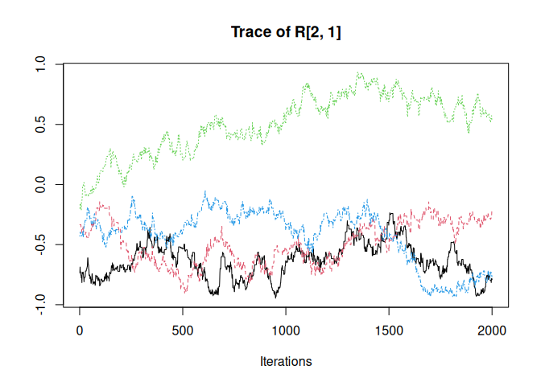

<!-- README.md is generated from README.Rmd. Please edit that file -->
<!-- knit with rmarkdown::render("README.Rmd", output_format = "md_document") -->

# Individual Variance Detection

<!-- badges: start -->

<!-- badges: end -->

*ivd* is an R package for random effects selection in the scale part of
Mixed Effects Location Scale Modlels (MELSM). `ivd()` fits a random
intercepts model with a spike-and-slab prior on the random effects of
the scale.

## Installation

This package can be installed with

    # install.packages("devtools")
    devtools::install_github("consistentlybetter/ivd")

## Example

    library(ivd)

    d <- mlmRev::Hsb82

    ## Ensure that school id is a continuous vector
    school_dat$schoolid <- NA
    k <- 0
    for( i in unique(school_dat$school) ) {
      k <- k+1
      school_dat[school_dat$school == i, "schoolid"] <- k
    }

## Estimate Model

    out <- ivd(location_formula = mAch ~ meanses + ses + sector + (ses | schoolid),
               scale_formula =  ~ meanses + ses + (1 | schoolid),
               data = school_dat,
               niter = 2000, nburnin = 3000)
    #> ===== Monitors =====
    #> thin = 1: beta, L, sigma_rand, ss, z, zeta
    #> ===== Samplers =====
    #> RW_block_lkj_corr_cholesky sampler (1)
    #>   - L[1:3, 1:3] 
    #> RW sampler (486)
    #>   - z[]  (480 elements)
    #>   - zeta[]  (3 elements)
    #>   - sigma_rand[]  (3 elements)
    #> conjugate sampler (4)
    #>   - beta[]  (4 elements)
    #> binary sampler (480)
    #>   - ss[]  (480 elements)
    #> |-------------|-------------|-------------|-------------|
    #> |-------------------------------------------------------|
    #>   [Warning] There are 5 individual pWAIC values that are greater than 0.4. This may indicate that the WAIC estimate is unstable (Vehtari et al., 2017), at least in cases without grouping of data nodes or multivariate data nodes.
    #> Defining model
    #> Building model
    #> Setting data and initial values
    #>   [Note] 'Z_scale' is provided in 'data' but is not a variable in the model and is being ignored.
    #> Running calculate on model
    #>   [Note] Any error reports that follow may simply reflect missing values in model variables.
    #> Checking model sizes and dimensions
    #>   [Note] This model is not fully initialized. This is not an error.
    #>          To see which variables are not initialized, use model$initializeInfo().
    #>          For more information on model initialization, see help(modelInitialization).
    #> Compiling
    #>   [Note] This may take a minute.
    #>   [Note] Use 'showCompilerOutput = TRUE' to see C++ compilation details.
    #> Compiling
    #>   [Note] This may take a minute.
    #>   [Note] Use 'showCompilerOutput = TRUE' to see C++ compilation details.
    #> running chain 1...
    #> ===== Monitors =====
    #> thin = 1: beta, L, sigma_rand, ss, z, zeta
    #> ===== Samplers =====
    #> RW_block_lkj_corr_cholesky sampler (1)
    #>   - L[1:3, 1:3] 
    #> RW sampler (486)
    #>   - z[]  (480 elements)
    #>   - zeta[]  (3 elements)
    #>   - sigma_rand[]  (3 elements)
    #> conjugate sampler (4)
    #>   - beta[]  (4 elements)
    #> binary sampler (480)
    #>   - ss[]  (480 elements)
    #> |-------------|-------------|-------------|-------------|
    #> |-------------------------------------------------------|
    #>   [Warning] There are 5 individual pWAIC values that are greater than 0.4. This may indicate that the WAIC estimate is unstable (Vehtari et al., 2017), at least in cases without grouping of data nodes or multivariate data nodes.
    #> Defining model
    #> Building model
    #> Setting data and initial values
    #>   [Note] 'Z_scale' is provided in 'data' but is not a variable in the model and is being ignored.
    #> Running calculate on model
    #>   [Note] Any error reports that follow may simply reflect missing values in model variables.
    #> Checking model sizes and dimensions
    #>   [Note] This model is not fully initialized. This is not an error.
    #>          To see which variables are not initialized, use model$initializeInfo().
    #>          For more information on model initialization, see help(modelInitialization).
    #> Compiling
    #>   [Note] This may take a minute.
    #>   [Note] Use 'showCompilerOutput = TRUE' to see C++ compilation details.
    #> Compiling
    #>   [Note] This may take a minute.
    #>   [Note] Use 'showCompilerOutput = TRUE' to see C++ compilation details.
    #> running chain 1...
    #> ===== Monitors =====
    #> thin = 1: beta, L, sigma_rand, ss, z, zeta
    #> ===== Samplers =====
    #> RW_block_lkj_corr_cholesky sampler (1)
    #>   - L[1:3, 1:3] 
    #> RW sampler (486)
    #>   - z[]  (480 elements)
    #>   - zeta[]  (3 elements)
    #>   - sigma_rand[]  (3 elements)
    #> conjugate sampler (4)
    #>   - beta[]  (4 elements)
    #> binary sampler (480)
    #>   - ss[]  (480 elements)
    #> |-------------|-------------|-------------|-------------|
    #> |-------------------------------------------------------|
    #>   [Warning] There are 6 individual pWAIC values that are greater than 0.4. This may indicate that the WAIC estimate is unstable (Vehtari et al., 2017), at least in cases without grouping of data nodes or multivariate data nodes.
    #> Defining model
    #> Building model
    #> Setting data and initial values
    #>   [Note] 'Z_scale' is provided in 'data' but is not a variable in the model and is being ignored.
    #> Running calculate on model
    #>   [Note] Any error reports that follow may simply reflect missing values in model variables.
    #> Checking model sizes and dimensions
    #>   [Note] This model is not fully initialized. This is not an error.
    #>          To see which variables are not initialized, use model$initializeInfo().
    #>          For more information on model initialization, see help(modelInitialization).
    #> Compiling
    #>   [Note] This may take a minute.
    #>   [Note] Use 'showCompilerOutput = TRUE' to see C++ compilation details.
    #> Compiling
    #>   [Note] This may take a minute.
    #>   [Note] Use 'showCompilerOutput = TRUE' to see C++ compilation details.
    #> running chain 1...
    #> ===== Monitors =====
    #> thin = 1: beta, L, sigma_rand, ss, z, zeta
    #> ===== Samplers =====
    #> RW_block_lkj_corr_cholesky sampler (1)
    #>   - L[1:3, 1:3] 
    #> RW sampler (486)
    #>   - z[]  (480 elements)
    #>   - zeta[]  (3 elements)
    #>   - sigma_rand[]  (3 elements)
    #> conjugate sampler (4)
    #>   - beta[]  (4 elements)
    #> binary sampler (480)
    #>   - ss[]  (480 elements)
    #> |-------------|-------------|-------------|-------------|
    #> |-------------------------------------------------------|
    #>   [Warning] There are 5 individual pWAIC values that are greater than 0.4. This may indicate that the WAIC estimate is unstable (Vehtari et al., 2017), at least in cases without grouping of data nodes or multivariate data nodes.
    #> Defining model
    #> Building model
    #> Setting data and initial values
    #>   [Note] 'Z_scale' is provided in 'data' but is not a variable in the model and is being ignored.
    #> Running calculate on model
    #>   [Note] Any error reports that follow may simply reflect missing values in model variables.
    #> Checking model sizes and dimensions
    #>   [Note] This model is not fully initialized. This is not an error.
    #>          To see which variables are not initialized, use model$initializeInfo().
    #>          For more information on model initialization, see help(modelInitialization).
    #> Compiling
    #>   [Note] This may take a minute.
    #>   [Note] Use 'showCompilerOutput = TRUE' to see C++ compilation details.
    #> Compiling
    #>   [Note] This may take a minute.
    #>   [Note] Use 'showCompilerOutput = TRUE' to see C++ compilation details.
    #> running chain 1...

    summary(out)
    #> Summary statistics for ivd model:
    #>                    Mean    SD Time-series SE   2.5%    50%  97.5% Point est. Upper C.I.
    #> R[2, 1]           0.500 0.314          0.066 -0.173  0.531  0.931      1.344      1.860
    #> R[3, 1]          -0.629 0.200          0.032 -0.937 -0.654 -0.179      1.178      1.463
    #> R[3, 2]           0.101 0.309          0.046 -0.506  0.127  0.651      1.227      1.588
    #> beta[1]          12.171 0.218          0.012 11.735 12.176 12.593      1.044      1.127
    #> beta[2]           3.308 0.409          0.018  2.527  3.300  4.119      1.004      1.007
    #> beta[3]           2.186 0.124          0.003  1.945  2.185  2.430      1.004      1.011
    #> beta[4]           1.092 0.340          0.020  0.431  1.088  1.760      1.063      1.174
    #> sigma_rand[1, 1]  1.197 0.129          0.010  0.965  1.192  1.451      1.083      1.234
    #> sigma_rand[2, 2]  0.716 0.232          0.024  0.308  0.698  1.267      1.079      1.226
    #> sigma_rand[3, 3]  0.260 0.154          0.032  0.096  0.219  0.739      1.269      1.909
    #> ss[3, 1]          0.609 0.488          0.009  0.000  1.000  1.000      1.001      1.003
    #> ss[3, 2]          0.473 0.499          0.006  0.000  0.000  1.000      1.000      1.001
    #> ss[3, 3]          0.429 0.495          0.010  0.000  0.000  1.000      1.006      1.020
    #> ss[3, 4]          0.458 0.498          0.006  0.000  0.000  1.000      1.001      1.003
    #> ss[3, 5]          0.434 0.496          0.007  0.000  0.000  1.000      1.004      1.014
    #> ss[3, 6]          0.424 0.494          0.007  0.000  0.000  1.000      1.001      1.003
    #> ss[3, 7]          0.774 0.418          0.007  0.000  1.000  1.000      1.000      1.000
    #> ss[3, 8]          0.839 0.367          0.008  0.000  1.000  1.000      1.005      1.011
    #> ss[3, 9]          0.747 0.435          0.009  0.000  1.000  1.000      1.004      1.011
    #> ss[3, 10]         0.440 0.496          0.006  0.000  0.000  1.000      1.000      1.001
    #> ss[3, 11]         0.399 0.490          0.007  0.000  0.000  1.000      1.001      1.003
    #> ss[3, 12]         0.606 0.489          0.013  0.000  1.000  1.000      1.006      1.019
    #> ss[3, 13]         0.381 0.486          0.008  0.000  0.000  1.000      1.000      1.001
    #> ss[3, 14]         0.467 0.499          0.006  0.000  0.000  1.000      1.000      1.000
    #> ss[3, 15]         0.476 0.499          0.007  0.000  0.000  1.000      1.001      1.003
    #> ss[3, 16]         0.463 0.499          0.006  0.000  0.000  1.000      1.000      1.000
    #> ss[3, 17]         0.469 0.499          0.006  0.000  0.000  1.000      1.000      1.001
    #> ss[3, 18]         0.454 0.498          0.007  0.000  0.000  1.000      1.000      1.000
    #> ss[3, 19]         0.451 0.498          0.006  0.000  0.000  1.000      1.000      1.000
    #> ss[3, 20]         0.419 0.493          0.007  0.000  0.000  1.000      1.000      1.002
    #> ss[3, 21]         0.556 0.497          0.007  0.000  1.000  1.000      1.001      1.004
    #> ss[3, 22]         0.833 0.373          0.008  0.000  1.000  1.000      1.005      1.013
    #> ss[3, 23]         0.444 0.497          0.006  0.000  0.000  1.000      1.000      1.001
    #> ss[3, 24]         0.434 0.496          0.007  0.000  0.000  1.000      1.002      1.008
    #> ss[3, 25]         0.460 0.498          0.006  0.000  0.000  1.000      1.000      1.002
    #> ss[3, 26]         0.770 0.421          0.007  0.000  1.000  1.000      1.002      1.007
    #> ss[3, 27]         0.460 0.498          0.006  0.000  0.000  1.000      1.000      1.000
    #> ss[3, 28]         0.700 0.459          0.006  0.000  1.000  1.000      1.000      1.002
    #> ss[3, 29]         0.484 0.500          0.006  0.000  0.000  1.000      1.000      1.001
    #> ss[3, 30]         0.471 0.499          0.006  0.000  0.000  1.000      1.000      1.000
    #> ss[3, 31]         0.550 0.498          0.007  0.000  1.000  1.000      1.000      1.002
    #> ss[3, 32]         0.393 0.489          0.007  0.000  0.000  1.000      1.001      1.004
    #> ss[3, 33]         0.425 0.494          0.007  0.000  0.000  1.000      1.000      1.000
    #> ss[3, 34]         0.478 0.500          0.006  0.000  0.000  1.000      1.001      1.003
    #> ss[3, 35]         0.424 0.494          0.006  0.000  0.000  1.000      1.001      1.003
    #> ss[3, 36]         0.534 0.499          0.007  0.000  1.000  1.000      1.000      1.000
    #> ss[3, 37]         0.448 0.497          0.008  0.000  0.000  1.000      1.000      1.002
    #> ss[3, 38]         0.832 0.374          0.008  0.000  1.000  1.000      1.005      1.012
    #> ss[3, 39]         0.570 0.495          0.008  0.000  1.000  1.000      1.002      1.008
    #> ss[3, 40]         0.475 0.499          0.009  0.000  0.000  1.000      1.000      1.001
    #> ss[3, 41]         0.446 0.497          0.007  0.000  0.000  1.000      1.000      1.002
    #> ss[3, 42]         0.522 0.500          0.007  0.000  1.000  1.000      1.000      1.001
    #> ss[3, 43]         0.471 0.499          0.006  0.000  0.000  1.000      1.002      1.008
    #> ss[3, 44]         0.554 0.497          0.009  0.000  1.000  1.000      1.000      1.000
    #> ss[3, 45]         0.485 0.500          0.006  0.000  0.000  1.000      1.001      1.004
    #> ss[3, 46]         0.570 0.495          0.006  0.000  1.000  1.000      1.001      1.004
    #> ss[3, 47]         0.448 0.497          0.010  0.000  0.000  1.000      1.004      1.013
    #> ss[3, 48]         0.988 0.108          0.003  1.000  1.000  1.000      1.058      1.072
    #> ss[3, 49]         0.582 0.493          0.007  0.000  1.000  1.000      1.001      1.003
    #> ss[3, 50]         0.448 0.497          0.006  0.000  0.000  1.000      1.001      1.003
    #> ss[3, 51]         0.661 0.473          0.010  0.000  1.000  1.000      1.006      1.020
    #> ss[3, 52]         0.481 0.500          0.007  0.000  0.000  1.000      1.000      1.000
    #> ss[3, 53]         0.531 0.499          0.009  0.000  1.000  1.000      1.002      1.006
    #> ss[3, 54]         0.512 0.500          0.008  0.000  1.000  1.000      1.000      1.000
    #> ss[3, 55]         0.459 0.498          0.006  0.000  0.000  1.000      1.000      1.001
    #> ss[3, 56]         0.626 0.484          0.008  0.000  1.000  1.000      1.003      1.010
    #> ss[3, 57]         0.670 0.470          0.007  0.000  1.000  1.000      1.000      1.001
    #> ss[3, 58]         0.474 0.499          0.006  0.000  0.000  1.000      1.000      1.002
    #> ss[3, 59]         0.451 0.498          0.007  0.000  0.000  1.000      1.001      1.005
    #> ss[3, 60]         0.462 0.499          0.007  0.000  0.000  1.000      1.000      1.000
    #> ss[3, 61]         0.649 0.477          0.007  0.000  1.000  1.000      1.000      1.001
    #> ss[3, 62]         0.470 0.499          0.007  0.000  0.000  1.000      1.002      1.006
    #> ss[3, 63]         0.509 0.500          0.007  0.000  1.000  1.000      1.000      1.001
    #> ss[3, 64]         0.416 0.493          0.007  0.000  0.000  1.000      1.000      1.001
    #> ss[3, 65]         0.458 0.498          0.006  0.000  0.000  1.000      1.001      1.004
    #> ss[3, 66]         0.333 0.471          0.008  0.000  0.000  1.000      1.003      1.008
    #> ss[3, 67]         0.488 0.500          0.007  0.000  0.000  1.000      1.001      1.003
    #> ss[3, 68]         0.518 0.500          0.006  0.000  1.000  1.000      1.001      1.004
    #> ss[3, 69]         0.512 0.500          0.006  0.000  1.000  1.000      1.001      1.005
    #> ss[3, 70]         0.434 0.496          0.006  0.000  0.000  1.000      1.000      1.000
    #> ss[3, 71]         0.423 0.494          0.006  0.000  0.000  1.000      1.000      1.002
    #> ss[3, 72]         0.751 0.432          0.015  0.000  1.000  1.000      1.012      1.031
    #> ss[3, 73]         0.425 0.494          0.006  0.000  0.000  1.000      1.000      1.002
    #> ss[3, 74]         0.283 0.450          0.009  0.000  0.000  1.000      1.007      1.021
    #> ss[3, 75]         0.489 0.500          0.009  0.000  0.000  1.000      1.003      1.011
    #> ss[3, 76]         0.440 0.496          0.006  0.000  0.000  1.000      1.000      1.002
    #> ss[3, 77]         0.437 0.496          0.007  0.000  0.000  1.000      1.001      1.004
    #> ss[3, 78]         0.498 0.500          0.007  0.000  0.000  1.000      1.001      1.003
    #> ss[3, 79]         0.545 0.498          0.006  0.000  1.000  1.000      1.001      1.005
    #> ss[3, 80]         0.440 0.496          0.006  0.000  0.000  1.000      1.000      1.002
    #> ss[3, 81]         0.634 0.482          0.007  0.000  1.000  1.000      1.000      1.001
    #> ss[3, 82]         0.429 0.495          0.009  0.000  0.000  1.000      1.001      1.004
    #> ss[3, 83]         0.388 0.487          0.007  0.000  0.000  1.000      1.000      1.001
    #> ss[3, 84]         0.459 0.498          0.007  0.000  0.000  1.000      1.000      1.001
    #> ss[3, 85]         0.509 0.500          0.007  0.000  1.000  1.000      1.002      1.007
    #> ss[3, 86]         0.420 0.494          0.006  0.000  0.000  1.000      1.000      1.001
    #> ss[3, 87]         0.519 0.500          0.010  0.000  1.000  1.000      1.008      1.025
    #> ss[3, 88]         0.456 0.498          0.006  0.000  0.000  1.000      1.000      1.001
    #> ss[3, 89]         0.446 0.497          0.007  0.000  0.000  1.000      1.002      1.008
    #> ss[3, 90]         0.577 0.494          0.008  0.000  1.000  1.000      1.000      1.001
    #> ss[3, 91]         0.493 0.500          0.007  0.000  0.000  1.000      1.000      1.002
    #> ss[3, 92]         0.549 0.498          0.006  0.000  1.000  1.000      1.000      1.000
    #> ss[3, 93]         0.411 0.492          0.006  0.000  0.000  1.000      1.000      1.002
    #> ss[3, 94]         0.391 0.488          0.007  0.000  0.000  1.000      1.000      1.000
    #> ss[3, 95]         0.425 0.494          0.006  0.000  0.000  1.000      1.001      1.003
    #> ss[3, 96]         0.444 0.497          0.009  0.000  0.000  1.000      1.004      1.014
    #> ss[3, 97]         0.456 0.498          0.006  0.000  0.000  1.000      1.000      1.001
    #> ss[3, 98]         0.408 0.491          0.007  0.000  0.000  1.000      1.002      1.008
    #> ss[3, 99]         0.415 0.493          0.008  0.000  0.000  1.000      1.000      1.001
    #> ss[3, 100]        0.438 0.496          0.007  0.000  0.000  1.000      1.000      1.001
    #> ss[3, 101]        0.470 0.499          0.006  0.000  0.000  1.000      1.000      1.000
    #> ss[3, 102]        0.461 0.498          0.007  0.000  0.000  1.000      1.001      1.004
    #> ss[3, 103]        0.712 0.453          0.011  0.000  1.000  1.000      1.004      1.013
    #> ss[3, 104]        0.447 0.497          0.010  0.000  0.000  1.000      1.000      1.001
    #> ss[3, 105]        0.431 0.495          0.006  0.000  0.000  1.000      1.000      1.000
    #> ss[3, 106]        0.411 0.492          0.006  0.000  0.000  1.000      1.000      1.001
    #> ss[3, 107]        0.549 0.498          0.006  0.000  1.000  1.000      1.000      1.001
    #> ss[3, 108]        0.662 0.473          0.014  0.000  1.000  1.000      1.008      1.024
    #> ss[3, 109]        0.436 0.496          0.006  0.000  0.000  1.000      1.000      1.002
    #> ss[3, 110]        0.375 0.484          0.013  0.000  0.000  1.000      1.018      1.054
    #> ss[3, 111]        0.465 0.499          0.006  0.000  0.000  1.000      1.001      1.003
    #> ss[3, 112]        0.460 0.498          0.006  0.000  0.000  1.000      1.000      1.000
    #> ss[3, 113]        0.375 0.484          0.009  0.000  0.000  1.000      1.005      1.015
    #> ss[3, 114]        0.422 0.494          0.006  0.000  0.000  1.000      1.000      1.001
    #> ss[3, 115]        0.426 0.494          0.007  0.000  0.000  1.000      1.000      1.001
    #> ss[3, 116]        0.457 0.498          0.007  0.000  0.000  1.000      1.001      1.005
    #> ss[3, 117]        0.472 0.499          0.009  0.000  0.000  1.000      1.003      1.009
    #> ss[3, 118]        0.415 0.493          0.007  0.000  0.000  1.000      1.001      1.004
    #> ss[3, 119]        0.483 0.500          0.006  0.000  0.000  1.000      1.001      1.003
    #> ss[3, 120]        0.455 0.498          0.006  0.000  0.000  1.000      1.000      1.000
    #> ss[3, 121]        0.438 0.496          0.006  0.000  0.000  1.000      1.000      1.000
    #> ss[3, 122]        0.898 0.303          0.006  0.000  1.000  1.000      1.021      1.042
    #> ss[3, 123]        0.440 0.496          0.007  0.000  0.000  1.000      1.000      1.000
    #> ss[3, 124]        0.503 0.500          0.007  0.000  1.000  1.000      1.000      1.002
    #> ss[3, 125]        0.438 0.496          0.006  0.000  0.000  1.000      1.001      1.004
    #> ss[3, 126]        0.491 0.500          0.007  0.000  0.000  1.000      1.001      1.003
    #> ss[3, 127]        0.428 0.495          0.006  0.000  0.000  1.000      1.000      1.000
    #> ss[3, 128]        0.572 0.495          0.007  0.000  1.000  1.000      1.001      1.003
    #> ss[3, 129]        0.579 0.494          0.007  0.000  1.000  1.000      1.001      1.005
    #> ss[3, 130]        0.451 0.498          0.006  0.000  0.000  1.000      1.001      1.004
    #> ss[3, 131]        0.431 0.495          0.006  0.000  0.000  1.000      1.001      1.005
    #> ss[3, 132]        0.924 0.265          0.005  0.000  1.000  1.000      1.002      1.004
    #> ss[3, 133]        0.626 0.484          0.007  0.000  1.000  1.000      1.000      1.000
    #> ss[3, 134]        0.437 0.496          0.006  0.000  0.000  1.000      1.000      1.002
    #> ss[3, 135]        0.452 0.498          0.006  0.000  0.000  1.000      1.001      1.003
    #> ss[3, 136]        0.440 0.496          0.006  0.000  0.000  1.000      1.000      1.001
    #> ss[3, 137]        0.658 0.474          0.008  0.000  1.000  1.000      1.003      1.011
    #> ss[3, 138]        0.464 0.499          0.006  0.000  0.000  1.000      1.000      1.003
    #> ss[3, 139]        0.401 0.490          0.007  0.000  0.000  1.000      1.000      1.002
    #> ss[3, 140]        0.423 0.494          0.006  0.000  0.000  1.000      1.000      1.002
    #> ss[3, 141]        0.480 0.500          0.007  0.000  0.000  1.000      1.001      1.004
    #> ss[3, 142]        0.423 0.494          0.006  0.000  0.000  1.000      1.000      1.001
    #> ss[3, 143]        0.324 0.468          0.008  0.000  0.000  1.000      1.003      1.009
    #> ss[3, 144]        0.490 0.500          0.007  0.000  0.000  1.000      1.000      1.002
    #> ss[3, 145]        0.436 0.496          0.006  0.000  0.000  1.000      1.000      1.001
    #> ss[3, 146]        0.432 0.495          0.006  0.000  0.000  1.000      1.000      1.000
    #> ss[3, 147]        0.426 0.495          0.006  0.000  0.000  1.000      1.000      1.001
    #> ss[3, 148]        0.438 0.496          0.009  0.000  0.000  1.000      1.001      1.003
    #> ss[3, 149]        0.429 0.495          0.006  0.000  0.000  1.000      1.001      1.003
    #> ss[3, 150]        0.369 0.483          0.008  0.000  0.000  1.000      1.000      1.002
    #> ss[3, 151]        0.505 0.500          0.006  0.000  1.000  1.000      1.001      1.004
    #> ss[3, 152]        0.446 0.497          0.007  0.000  0.000  1.000      1.000      1.002
    #> ss[3, 153]        0.449 0.497          0.006  0.000  0.000  1.000      1.000      1.001
    #> ss[3, 154]        0.453 0.498          0.006  0.000  0.000  1.000      1.001      1.005
    #> ss[3, 155]        0.423 0.494          0.007  0.000  0.000  1.000      1.000      1.001
    #> ss[3, 156]        0.560 0.496          0.014  0.000  1.000  1.000      1.010      1.031
    #> ss[3, 157]        0.468 0.499          0.006  0.000  0.000  1.000      1.000      1.000
    #> ss[3, 158]        0.446 0.497          0.006  0.000  0.000  1.000      1.000      1.002
    #> ss[3, 159]        0.621 0.485          0.007  0.000  1.000  1.000      1.001      1.003
    #> ss[3, 160]        0.508 0.500          0.007  0.000  1.000  1.000      1.000      1.003
    #> zeta[1]           1.804 0.010          0.000  1.784  1.804  1.825      1.005      1.009
    #> zeta[2]          -0.067 0.028          0.001 -0.122 -0.067 -0.011      1.004      1.008
    #> zeta[3]           0.000 0.013          0.000 -0.026  0.000  0.026      1.012      1.032

    plot(out, type = "pip" )

    plot(out, type =  "funnel")

Diagnostic plots based on coda plots:

    codaplot(out, parameter =  "beta[1]")

    #> NULL
    codaplot(out, parameter =  "R[2, 1]")

    #> NULL

# References
