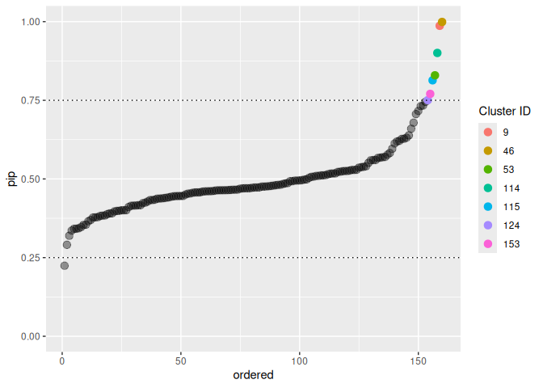

<!-- README.md is generated from README.Rmd. Please edit that file -->
<!-- knit with rmarkdown::render("README.Rmd", output_format = "md_document") -->

Individual Variance Detection
=============================

<!-- badges: start -->

<!-- badges: end -->

SSranef is an R package for random effects selection that corresponds to
the models described in Rodriguez, Williams, and Rast (2021).
Specifically, `ss_ranef_alpha()` fits a random intercepts model with a
spike-and-slab prior on the random effects and `ss_ranef_beta()` fits a
model with both random intercepts and random slopes, with a
spike-and-slab prior on the random effects for the slope. The function
`ss_ranef_mv()` fits a multivariate mixed-effects models for two
outcomes and places a spike-and-slab prior on the random slope for each
outcome.

This package is repurposed from the orginal verision at
[josue-rodriguez/SSranef](https://www.github.com/josue-rodriguez/SSranef)

Installation
------------

This package can be installed with

    # install.packages("devtools")
    devtools::install_github("rast-ph/ivd")

Example
-------

Because `SSranef` uses JAGS as a backend, we must also load the `rjags`
package.

    library(ivd)
    library(rjags)
    #> Loading required package: coda
    #> Linked to JAGS 4.3.2
    #> Loaded modules: basemod,bugs

    d <- lme4::sleepstudy

Alpha model
-----------

    d$y <- c(scale(d$Reaction))

    alpha <- ss_ranef_alpha(y = d$y, unit = d$Subject)
    #> Compiling model graph
    #>    Resolving undeclared variables
    #>    Allocating nodes
    #> Graph information:
    #>    Observed stochastic nodes: 180
    #>    Unobserved stochastic nodes: 39
    #>    Total graph size: 486
    #> 
    #> Initializing model
    #> 
    #>   |                                                          |                                                  |   0%  |                                                          |+                                                 |   2%  |                                                          |++                                                |   4%  |                                                          |+++                                               |   6%  |                                                          |++++                                              |   8%  |                                                          |+++++                                             |  10%  |                                                          |++++++                                            |  12%  |                                                          |+++++++                                           |  14%  |                                                          |++++++++                                          |  16%  |                                                          |+++++++++                                         |  18%  |                                                          |++++++++++                                        |  20%  |                                                          |+++++++++++                                       |  22%  |                                                          |++++++++++++                                      |  24%  |                                                          |+++++++++++++                                     |  26%  |                                                          |++++++++++++++                                    |  28%  |                                                          |+++++++++++++++                                   |  30%  |                                                          |++++++++++++++++                                  |  32%  |                                                          |+++++++++++++++++                                 |  34%  |                                                          |++++++++++++++++++                                |  36%  |                                                          |+++++++++++++++++++                               |  38%  |                                                          |++++++++++++++++++++                              |  40%  |                                                          |+++++++++++++++++++++                             |  42%  |                                                          |++++++++++++++++++++++                            |  44%  |                                                          |+++++++++++++++++++++++                           |  46%  |                                                          |++++++++++++++++++++++++                          |  48%  |                                                          |+++++++++++++++++++++++++                         |  50%  |                                                          |++++++++++++++++++++++++++                        |  52%  |                                                          |+++++++++++++++++++++++++++                       |  54%  |                                                          |++++++++++++++++++++++++++++                      |  56%  |                                                          |+++++++++++++++++++++++++++++                     |  58%  |                                                          |++++++++++++++++++++++++++++++                    |  60%  |                                                          |+++++++++++++++++++++++++++++++                   |  62%  |                                                          |++++++++++++++++++++++++++++++++                  |  64%  |                                                          |+++++++++++++++++++++++++++++++++                 |  66%  |                                                          |++++++++++++++++++++++++++++++++++                |  68%  |                                                          |+++++++++++++++++++++++++++++++++++               |  70%  |                                                          |++++++++++++++++++++++++++++++++++++              |  72%  |                                                          |+++++++++++++++++++++++++++++++++++++             |  74%  |                                                          |++++++++++++++++++++++++++++++++++++++            |  76%  |                                                          |+++++++++++++++++++++++++++++++++++++++           |  78%  |                                                          |++++++++++++++++++++++++++++++++++++++++          |  80%  |                                                          |+++++++++++++++++++++++++++++++++++++++++         |  82%  |                                                          |++++++++++++++++++++++++++++++++++++++++++        |  84%  |                                                          |+++++++++++++++++++++++++++++++++++++++++++       |  86%  |                                                          |++++++++++++++++++++++++++++++++++++++++++++      |  88%  |                                                          |+++++++++++++++++++++++++++++++++++++++++++++     |  90%  |                                                          |++++++++++++++++++++++++++++++++++++++++++++++    |  92%  |                                                          |+++++++++++++++++++++++++++++++++++++++++++++++   |  94%  |                                                          |++++++++++++++++++++++++++++++++++++++++++++++++  |  96%  |                                                          |+++++++++++++++++++++++++++++++++++++++++++++++++ |  98%  |                                                          |++++++++++++++++++++++++++++++++++++++++++++++++++| 100%
    #>   |                                                          |                                                  |   0%  |                                                          |*                                                 |   2%  |                                                          |**                                                |   4%  |                                                          |***                                               |   6%  |                                                          |****                                              |   8%  |                                                          |*****                                             |  10%  |                                                          |******                                            |  12%  |                                                          |*******                                           |  14%  |                                                          |********                                          |  16%  |                                                          |*********                                         |  18%  |                                                          |**********                                        |  20%  |                                                          |***********                                       |  22%  |                                                          |************                                      |  24%  |                                                          |*************                                     |  26%  |                                                          |**************                                    |  28%  |                                                          |***************                                   |  30%  |                                                          |****************                                  |  32%  |                                                          |*****************                                 |  34%  |                                                          |******************                                |  36%  |                                                          |*******************                               |  38%  |                                                          |********************                              |  40%  |                                                          |*********************                             |  42%  |                                                          |**********************                            |  44%  |                                                          |***********************                           |  46%  |                                                          |************************                          |  48%  |                                                          |*************************                         |  50%  |                                                          |**************************                        |  52%  |                                                          |***************************                       |  54%  |                                                          |****************************                      |  56%  |                                                          |*****************************                     |  58%  |                                                          |******************************                    |  60%  |                                                          |*******************************                   |  62%  |                                                          |********************************                  |  64%  |                                                          |*********************************                 |  66%  |                                                          |**********************************                |  68%  |                                                          |***********************************               |  70%  |                                                          |************************************              |  72%  |                                                          |*************************************             |  74%  |                                                          |**************************************            |  76%  |                                                          |***************************************           |  78%  |                                                          |****************************************          |  80%  |                                                          |*****************************************         |  82%  |                                                          |******************************************        |  84%  |                                                          |*******************************************       |  86%  |                                                          |********************************************      |  88%  |                                                          |*********************************************     |  90%  |                                                          |**********************************************    |  92%  |                                                          |***********************************************   |  94%  |                                                          |************************************************  |  96%  |                                                          |************************************************* |  98%  |                                                          |**************************************************| 100%
    #>   |                                                          |                                                  |   0%  |                                                          |*                                                 |   2%  |                                                          |**                                                |   4%  |                                                          |***                                               |   6%  |                                                          |****                                              |   8%  |                                                          |*****                                             |  10%  |                                                          |******                                            |  12%  |                                                          |*******                                           |  14%  |                                                          |********                                          |  16%  |                                                          |*********                                         |  18%  |                                                          |**********                                        |  20%  |                                                          |***********                                       |  22%  |                                                          |************                                      |  24%  |                                                          |*************                                     |  26%  |                                                          |**************                                    |  28%  |                                                          |***************                                   |  30%  |                                                          |****************                                  |  32%  |                                                          |*****************                                 |  34%  |                                                          |******************                                |  36%  |                                                          |*******************                               |  38%  |                                                          |********************                              |  40%  |                                                          |*********************                             |  42%  |                                                          |**********************                            |  44%  |                                                          |***********************                           |  46%  |                                                          |************************                          |  48%  |                                                          |*************************                         |  50%  |                                                          |**************************                        |  52%  |                                                          |***************************                       |  54%  |                                                          |****************************                      |  56%  |                                                          |*****************************                     |  58%  |                                                          |******************************                    |  60%  |                                                          |*******************************                   |  62%  |                                                          |********************************                  |  64%  |                                                          |*********************************                 |  66%  |                                                          |**********************************                |  68%  |                                                          |***********************************               |  70%  |                                                          |************************************              |  72%  |                                                          |*************************************             |  74%  |                                                          |**************************************            |  76%  |                                                          |***************************************           |  78%  |                                                          |****************************************          |  80%  |                                                          |*****************************************         |  82%  |                                                          |******************************************        |  84%  |                                                          |*******************************************       |  86%  |                                                          |********************************************      |  88%  |                                                          |*********************************************     |  90%  |                                                          |**********************************************    |  92%  |                                                          |***********************************************   |  94%  |                                                          |************************************************  |  96%  |                                                          |************************************************* |  98%  |                                                          |**************************************************| 100%

    posterior_summary(alpha, ci = 0.90, digits = 2)
    #> Linear mixed model fit with SSranef
    #> Call: ss_ranef_alpha(y = d$y, unit = d$Subject)
    #> 
    #>       Post_mean q05   q95 
    #> alpha 0.09      -0.08 0.26
    #> sigma 0.79       0.72 0.86
    #> tau   0.99       0.62 1.56

    ranef_summary(alpha, ci = 0.95, digits = 2)
    #> Linear mixed model fit with SSranef
    #> Call: ss_ranef_alpha(y = d$y, unit = d$Subject)
    #> 
    #>           Post_mean q025  q975  PIP  BF_10   BF_01
    #> theta_308  0.57      0.00  1.13 0.86    6.33 0.16 
    #> theta_309 -1.45     -1.96 -0.93 1.00     Inf 0.00 
    #> theta_310 -1.19     -1.71 -0.70 1.00 3999.00 0.00 
    #> theta_330  0.00     -0.31  0.31 0.21    0.27 3.66 
    #> theta_331  0.03     -0.19  0.44 0.22    0.29 3.47 
    #> theta_332  0.02     -0.24  0.38 0.23    0.30 3.36 
    #> theta_333  0.07     -0.12  0.58 0.30    0.43 2.31 
    #> theta_334 -0.04     -0.50  0.20 0.25    0.33 3.01 
    #> theta_335 -0.87     -1.39 -0.30 0.99   80.63 0.01 
    #> theta_337  1.19      0.67  1.68 1.00     Inf 0.00 
    #> theta_349 -0.30     -0.94  0.00 0.62    1.63 0.61 
    #> theta_350  0.05     -0.12  0.52 0.25    0.33 2.99 
    #> theta_351 -0.07     -0.61  0.12 0.30    0.44 2.28 
    #> theta_352  0.45      0.00  1.05 0.77    3.28 0.31 
    #> theta_369  0.01     -0.28  0.37 0.22    0.27 3.65 
    #> theta_370 -0.07     -0.57  0.14 0.29    0.41 2.42 
    #> theta_371 -0.04     -0.49  0.18 0.24    0.32 3.13 
    #> theta_372  0.08     -0.12  0.61 0.31    0.45 2.20

    caterpillar_plot(alpha)

    pip_plot(alpha)

Beta model
----------

    beta <- ss_ranef_beta(y = d$y, X = d$Days, unit = d$Subject)
    #> Compiling model graph
    #>    Resolving undeclared variables
    #>    Allocating nodes
    #> Graph information:
    #>    Observed stochastic nodes: 180
    #>    Unobserved stochastic nodes: 60
    #>    Total graph size: 1316
    #> 
    #> Initializing model
    #> 
    #>   |                                                          |                                                  |   0%  |                                                          |+                                                 |   2%  |                                                          |++                                                |   4%  |                                                          |+++                                               |   6%  |                                                          |++++                                              |   8%  |                                                          |+++++                                             |  10%  |                                                          |++++++                                            |  12%  |                                                          |+++++++                                           |  14%  |                                                          |++++++++                                          |  16%  |                                                          |+++++++++                                         |  18%  |                                                          |++++++++++                                        |  20%  |                                                          |+++++++++++                                       |  22%  |                                                          |++++++++++++                                      |  24%  |                                                          |+++++++++++++                                     |  26%  |                                                          |++++++++++++++                                    |  28%  |                                                          |+++++++++++++++                                   |  30%  |                                                          |++++++++++++++++                                  |  32%  |                                                          |+++++++++++++++++                                 |  34%  |                                                          |++++++++++++++++++                                |  36%  |                                                          |+++++++++++++++++++                               |  38%  |                                                          |++++++++++++++++++++                              |  40%  |                                                          |+++++++++++++++++++++                             |  42%  |                                                          |++++++++++++++++++++++                            |  44%  |                                                          |+++++++++++++++++++++++                           |  46%  |                                                          |++++++++++++++++++++++++                          |  48%  |                                                          |+++++++++++++++++++++++++                         |  50%  |                                                          |++++++++++++++++++++++++++                        |  52%  |                                                          |+++++++++++++++++++++++++++                       |  54%  |                                                          |++++++++++++++++++++++++++++                      |  56%  |                                                          |+++++++++++++++++++++++++++++                     |  58%  |                                                          |++++++++++++++++++++++++++++++                    |  60%  |                                                          |+++++++++++++++++++++++++++++++                   |  62%  |                                                          |++++++++++++++++++++++++++++++++                  |  64%  |                                                          |+++++++++++++++++++++++++++++++++                 |  66%  |                                                          |++++++++++++++++++++++++++++++++++                |  68%  |                                                          |+++++++++++++++++++++++++++++++++++               |  70%  |                                                          |++++++++++++++++++++++++++++++++++++              |  72%  |                                                          |+++++++++++++++++++++++++++++++++++++             |  74%  |                                                          |++++++++++++++++++++++++++++++++++++++            |  76%  |                                                          |+++++++++++++++++++++++++++++++++++++++           |  78%  |                                                          |++++++++++++++++++++++++++++++++++++++++          |  80%  |                                                          |+++++++++++++++++++++++++++++++++++++++++         |  82%  |                                                          |++++++++++++++++++++++++++++++++++++++++++        |  84%  |                                                          |+++++++++++++++++++++++++++++++++++++++++++       |  86%  |                                                          |++++++++++++++++++++++++++++++++++++++++++++      |  88%  |                                                          |+++++++++++++++++++++++++++++++++++++++++++++     |  90%  |                                                          |++++++++++++++++++++++++++++++++++++++++++++++    |  92%  |                                                          |+++++++++++++++++++++++++++++++++++++++++++++++   |  94%  |                                                          |++++++++++++++++++++++++++++++++++++++++++++++++  |  96%  |                                                          |+++++++++++++++++++++++++++++++++++++++++++++++++ |  98%  |                                                          |++++++++++++++++++++++++++++++++++++++++++++++++++| 100%
    #>   |                                                          |                                                  |   0%  |                                                          |*                                                 |   2%  |                                                          |**                                                |   4%  |                                                          |***                                               |   6%  |                                                          |****                                              |   8%  |                                                          |*****                                             |  10%  |                                                          |******                                            |  12%  |                                                          |*******                                           |  14%  |                                                          |********                                          |  16%  |                                                          |*********                                         |  18%  |                                                          |**********                                        |  20%  |                                                          |***********                                       |  22%  |                                                          |************                                      |  24%  |                                                          |*************                                     |  26%  |                                                          |**************                                    |  28%  |                                                          |***************                                   |  30%  |                                                          |****************                                  |  32%  |                                                          |*****************                                 |  34%  |                                                          |******************                                |  36%  |                                                          |*******************                               |  38%  |                                                          |********************                              |  40%  |                                                          |*********************                             |  42%  |                                                          |**********************                            |  44%  |                                                          |***********************                           |  46%  |                                                          |************************                          |  48%  |                                                          |*************************                         |  50%  |                                                          |**************************                        |  52%  |                                                          |***************************                       |  54%  |                                                          |****************************                      |  56%  |                                                          |*****************************                     |  58%  |                                                          |******************************                    |  60%  |                                                          |*******************************                   |  62%  |                                                          |********************************                  |  64%  |                                                          |*********************************                 |  66%  |                                                          |**********************************                |  68%  |                                                          |***********************************               |  70%  |                                                          |************************************              |  72%  |                                                          |*************************************             |  74%  |                                                          |**************************************            |  76%  |                                                          |***************************************           |  78%  |                                                          |****************************************          |  80%  |                                                          |*****************************************         |  82%  |                                                          |******************************************        |  84%  |                                                          |*******************************************       |  86%  |                                                          |********************************************      |  88%  |                                                          |*********************************************     |  90%  |                                                          |**********************************************    |  92%  |                                                          |***********************************************   |  94%  |                                                          |************************************************  |  96%  |                                                          |************************************************* |  98%  |                                                          |**************************************************| 100%
    #>   |                                                          |                                                  |   0%  |                                                          |*                                                 |   2%  |                                                          |**                                                |   4%  |                                                          |***                                               |   6%  |                                                          |****                                              |   8%  |                                                          |*****                                             |  10%  |                                                          |******                                            |  12%  |                                                          |*******                                           |  14%  |                                                          |********                                          |  16%  |                                                          |*********                                         |  18%  |                                                          |**********                                        |  20%  |                                                          |***********                                       |  22%  |                                                          |************                                      |  24%  |                                                          |*************                                     |  26%  |                                                          |**************                                    |  28%  |                                                          |***************                                   |  30%  |                                                          |****************                                  |  32%  |                                                          |*****************                                 |  34%  |                                                          |******************                                |  36%  |                                                          |*******************                               |  38%  |                                                          |********************                              |  40%  |                                                          |*********************                             |  42%  |                                                          |**********************                            |  44%  |                                                          |***********************                           |  46%  |                                                          |************************                          |  48%  |                                                          |*************************                         |  50%  |                                                          |**************************                        |  52%  |                                                          |***************************                       |  54%  |                                                          |****************************                      |  56%  |                                                          |*****************************                     |  58%  |                                                          |******************************                    |  60%  |                                                          |*******************************                   |  62%  |                                                          |********************************                  |  64%  |                                                          |*********************************                 |  66%  |                                                          |**********************************                |  68%  |                                                          |***********************************               |  70%  |                                                          |************************************              |  72%  |                                                          |*************************************             |  74%  |                                                          |**************************************            |  76%  |                                                          |***************************************           |  78%  |                                                          |****************************************          |  80%  |                                                          |*****************************************         |  82%  |                                                          |******************************************        |  84%  |                                                          |*******************************************       |  86%  |                                                          |********************************************      |  88%  |                                                          |*********************************************     |  90%  |                                                          |**********************************************    |  92%  |                                                          |***********************************************   |  94%  |                                                          |************************************************  |  96%  |                                                          |************************************************* |  98%  |                                                          |**************************************************| 100%
    posterior_summary(beta, digits = 2)
    #> Linear mixed model fit with SSranef
    #> Call: ss_ranef_beta(y = d$y, X = d$Days, unit = d$Subject)
    #> 
    #>       Post_mean q05   q95  
    #> alpha -0.84     -1.03 -0.64
    #> beta   0.19      0.15  0.22
    #> sigma  0.47      0.42  0.52
    #> tau1   0.42      0.23  0.63
    #> tau2   0.16      0.09  0.27
    #> rho    0.27     -0.35  0.80

    ranef_summary(beta, digits = 2)
    #> Linear mixed model fit with SSranef
    #> Call: ss_ranef_beta(y = d$y, X = d$Days, unit = d$Subject)
    #> 
    #>            Post_mean q05   q95   PIP  BF_10  BF_01
    #> theta1_308  0.04     -0.38  0.42   NA     NA   NA 
    #> theta1_309 -0.63     -1.08 -0.21   NA     NA   NA 
    #> theta1_310 -0.63     -1.17 -0.18   NA     NA   NA 
    #> theta1_330  0.27     -0.12  0.73   NA     NA   NA 
    #> theta1_331  0.26     -0.08  0.65   NA     NA   NA 
    #> theta1_332  0.14     -0.17  0.46   NA     NA   NA 
    #> theta1_333  0.27     -0.05  0.62   NA     NA   NA 
    #> theta1_334 -0.06     -0.41  0.25   NA     NA   NA 
    #> theta1_335  0.00     -0.38  0.42   NA     NA   NA 
    #> theta1_337  0.52      0.14  0.93   NA     NA   NA 
    #> theta1_349 -0.35     -0.72 -0.03   NA     NA   NA 
    #> theta1_350 -0.14     -0.57  0.26   NA     NA   NA 
    #> theta1_351 -0.02     -0.36  0.36   NA     NA   NA 
    #> theta1_352  0.45      0.05  0.85   NA     NA   NA 
    #> theta1_369  0.10     -0.23  0.43   NA     NA   NA 
    #> theta1_370 -0.28     -0.75  0.10   NA     NA   NA 
    #> theta1_371 -0.03     -0.34  0.31   NA     NA   NA 
    #> theta1_372  0.27     -0.06  0.60   NA     NA   NA 
    #> theta2_308  0.17      0.09  0.25 1.00 221.22 0.00 
    #> theta2_309 -0.17     -0.25 -0.09 0.99 104.26 0.01 
    #> theta2_310 -0.10     -0.20  0.00 0.85   5.51 0.18 
    #> theta2_330 -0.05     -0.15  0.00 0.61   1.58 0.63 
    #> theta2_331 -0.02     -0.11  0.00 0.41   0.70 1.44 
    #> theta2_332  0.00     -0.04  0.03 0.24   0.32 3.10 
    #> theta2_333  0.00     -0.04  0.04 0.25   0.34 2.98 
    #> theta2_334  0.00     -0.02  0.06 0.26   0.35 2.85 
    #> theta2_335 -0.20     -0.28 -0.12 1.00    Inf 0.00 
    #> theta2_337  0.17      0.09  0.25 0.99 159.00 0.01 
    #> theta2_349  0.00     -0.03  0.05 0.26   0.34 2.90 
    #> theta2_350  0.10      0.00  0.19 0.89   7.95 0.13 
    #> theta2_351 -0.03     -0.11  0.00 0.43   0.75 1.33 
    #> theta2_352  0.04      0.00  0.14 0.53   1.12 0.89 
    #> theta2_369  0.01     -0.02  0.06 0.26   0.36 2.82 
    #> theta2_370  0.05      0.00  0.16 0.58   1.37 0.73 
    #> theta2_371 -0.01     -0.06  0.02 0.26   0.36 2.78 
    #> theta2_372  0.01     -0.02  0.07 0.29   0.41 2.45

    caterpillar_plot(beta)

    pip_plot(beta)

Multivariate model
------------------

    mv_data <- gen_mv_data(5, 5)
    str(mv_data)
    #> 'data.frame':    25 obs. of  4 variables:
    #>  $ y1: num  -2.197 3.206 0.325 -3.464 -2.069 ...
    #>  $ y2: num  2.15 3.09 2.85 5.13 5.48 ...
    #>  $ x : num  0 0 0 1 1 1 1 1 0 1 ...
    #>  $ id: Factor w/ 5 levels "1","2","3","4",..: 1 1 1 1 1 2 2 2 2 2 ...

    mv_model <- ss_ranef_mv(Y = cbind(mv_data$y1, mv_data$y2),
                            X = mv_data$x,
                            unit = mv_data$id,
                            burnin = 100,
                            iter = 500,
                            chains = 4)
    #> Compiling model graph
    #>    Resolving undeclared variables
    #>    Allocating nodes
    #> Graph information:
    #>    Observed stochastic nodes: 25
    #>    Unobserved stochastic nodes: 23
    #>    Total graph size: 338
    #> 
    #> Initializing model
    #> 
    #>   |                                                          |                                                  |   0%  |                                                          |+                                                 |   2%  |                                                          |++                                                |   4%  |                                                          |+++                                               |   6%  |                                                          |++++                                              |   8%  |                                                          |+++++                                             |  10%  |                                                          |++++++                                            |  12%  |                                                          |+++++++                                           |  14%  |                                                          |++++++++                                          |  16%  |                                                          |+++++++++                                         |  18%  |                                                          |++++++++++                                        |  20%  |                                                          |+++++++++++                                       |  22%  |                                                          |++++++++++++                                      |  24%  |                                                          |+++++++++++++                                     |  26%  |                                                          |++++++++++++++                                    |  28%  |                                                          |+++++++++++++++                                   |  30%  |                                                          |++++++++++++++++                                  |  32%  |                                                          |+++++++++++++++++                                 |  34%  |                                                          |++++++++++++++++++                                |  36%  |                                                          |+++++++++++++++++++                               |  38%  |                                                          |++++++++++++++++++++                              |  40%  |                                                          |+++++++++++++++++++++                             |  42%  |                                                          |++++++++++++++++++++++                            |  44%  |                                                          |+++++++++++++++++++++++                           |  46%  |                                                          |++++++++++++++++++++++++                          |  48%  |                                                          |+++++++++++++++++++++++++                         |  50%  |                                                          |++++++++++++++++++++++++++                        |  52%  |                                                          |+++++++++++++++++++++++++++                       |  54%  |                                                          |++++++++++++++++++++++++++++                      |  56%  |                                                          |+++++++++++++++++++++++++++++                     |  58%  |                                                          |++++++++++++++++++++++++++++++                    |  60%  |                                                          |+++++++++++++++++++++++++++++++                   |  62%  |                                                          |++++++++++++++++++++++++++++++++                  |  64%  |                                                          |+++++++++++++++++++++++++++++++++                 |  66%  |                                                          |++++++++++++++++++++++++++++++++++                |  68%  |                                                          |+++++++++++++++++++++++++++++++++++               |  70%  |                                                          |++++++++++++++++++++++++++++++++++++              |  72%  |                                                          |+++++++++++++++++++++++++++++++++++++             |  74%  |                                                          |++++++++++++++++++++++++++++++++++++++            |  76%  |                                                          |+++++++++++++++++++++++++++++++++++++++           |  78%  |                                                          |++++++++++++++++++++++++++++++++++++++++          |  80%  |                                                          |+++++++++++++++++++++++++++++++++++++++++         |  82%  |                                                          |++++++++++++++++++++++++++++++++++++++++++        |  84%  |                                                          |+++++++++++++++++++++++++++++++++++++++++++       |  86%  |                                                          |++++++++++++++++++++++++++++++++++++++++++++      |  88%  |                                                          |+++++++++++++++++++++++++++++++++++++++++++++     |  90%  |                                                          |++++++++++++++++++++++++++++++++++++++++++++++    |  92%  |                                                          |+++++++++++++++++++++++++++++++++++++++++++++++   |  94%  |                                                          |++++++++++++++++++++++++++++++++++++++++++++++++  |  96%  |                                                          |+++++++++++++++++++++++++++++++++++++++++++++++++ |  98%  |                                                          |++++++++++++++++++++++++++++++++++++++++++++++++++| 100%
    #>   |                                                          |                                                  |   0%  |                                                          |*                                                 |   2%  |                                                          |**                                                |   4%  |                                                          |***                                               |   6%  |                                                          |****                                              |   8%  |                                                          |*****                                             |  10%  |                                                          |******                                            |  12%  |                                                          |*******                                           |  14%  |                                                          |********                                          |  16%  |                                                          |*********                                         |  18%  |                                                          |**********                                        |  20%  |                                                          |***********                                       |  22%  |                                                          |************                                      |  24%  |                                                          |*************                                     |  26%  |                                                          |**************                                    |  28%  |                                                          |***************                                   |  30%  |                                                          |****************                                  |  32%  |                                                          |*****************                                 |  34%  |                                                          |******************                                |  36%  |                                                          |*******************                               |  38%  |                                                          |********************                              |  40%  |                                                          |*********************                             |  42%  |                                                          |**********************                            |  44%  |                                                          |***********************                           |  46%  |                                                          |************************                          |  48%  |                                                          |*************************                         |  50%  |                                                          |**************************                        |  52%  |                                                          |***************************                       |  54%  |                                                          |****************************                      |  56%  |                                                          |*****************************                     |  58%  |                                                          |******************************                    |  60%  |                                                          |*******************************                   |  62%  |                                                          |********************************                  |  64%  |                                                          |*********************************                 |  66%  |                                                          |**********************************                |  68%  |                                                          |***********************************               |  70%  |                                                          |************************************              |  72%  |                                                          |*************************************             |  74%  |                                                          |**************************************            |  76%  |                                                          |***************************************           |  78%  |                                                          |****************************************          |  80%  |                                                          |*****************************************         |  82%  |                                                          |******************************************        |  84%  |                                                          |*******************************************       |  86%  |                                                          |********************************************      |  88%  |                                                          |*********************************************     |  90%  |                                                          |**********************************************    |  92%  |                                                          |***********************************************   |  94%  |                                                          |************************************************  |  96%  |                                                          |************************************************* |  98%  |                                                          |**************************************************| 100%
    #>   |                                                          |                                                  |   0%  |                                                          |*                                                 |   2%  |                                                          |**                                                |   4%  |                                                          |***                                               |   6%  |                                                          |****                                              |   8%  |                                                          |*****                                             |  10%  |                                                          |******                                            |  12%  |                                                          |*******                                           |  14%  |                                                          |********                                          |  16%  |                                                          |*********                                         |  18%  |                                                          |**********                                        |  20%  |                                                          |***********                                       |  22%  |                                                          |************                                      |  24%  |                                                          |*************                                     |  26%  |                                                          |**************                                    |  28%  |                                                          |***************                                   |  30%  |                                                          |****************                                  |  32%  |                                                          |*****************                                 |  34%  |                                                          |******************                                |  36%  |                                                          |*******************                               |  38%  |                                                          |********************                              |  40%  |                                                          |*********************                             |  42%  |                                                          |**********************                            |  44%  |                                                          |***********************                           |  46%  |                                                          |************************                          |  48%  |                                                          |*************************                         |  50%  |                                                          |**************************                        |  52%  |                                                          |***************************                       |  54%  |                                                          |****************************                      |  56%  |                                                          |*****************************                     |  58%  |                                                          |******************************                    |  60%  |                                                          |*******************************                   |  62%  |                                                          |********************************                  |  64%  |                                                          |*********************************                 |  66%  |                                                          |**********************************                |  68%  |                                                          |***********************************               |  70%  |                                                          |************************************              |  72%  |                                                          |*************************************             |  74%  |                                                          |**************************************            |  76%  |                                                          |***************************************           |  78%  |                                                          |****************************************          |  80%  |                                                          |*****************************************         |  82%  |                                                          |******************************************        |  84%  |                                                          |*******************************************       |  86%  |                                                          |********************************************      |  88%  |                                                          |*********************************************     |  90%  |                                                          |**********************************************    |  92%  |                                                          |***********************************************   |  94%  |                                                          |************************************************  |  96%  |                                                          |************************************************* |  98%  |                                                          |**************************************************| 100%

    posterior_summary(mv_model)
    #> Linear mixed model fit with SSranef
    #> Call: ss_ranef_mv(Y = cbind(mv_data$y1, mv_data$y2), X = mv_data$x, 
    #>     unit = mv_data$id, burnin = 100, iter = 500, chains = 4)
    #> 
    #>         Post_mean q05   q95   
    #> B_1_1    1.51      0.43   2.56
    #> B_1_2    0.13     -2.28   2.34
    #> B_2_1    2.94      2.60   3.28
    #> B_2_2    1.66      1.06   2.37
    #> rb_1_2   0.33     -0.99   1.00
    #> rb_1_3  -0.17     -0.99   0.98
    #> rb_1_4   0.08     -0.99   0.99
    #> rb_2_3  -0.13     -1.00   0.99
    #> rb_2_4  -0.24     -1.00   0.99
    #> rb_3_4   0.03     -0.99   0.99
    #> rw       0.29     -0.06   0.58
    #> sigma_1  2.53      1.99   3.26
    #> sigma_2  0.76      0.58   0.98
    #> Tau_1_1 15.28      0.31  68.36
    #> Tau_2_2 54.83      9.86 155.46
    #> Tau_3_3 31.15      0.34 148.42
    #> Tau_4_4 23.15      1.62  75.70

Priors
------

Priors can be passed on to either of the `ss_ranef` functions through a
named list and using JAGS code, e.g.,

    # change prior for mean intercept
    priors <- list(alpha = "alpha ~ dt(0, 1, 3)",
                   # for each jth unit, change prior probability of inclusion
                   gamma = "gamma[j] ~ dbern(0.75)") 

    fit <- ss_ranef_alpha(y = d$y, unit = d$Subject, priors = priors)
    #> Compiling model graph
    #>    Resolving undeclared variables
    #>    Allocating nodes
    #> Graph information:
    #>    Observed stochastic nodes: 180
    #>    Unobserved stochastic nodes: 39
    #>    Total graph size: 485
    #> 
    #> Initializing model
    #> 
    #>   |                                                          |                                                  |   0%  |                                                          |+                                                 |   2%  |                                                          |++                                                |   4%  |                                                          |+++                                               |   6%  |                                                          |++++                                              |   8%  |                                                          |+++++                                             |  10%  |                                                          |++++++                                            |  12%  |                                                          |+++++++                                           |  14%  |                                                          |++++++++                                          |  16%  |                                                          |+++++++++                                         |  18%  |                                                          |++++++++++                                        |  20%  |                                                          |+++++++++++                                       |  22%  |                                                          |++++++++++++                                      |  24%  |                                                          |+++++++++++++                                     |  26%  |                                                          |++++++++++++++                                    |  28%  |                                                          |+++++++++++++++                                   |  30%  |                                                          |++++++++++++++++                                  |  32%  |                                                          |+++++++++++++++++                                 |  34%  |                                                          |++++++++++++++++++                                |  36%  |                                                          |+++++++++++++++++++                               |  38%  |                                                          |++++++++++++++++++++                              |  40%  |                                                          |+++++++++++++++++++++                             |  42%  |                                                          |++++++++++++++++++++++                            |  44%  |                                                          |+++++++++++++++++++++++                           |  46%  |                                                          |++++++++++++++++++++++++                          |  48%  |                                                          |+++++++++++++++++++++++++                         |  50%  |                                                          |++++++++++++++++++++++++++                        |  52%  |                                                          |+++++++++++++++++++++++++++                       |  54%  |                                                          |++++++++++++++++++++++++++++                      |  56%  |                                                          |+++++++++++++++++++++++++++++                     |  58%  |                                                          |++++++++++++++++++++++++++++++                    |  60%  |                                                          |+++++++++++++++++++++++++++++++                   |  62%  |                                                          |++++++++++++++++++++++++++++++++                  |  64%  |                                                          |+++++++++++++++++++++++++++++++++                 |  66%  |                                                          |++++++++++++++++++++++++++++++++++                |  68%  |                                                          |+++++++++++++++++++++++++++++++++++               |  70%  |                                                          |++++++++++++++++++++++++++++++++++++              |  72%  |                                                          |+++++++++++++++++++++++++++++++++++++             |  74%  |                                                          |++++++++++++++++++++++++++++++++++++++            |  76%  |                                                          |+++++++++++++++++++++++++++++++++++++++           |  78%  |                                                          |++++++++++++++++++++++++++++++++++++++++          |  80%  |                                                          |+++++++++++++++++++++++++++++++++++++++++         |  82%  |                                                          |++++++++++++++++++++++++++++++++++++++++++        |  84%  |                                                          |+++++++++++++++++++++++++++++++++++++++++++       |  86%  |                                                          |++++++++++++++++++++++++++++++++++++++++++++      |  88%  |                                                          |+++++++++++++++++++++++++++++++++++++++++++++     |  90%  |                                                          |++++++++++++++++++++++++++++++++++++++++++++++    |  92%  |                                                          |+++++++++++++++++++++++++++++++++++++++++++++++   |  94%  |                                                          |++++++++++++++++++++++++++++++++++++++++++++++++  |  96%  |                                                          |+++++++++++++++++++++++++++++++++++++++++++++++++ |  98%  |                                                          |++++++++++++++++++++++++++++++++++++++++++++++++++| 100%
    #>   |                                                          |                                                  |   0%  |                                                          |*                                                 |   2%  |                                                          |**                                                |   4%  |                                                          |***                                               |   6%  |                                                          |****                                              |   8%  |                                                          |*****                                             |  10%  |                                                          |******                                            |  12%  |                                                          |*******                                           |  14%  |                                                          |********                                          |  16%  |                                                          |*********                                         |  18%  |                                                          |**********                                        |  20%  |                                                          |***********                                       |  22%  |                                                          |************                                      |  24%  |                                                          |*************                                     |  26%  |                                                          |**************                                    |  28%  |                                                          |***************                                   |  30%  |                                                          |****************                                  |  32%  |                                                          |*****************                                 |  34%  |                                                          |******************                                |  36%  |                                                          |*******************                               |  38%  |                                                          |********************                              |  40%  |                                                          |*********************                             |  42%  |                                                          |**********************                            |  44%  |                                                          |***********************                           |  46%  |                                                          |************************                          |  48%  |                                                          |*************************                         |  50%  |                                                          |**************************                        |  52%  |                                                          |***************************                       |  54%  |                                                          |****************************                      |  56%  |                                                          |*****************************                     |  58%  |                                                          |******************************                    |  60%  |                                                          |*******************************                   |  62%  |                                                          |********************************                  |  64%  |                                                          |*********************************                 |  66%  |                                                          |**********************************                |  68%  |                                                          |***********************************               |  70%  |                                                          |************************************              |  72%  |                                                          |*************************************             |  74%  |                                                          |**************************************            |  76%  |                                                          |***************************************           |  78%  |                                                          |****************************************          |  80%  |                                                          |*****************************************         |  82%  |                                                          |******************************************        |  84%  |                                                          |*******************************************       |  86%  |                                                          |********************************************      |  88%  |                                                          |*********************************************     |  90%  |                                                          |**********************************************    |  92%  |                                                          |***********************************************   |  94%  |                                                          |************************************************  |  96%  |                                                          |************************************************* |  98%  |                                                          |**************************************************| 100%
    #>   |                                                          |                                                  |   0%  |                                                          |*                                                 |   2%  |                                                          |**                                                |   4%  |                                                          |***                                               |   6%  |                                                          |****                                              |   8%  |                                                          |*****                                             |  10%  |                                                          |******                                            |  12%  |                                                          |*******                                           |  14%  |                                                          |********                                          |  16%  |                                                          |*********                                         |  18%  |                                                          |**********                                        |  20%  |                                                          |***********                                       |  22%  |                                                          |************                                      |  24%  |                                                          |*************                                     |  26%  |                                                          |**************                                    |  28%  |                                                          |***************                                   |  30%  |                                                          |****************                                  |  32%  |                                                          |*****************                                 |  34%  |                                                          |******************                                |  36%  |                                                          |*******************                               |  38%  |                                                          |********************                              |  40%  |                                                          |*********************                             |  42%  |                                                          |**********************                            |  44%  |                                                          |***********************                           |  46%  |                                                          |************************                          |  48%  |                                                          |*************************                         |  50%  |                                                          |**************************                        |  52%  |                                                          |***************************                       |  54%  |                                                          |****************************                      |  56%  |                                                          |*****************************                     |  58%  |                                                          |******************************                    |  60%  |                                                          |*******************************                   |  62%  |                                                          |********************************                  |  64%  |                                                          |*********************************                 |  66%  |                                                          |**********************************                |  68%  |                                                          |***********************************               |  70%  |                                                          |************************************              |  72%  |                                                          |*************************************             |  74%  |                                                          |**************************************            |  76%  |                                                          |***************************************           |  78%  |                                                          |****************************************          |  80%  |                                                          |*****************************************         |  82%  |                                                          |******************************************        |  84%  |                                                          |*******************************************       |  86%  |                                                          |********************************************      |  88%  |                                                          |*********************************************     |  90%  |                                                          |**********************************************    |  92%  |                                                          |***********************************************   |  94%  |                                                          |************************************************  |  96%  |                                                          |************************************************* |  98%  |                                                          |**************************************************| 100%
    ranef_summary(fit)
    #> Linear mixed model fit with SSranef
    #> Call: ss_ranef_alpha(y = d$y, unit = d$Subject, priors = priors)
    #> 
    #>           Post_mean q05   q95   PIP  BF_10   BF_01
    #> theta_308  0.61      0.00  1.06 0.95   18.90 0.05 
    #> theta_309 -1.39     -1.83 -0.95 1.00     Inf 0.00 
    #> theta_310 -1.14     -1.58 -0.71 1.00     Inf 0.00 
    #> theta_330  0.01     -0.30  0.35 0.48    0.93 1.07 
    #> theta_331  0.06     -0.20  0.44 0.51    1.04 0.96 
    #> theta_332  0.05     -0.26  0.44 0.52    1.08 0.92 
    #> theta_333  0.15     -0.12  0.60 0.60    1.48 0.67 
    #> theta_334 -0.06     -0.46  0.22 0.52    1.10 0.91 
    #> theta_335 -0.84     -1.28 -0.40 1.00  399.00 0.00 
    #> theta_337  1.17      0.72  1.60 1.00 1999.00 0.00 
    #> theta_349 -0.36     -0.85  0.00 0.81    4.21 0.24 
    #> theta_350  0.11     -0.15  0.55 0.57    1.31 0.76 
    #> theta_351 -0.13     -0.59  0.14 0.60    1.51 0.66 
    #> theta_352  0.53      0.00  0.99 0.92   11.08 0.09 
    #> theta_369  0.03     -0.27  0.42 0.50    1.01 0.99 
    #> theta_370 -0.10     -0.53  0.17 0.55    1.23 0.81 
    #> theta_371 -0.07     -0.48  0.22 0.53    1.12 0.89 
    #> theta_372  0.16     -0.09  0.64 0.62    1.63 0.61

Building on top of SSranef models
---------------------------------

The code for each model can also be extracted to make more extensive
modifications or build more complex models

    jags_model_text <- fit$model_text
    cat(jags_model_text)
    #> model{
    #>   for (i in 1:N) {
    #>     # likelihood
    #>     y[i] ~ dnorm(alpha_j[unit[i]], precision)
    #>   }
    #>   for (j in 1:J) {
    #>     gamma[j] ~ dbern(0.75)
    #>     # non-centered parameterization
    #>     alpha_raw[j] ~ dnorm(0, 1)
    #>     theta[j] <- tau * alpha_raw[j] * gamma[j]
    #>     alpha_j[j] <- alpha + theta[j]
    #>     lambda[j] <- (tau^2 / (tau^2 + sigma^2/n_j[j])) * gamma[j]
    #>   }
    #>   alpha ~ dt(0, 1, 3)
    #>   tau ~ dt(0, 1, 3)T(0, )
    #>   precision <- pow(sigma, -2)
    #>   sigma ~ dt(0, 1, 3)T(0, )
    #> }

References
==========

Rodriguez, Josue E, Donald R Williams, and Philippe Rast. 2021. Who Is
and Is Not" Average"? Random Effects Selection with Spike-and-Slab
Priors. <https://doi.org/10.31234/osf.io/4d9tv>.
